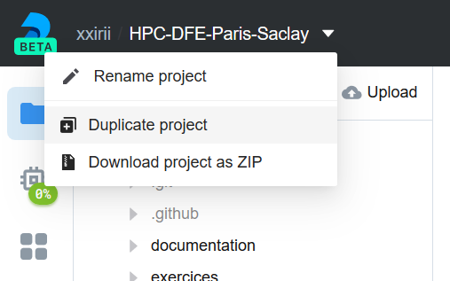

# Deepnote

Deepnote est un service en ligne permettant de travailler via votre navigateur dans un environnement virtualisé Linux (Docker).
Ce service est à l'origine porté sur l'Utilisation de notebook Jupyter collaboratif et partagé.
Il embarque de nombreux outils permettant le développement en ligne.

Nous avons mis en place un environnement complet pour ce cours.
Les bibliothèques principales y sont installées.
Vous trouverez le projet sur ce lien : https://deepnote.com/project/d66cb4f8-7e0d-44bb-bd40-99b22b0cf318.

## Accéder et dupliquer l'environnement Deepnote

Sans compte, vous pouvez visualiser le projet par défaut mais vous ne pourrez pas le dupliquer et le modifier.
Pour cela, il vous faut vous identifier soit avec un compte Gmail soit avec un compte GitHub.

- Cliquez sur le lien du projet Deepnote que vous trouverez en entête.
- Cliquez sur le nom du projet `HPC-DFE-Paris-Saclay` :

- Cliquez ensuite sur `Duplicate` :

Vous avez maintenant dupliqué le projet et il vous appartient.
Vous pouvez modifier, compiler et exécuter les codes.
