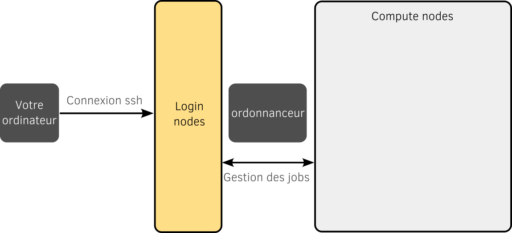

# Utilisation du super-calculateur Ruche

Ruche est un super-calculateur installé au [Mésocentre du Moulon](http://mesocentre.centralesupelec.fr/) sur le Campus de l'université Paris-Saclay. La partition CPU est composé de 216 noeuds bisocket Intel Cascadelake 6230 pour une puissance totale de 0.5 petaflops.

La documentation du calculateur est disponible en ligne : https://mesocentre.pages.centralesupelec.fr/user_doc/

## Architecture d'un super-calculateur



Un super-calculateur se compose de différentes partitions.

- La partition que l'on appelle le plus souvent *login node* ou *frontal* est celle qui accueille les utilisateurs à la connexion. Les ressources en calcul sur cette partition sont destinées à la gestoon de votre espace (commandes Unix, logiciels légers) et à l'utilisation de script léger et simple (python pour la visualisation par exemple). On ne fait pas tourner de calculs parallèles sur cette partition.
- La partition destinée à exécuter les codes sont séparée. Il peut y en avoir plusieurs en fonction des technologies dsponibles. Dans notre cas nous n'utiliserons que la partition CPU classique.

Contrairement à un ordinateur local, on ne lance pas soit même un calcul sur les ressources du super-calculateur. On soumet nos travaux, que l'on appelle *job* à un ordonnanceur ou *job scheduler* qui décide en fonction des ressources disponibles et d'autres critères (durée du *job*, priorité, ressources demandées, etc) quand réaliser l'execution de vos travaux. 

Concrètement, on écrit nos besoins et nos étapes de travail dans un script qui sera ensuite lu et exécuté par l'ordonnanceur. 

En terme de stockage, il y a là aussi plusieurs partitions:

- `$HOME` En général, une partition *home* avec peu de mémoire disponible et destionée surtout aux fichiers systèmes, aux scripts et aux bibliothèques légères.
- `$WORK` Une partition *work* est disponible pour les codes, les bibliothèques lourdes et la généraion des données de simulation. C'est comme son nom l'indique la partition de travail.

Pour accéder à l'espace *work*, il suffit de faire :
```bash
cd $WORK
```

Vous pouvez savoir le taux d'utilisation de vos espaces de stockage en faisant :

```bash
ruche-quota -u <login>
```

Où `<login>` doit être remplacé par votre login.


## Comment se connecter sur les noeuds de login

La connexion à Ruche se fait par ssh en utilisant la commande :

```bash
ssh -XY <login>@ruche.mesocentre.universite-paris-saclay.fr
```

Où `<login>` doit être remplacé par votre login.

Il est également possible de se connecter depuis un PC windows en utilisant le terminal Ubuntu, le logiciel Putty ou la machine virtuelle du Master. Plus d'information sur [cette page](https://mesocentre.pages.centralesupelec.fr/user_doc/ruche/03_connection_and_file_transfer/).

## Utilisation des modules

Un grand nombre de bibliothèques et logiciels sont déjà installés sur le super-calculateur. Il est préférable de les utiliser pour obtenir les meilleures performances. Nous allons donc utiliser les compilateurs et une bibliothèque MPI déjà disponibles.

Par défaut, aucun logiciel et bibliothèque n'est disponible dans votre environnement. Il faut les charger grâce à l'outil module. Les modules permettent d'adapter l'environnement à l'application que vous voulez utiliser.

La commande `module avail` permet d'obtenir la liste des logiciels et bibliothèques disponibles. Cela inclut les différents compilateurs ou Python par exemple.

```
module avail
```

La commande `module list` vous donne la liste des modules chargés dans votre environnement.

```
module list
```

La commande `module load <logiciel>` permet de charger un logiciel ou une bibliothèque. Par exemple :

```
module load python
```

Plus d'information sur le fonctionnement des modules : https://mesocentre.pages.centralesupelec.fr/user_doc/ruche/04_module_command/ 

## Créer et lancer un job de calcul

Un job est avant tout un script qui décrit les ressources demandées et qu'est-ce que les noeuds de calcul vont devoir effectuer.

Par exemple, voici le contenu d'un script `launch.sh`.

```bash
#!/bin/bash
#SBATCH --job-name=master_dfe
#SBATCH --output=output
#SBATCH --output=error            # fichier qui réceptionne la sortie standard
#SBATCH --ntasks=1                # Nombre d'unité de calcul ou de processus MPI
#SBATCH --time=01:00:00           # Temps souhaité pour la réservation
#SBATCH --partition=cpu_short     # Partition des jobs rapides

# To clean and load modules defined at the compile and link phases
module purge
module load ...

# echo of commands
set -x

# To compute in the submission directory
cd ${SLURM_SUBMIT_DIR}

# execution
srun ./executable
```

En entête, le mot clé `#SBTACH` permet de donner des informations à l'ordonnanceur comme le nombre d'unités de calcul à utiliser.
On prépare ensuite l'environnement en chargeant les modules nécessaires.
On exécute ensuite notre programmme.
`srun` est un wrapper qui remplace la commande `mpirun` tout en s'adaptant aux informations fournies en entête.

Pour donner notre *job* à l'ordonnanceur, on utilise la commande `sbatch`, par exemple :
```bash
sbatch launcher.sh
```

Voir : https://mesocentre.pages.centralesupelec.fr/user_doc/ruche/06_slurm_jobs_management/ 

## Gestion des travaux en cours

Une fois les jobs lancés et en cours de traitement, il est possible de suivre leur évolution en faisant :

```
squeue -u <login>
```

Un job peut être annulé en utilisant la commande :

```
scancel <job id>
```

Toutes les commandes de gestion des jobs sont ici : https://mesocentre.pages.centralesupelec.fr/user_doc/ruche/06_slurm_jobs_management/