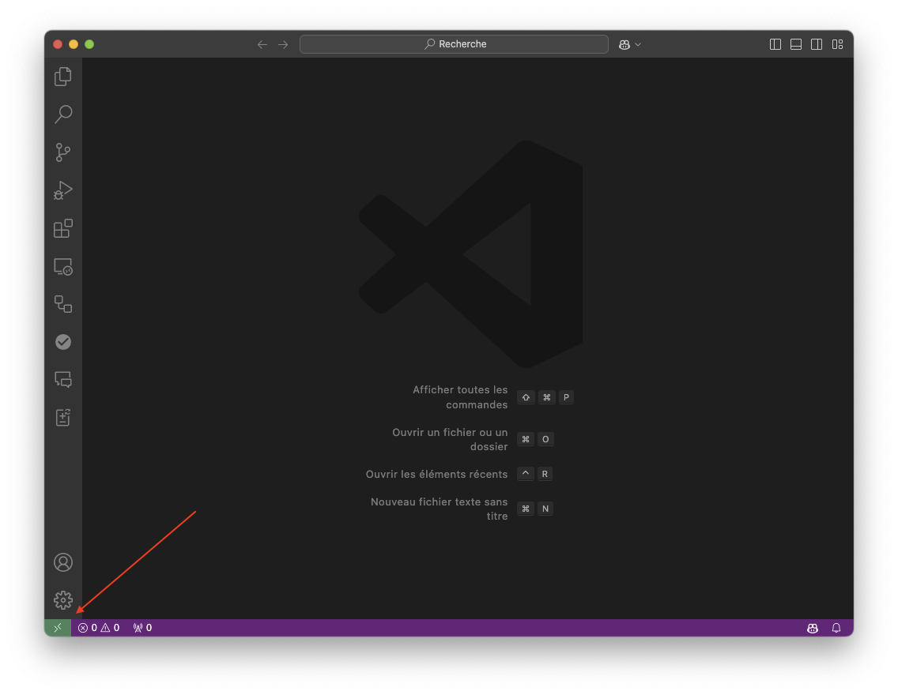
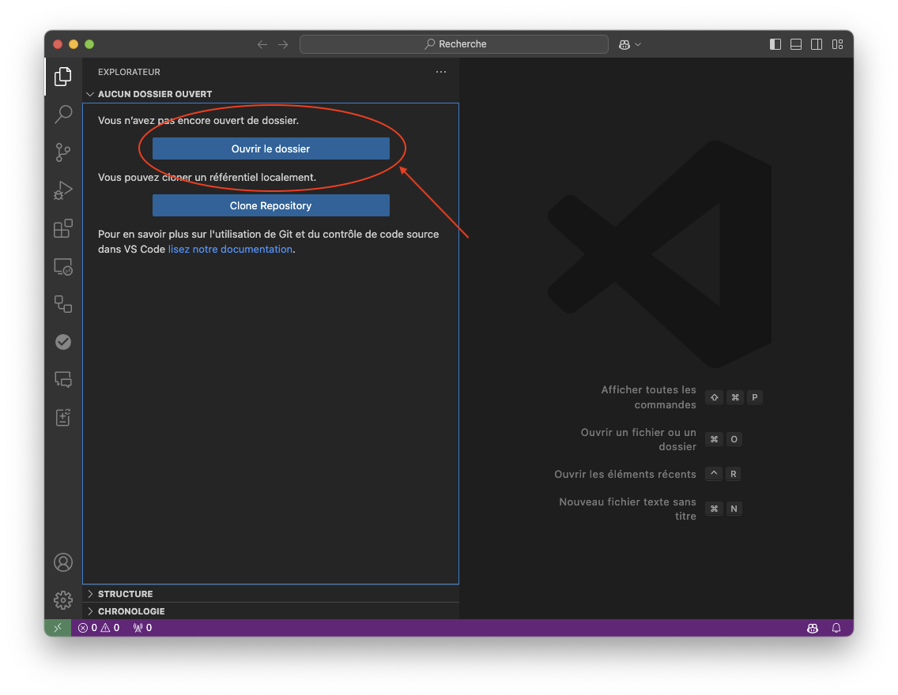

# Comment utiliser VScode sur Ruche

## Installation

VScode peut être installé sur votre ordinateur en suivant les instructions sur le site officiel de [VScode](https://code.visualstudio.com/). Il existe pour Windows, Mac et Linux.

Commencez donc par l'installer. Il est déjà disponible sur les ordinateurs de l'université.

## Démarrage

Vous pouvez démarrer VScode en tapant `code` dans un terminal. Vous pouvez aussi le lancer depuis le menu de votre ordinateur.

## Connexion à Ruche

Pour vous connecter à Ruche, vous devez installer l'extension `Remote - SSH` de VScode. Pour cela, ouvrez le menu des extensions (icône en forme de carré à gauche) et cherchez `Remote - SSH`. Cliquez sur `Install`.

Cliquer en bas à gauche sur l’icône de connexion à un serveur distant.



Choisissez ensuite l'option `Se connecter à l'host` et entrez l'adresse de Ruche :

```bash
ssh -XY <login>@ruche.mesocentre.universite-paris-saclay.fr
```

Si c'es la première fois que vous vous connectez à Ruche depuis votre ordinateur, vous pouvez ajouter la configuration ssh dans le fichier proposé. De cette façon, la configuration sera sauvegardé pour les prochaines connexions.

## Ouverture d'un dossier

Une fois connecté à Ruche, vous pouvez ouvrir un dossier en cliquant sur le bouton `ouvrir un dossier`.



VScode va se réouvrir avec le dossier distant ouvert. Vous pouvez alors travailler sur les fichiers comme si vous étiez sur votre ordinateur.

## Terminal

Vous pouvez ouvrir un terminal distant en cliquant sur `Terminal` puis `Nouveau terminal` dans la barre en haut. Ce terminal est un terminal distant sur Ruche.

Vous avez maintenant accès à un éditeur de texte puissant directement sur Ruche. Vous pouvez éditer vos fichiers et exécuter des scripts directement sur le serveur.