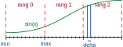

# Exercice : Utilisation des communications collectives MPI_REDUCE

Dans cet exercice, nous intégrons la fonction `f(x) = sin(x)` de
manière numérique entre 0 et pi en utilisant la méthode des rectangles
Le domaine d'intgération est subdivisé suivant le nombre de processus MPI demandé.



> [!WARNING]  
> n'oubliez pas de charger miniforge avant de commencer cet exercice.

```bash
source /gpfs/workdir/labotm/Installations/miniforges3/m2dfe_env.sh
```

## Consignes

La variable `discretization_per_rank` représente le nombre de `delta` utilisé
dans chaque rang pour mener l'intégration locale.
La taille du sous-domaine d'un rang est constante et stockée dans `rank_length`.
Les valeurs `min` et `max` représente les bornes du domaine local.

1. Complétez la valeur de `min`, `max`, et `delta`.

2. Complétez l'intérieur de la boucle d'intégration pour effectuer la méthode des rectangles

3. Complétez la ligne MPI destinées au processus de réduction des valeurs partielles
d'intégration dans la variable finale `integration`.

```python
integration = comm.reduce(...)
```

4. Rajoutez le calcul du temps passé dans la boucle d'intégration et le temps passé dans la réduction.

5. Exécutez le code en changeant le nombre de processus `N` et observez l'effet sur le résultat et le temps :

```bash
mpirun -np N python main.py
```

## Rappel

Vous pouvez utiliser l'exemple de script SLURM suivant pour exécuter votre code sur un noeud de Ruche :

```bash
#!/bin/bash
#SBATCH --job-name=master_dfe
#SBATCH --output=output
#SBATCH --error=error            # fichier qui réceptionne la sortie standard
#SBATCH --ntasks=1                # Nombre d'unité de calcul ou de processus MPI
#SBATCH --time=00:10:00           # Temps souhaité pour la réservation
#SBATCH --partition=cpu_short     # Partition des jobs rapides

source /gpfs/workdir/labotm/Installations/miniforges3/m2dfe_env.sh

mpirun -np 1 python3 main.py
```

Pour rappel, on exécute le script avec la commande `sbatch` :

```bash
sbatch launch.slurm
```

Vous pouvez modifier le paramètre `--ntasks` pour exécuter votre code avec plusieurs processus MPI.