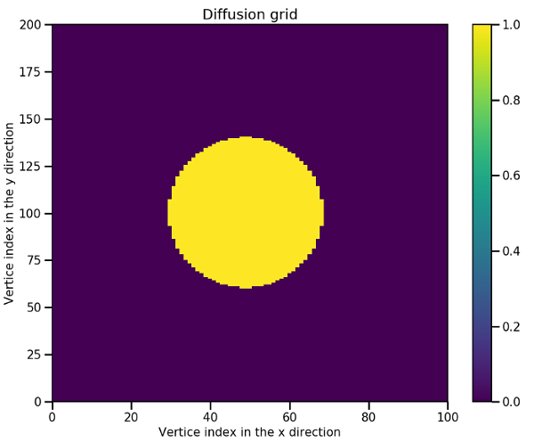

# Implémentation Fortran/MPI de l'équation de diffusion linéaire

## Description

Ce programme écrit en Fortran et parallélisé avec MPI se compose de plusieurs fichiers :
- main.F90: fichier principal contenant la structure du programme avec son initialisation et la boucle en temps
- parameters.F90 : fichier contenant tous les paramètres (variables)
- parallelism.F90 : fichier contenant les subroutines propres au parallélisme (initialisation, échange...)
- physics.F90 : fichier contenant l'initialisation physique du domaine et le solveur physique
- diagnostics.F90 : fichier contenant les diagnostiques
- timers.F90 : fichier pour le calcul du temps passé dans chaque partie

## Installation des dépendances

Il est nécessite l'installation de dépendances avant d'être compilé :
- MPI
- HDF5 : écriture de fichier en parallèle

MPI doit être installé en premier. L'installation de HDF5 parallèle nécessitera
que MPI soit déjà installé et fonctionnel.

Sur les postes de travail de l'université, MPI est déjà installé. En revanche, HDF5 n'est disponible qu'en séquentiel.

Une version a été installé juste pour vous dans l'espace commun : `/public/m2_dfe/hdf5-1.10.4/build`.

La compilation génère un exécutable `executable`.

## Consignes

Le but de cette exercice est de mettre en pratique l'ensemble des petits
exercices sur MPI dans un code de simulation.

1. **Structure du programme** : Ouvrez le fichier `main.F90` et regardez la structure du code depuis les
phases d'initialisation, en passant par la boucle ne temps jusqu'à la finalisation.

2. **Initialisation de MPI** : Vous allez dans un premier temps vous intéressez à la fonction
`initialize_mpi(...)` qui permet d'initialiser MPI et de
récupérer le nombre de rangs `number_of_ranks`.
C'est la première fonction appelée dans `main.F90`.
Elle est implémentée dans le fichier `parallelism.F90`.
Ouvrez le fichier `parallelism.F90`.
Il s'agit de la première fonction.
Compléter les noms de fonctions MPI correspondantes ainsi que les variables
 qui sont rappelées en entête de fonction.
Vous pouvez utiliser l'exercice 1 `1_initilization` pour vous aider ainsi
que le cours.

3. **Lecture des paramètres** : Les paramètres sont rentrés en dur dans le code
juste après l'initialisation de MPI dans le `main.F90`.

```fortran
! Définition des paramètres de simulation par défaut
ranks_per_direction = (/2 , 2/)           ! Nombre de rangs dans chaque dimension
Lx                  = 1.                  ! Taille du domaine dans la direction x
Ly                  = 1.                  ! Taille du domaine dans la direction y
Nx                  = 150                 ! Nombre de points sur la grille dans la direction x
Ny                  = 100                 ! Nombre de points sur la grille dans la direction y
D                   = 0.01                ! Coefficient de diffusion
Nt                  = 5000                ! Nombre d'itérations temporelles
alpha               = 0.5                 ! Facteur sur le pas en temps
print_period        = 1000                ! Période de sortie à l'écran des itérations
diagnostic_period   = 100                 ! Période en nombre d'itération entre chaque sortie de fichier
```

Certains arguments peuvent être donné en ligne de commande après l'exécutable.
La fonction `get_arguments` permet de les récupérer.

```bash
mpirun -np 4 ./executable -ranksxy 2 2 -Nxy 200 200 -Lxy 1 1 -Nt 5000 -diags 100
```

4. **Déclaration des paramètres** : Tous les paramètres sont déclarés dans un module unique situé dans le fichier `parameters.F90`.
Tous les paramètres sont décrits par un petit commentaire.

5. **Création de la topologie cartésienne** : Vous allez maintenant vous intéressez à la fonction
`create_cartesian_topology(...)` qui permet de créer la topologie cartésienne
à partir du nombre de rangs `number_of_ranks` et la répartition des rangs
dans chaque direction `ranks_per_direction`.
Cette fonction est appelée dans le `main.F90` juste après la lecture des
arguments.
C'est la deuxième fonction implémentée dans le fichier `parallelism.F90`.
Ouvrez le fichier `parallelism.F90`.
Compléter les noms de fonctions MPI correspondantes permettant de créer la
topologie cartésienne.
Utilisez les noms de variables donnés en entête de fonction.
Vous pouvez utiliser l'exercice 6 `6_cartesian_com` pour vous aider ainsi
que le cours.

6. **Les timers** : L'étape suivante dans le `main.F90`est l'initialisation des timers qui
permettent de capturer le temps passer dans les parties importantes du code.
Les timers utilisent `MPI_WTIME`.
L'utilisation des timers est dehors de ce cours.

7. **Initialisation du domaine** : Vient ensuite l'initialisation du domaine via la fonction `initialize_domain`.
Cette fonction initialise toutes les variables physiques à partir des
paramètres donnés par l'utilisateur.
C'est la première fonction implémentée dans le fichier `physics.F90`.
Prenez le temps de lire et de comprendre cette subroutine.
C'est ici que les sous-domaines sont dimensionnés.
Les grilles locales `U` (grille au pas de temps courant) et `Up`
(grille au pas de temps précédent) sont allouées dans cette fonction.
C'est également dans cette fonction que les grilles sont initialisées.
Au temps initial, le domaine est composé d'un cylindre elliptique de hauteur $`U = 1`$
et de rayons $`r_x = 0.2 L_x`$ et $`r_y = 0.2 L_y`$ .



8. **Boucle en temps** : la boucle en temps est le coeur du programme.
C'est là que le programme passe le plus de temps (pour peu qu'il y ait suffisamment d'itérations).
La boucle en temps se compose de 5 étapes :
  - Mise à jour de la grille via `update_domain(...)`
  - Echange des cellules fantômes via `exchange_gost_cells(...)`
  - Mise à jour des conditions limites via `update_boundaries(...)`
  - Ecriture d'informations dans le terminal via `print_timestep_information(...)`
  - Sortie de la grille à l'itération en cours via `output_diags(...)`

9. **Mise à jour de la grille** : A chaque itération, la grille est avancée au pas de temps suivant à partir de l'équation de diffusion discrétisée.
Cette opération est effectuée dans la fonction `update_domain(...)` appelée dans le `main.f90`
et programmée dans `physics.F90`.
  - Ouvrez le fichier `physics.F90` et allez à la fonction `update_domain(...)`. Cette fonction de quelques lignes est en fait le coeur de ce programme.
  - Vous observez que la fonction commence par une copie de `U` dans `Up`. `Up` représente la grille au pas de temps précédent. La fonction se compose ensuite de deux boucles sur les indices `i` et `j`, c'est à dire dans la direction x et y. Pour chaque noeud (i,j), `U` est mis à jour à partir des noeuds adjacents (stencil) au pas de temps précédent.

10. **Echange des cellules fantômes** : L'échanges des cellules fantômes est
une partie délicate. C'est généralement lors de la construction des échanges que des erreurs peuvent être facilement faites.
L'échange se fait via la fonction `exchange_gost_cells` appelée dans la boucle en temps du `main.F90` et programmée dans le fichier `parallelism.F90`.
  - Ouvrez le fichier `parallelism.F90`
  - Regardez l'intégralité de la fonction `exchange_gost_cells`
  - complétez le nom de la fonction MPI (`MPI_???`) qui s'adapte bien dans ce cas.
  - Certains des appels aux échanges MPI n'ont pas d'arguments, complétez ces appels avec les arguments correspondants. Aidez vous de la partie IV cours et des autres appels.

```fortran
! Envoi des données en +x et réception de -x
Call MPI_???(???, & ! La partie du tableau à envoyer
             ???, & ! Le nombre d'éléments
             ???, & ! Le type de donnée utilisé
             ???, & ! Le rang du voisin destinataire
             tag, & ! tag de la communication
             ???, & ! La partie du tableau qui va recevoir les données
             ???, & ! Le nombre d'éléments
             ???, & ! Le type de donnée pour les données reçues
             ???, & ! Le rang du voisin qui va nous envoyer des données
             tag, & ! tag de la communication
             ???, & ! Le communicateur
                  MPI_STATUS_IGNORE,          & ! Statut de la communication
                  ierror)                       ! Code d'erreur
```

11. **Mise à jour des conditions limites** : Les conditions limites sont mises à jour via la fonction `update_boundaries(...)` appelée dans le `main.F90` et programmée dans `physics.F90`.
  - Ouvrez le fichier `physics.F90`.
  - Prenez le temps de regarder comment cette fonction est construite.

12. **Intégration de la grille**: Intégrer une grille de discrétisation peut avoir différents buts.
Le plus commun est le calcul d'une grandeur globale (énergie, densité par exemple).
L'intégration de la grille totale nécessite tout d'abord d'intégrer les grilles locales sur chaque rang MPI.
Une fois les intégrations locales effectuées, on utilise une opération de réduction pour calculer l'intégration globale qui n'est ni plus ni moins que la somme des intégrations locales.
Une intégration se fait via la fonction `compute_grid_integration` programmée dans le fichier `parallelism.F90`.
  - Ouvrez le fichier `parallelism.F90`.
  - Regardez comment la fonction est construite
  - Complétez le nom de la fonction MPI (`MPI_???`) qui s'adapte bien dans ce cas.
  - Finissez de remplir les arguments de cette fonction

```Fortran
! Reduction dans le rang 0
CALL MPI_???(???, &   ! Variable d'intégration locale
                ???, & ! Variable d'intégration globale
                ???, & ! Taille
                ???, & ! Type de variable
                ???, & ! Type de réduction
                0,   & ! Le rang qui reçoit les résultats
                cartesian_communicator, ierror)
```

13. **Compilation du code** : Maintenant que vous avez mis à jour l'ensemble du code, nous allons le compiler.
  - Commencer par mettre à jour votre environnement Linux en faisant (vous devez faire ça dans chaque nouveau terminal) :

```bash
source /public/m2_dfe/hdf5-1.10.4/build/configuration
```

  Cette commande permet de charger les variables d'environnement de HDF5 nécessaire à la compilation du TP.

  - Tentez maintenant de compiler en utilisant la commande suivante dans le dossier des fichiers Fortran:

```bash
make
```

En cas d'erreur, il va falloir lire attentivement ce que vous remonte le compilateur pour comprendre où se trouve l'erreur.

Si tout se passe bien, vous devriez avoir un nouveau fichier du nom de `executable`.

14. **Architecture de la machine parallèle** : Avant de faire tourner notre code, il est important de regarder les propriétés de la machine parallèle que vous allez utiliser.
Dans notre cas, nous utiliserons des ordinateurs de bureau équipé d'un seul processeurs mais de plusieurs coeurs de calcul.
- La première chose à faire est de récupérer ces informations. Pour cela, vous pouvez utiliser la commande suivante :

```bash
cat /proc/cpuinfo
```

Cette commande vous donne toutes les informations qui concernent votre processeur.
La ligne `model name` vous permet de récupérer le nom commercial du processeur et de faire une recherche Internet par exemple.
La ligne `cpu cores` vous donne le nombre de coeurs.
vous noterez que les mêmes informations sont affichées un certain nombre de fois. autant de fois qu'il y a de threads pour être exact. Un thread une sous unité de calcul du coeur.
Il y a en général 2 threads par coeur qui partagent les ressources mémoires du coeurs.
Lorsque l'on désire utiliser les threads comme des unités de calcul, on parle d'hyperthreading.

- Donnez le nombre de coeurs total et le nombre de threads de votre processeur.

- Un autre moyen d'avoir des informations sur votre processeur est d'utiliser l'utilitaire graphique `Moniteur système` qui se substitue à la commande `top`. Combien de CPUs sont affichés ?
  A quoi correspondent-ils ?


15. **Exécution du code** : Maintenant que le code est correctement compilé, vous pouvez l'exécuter. Pour cela, on va utiliser `mpirun` comme pour les exercices.
Lorsque l'on précise le nombre de processus, il faut bien faire attention que la répartition des rangs dans chaque direction est cohérente.

```bash
# Par exemple, ici on demande 4 processus avec 2 rangs dans chaque direction :
mpirun -np 4 ./executable -ranksxy 2 2
```

Il est possible de passer des arguments par ligne de commande à l'exécutable
sans avoir à recompiler le code :

```bash
mpirun -np 4 ./executable -ranksxy 2 2 -Nxy 200 200 -Nt 5000 -diags 100 -Lxy 1 1
```

Les arguments ont la signification suivante :
- `ranksxy`: nombre de rangs dans la direction x puis y
- `Nxy`: nombre de points sur la grille dans la direction x puis y
- `Nt`: nombre d'itérations temporelles
- `diags`: période en nombre d'itérations entre chaque sortie
- `Lxy`: taille du domaine dans la direction x puis y (grandeur arbitraire)

Pour voir l'ensemble des paramètres ajustables par ligne de commande, voir la section `execution` avant les consignes.

**Attention** : Lorsque vous exécutez votre code, ne faite rien tourner d'autre à coté.
Cela risquerait de ralentir votre exécution et de perturber vos études dans la suite de ce TP.
Il est même conseillé d'éviter un nombre trop important d'applications ouvertes et un minimum d'onglet sur Firefox.

- Exécuter le code avec différents choix de paramètres.
- Observez les sorties dans votre terminal.
  Au cours de la boucle en temps, les itérations avec une période donnée s'affiche dans le terminal.
  A la fin de la simulation, vous obtenez un bilan du temps passé dans chaque partie du code.
  La première partie du bilan vous donne le temps passé dans l'initialisation et la boucle en temps.
  La deuxième partie vous donne un détail avec notamment le temps passé dans MPI.
  Les colonnes `min`/`mean`/`max` correspondent respectivement aux temps minimaux moyens et maximaux entre tous les processus.
  En effet, tous les processus n'avancent pas nécessairement à la même vitesse et les temps passés dans chaque partie peuvent fluctuer en conséquence d'un processus à un autre.

16. **Visualisation des fichiers de sortie** : L'exécution génère des fichiers HDF5 dans le dossier `diags`.
Les fichiers ont l'extension `.h5`.

- Exécuter le code avec un nombre important de sorties (toutes les 100 itérations) :

```bash
mpirun -np 4 ./executable -ranksxy 2 2 -Nxy 200 200 -Nt 5000 -diags 100
```

Les sorties sont dans le dossier `diags` avec pour nom `grid_*.h5`.

- Vous pouvez maintenant visualisez les fichiers de sortie en utilisant les scripts Python dans le dossier `tp/diffusion/python` :

```bash
# Pour voir la grille en 2D à l'itération 5000 par exemple :
python ../python/plot.py diags/grid_05000.h5
```

```bash
# Pour voir la grille en 3D à l'itération 5000 par exemple :
python ../python/plot3d.py diags/grid_05000.h5
```

Allez voir la [page](../python/README.md) sur la visualisation pour plus d'information.

17. **Scalabilité faible** : Vous allez utiliser le code pour effectuer des tests de scalabilité faible.
Pour cela, vous allez faire plusieurs *runs* en augmentant successivement le nombre de processus tout en gardant la même taille de sous-domaine par rang (la surface totale du domaine va donc augmenter proportionnellement au nombre de processus).

Pour ce faire, il vous est proposé d'adopter une taille de sous-grille de 100x800 points par processus.
La simulation tourne sur 5000 itérations.
Dans une première étude, le domaine sera décomposé uniquement dans la direction `x`.
Il est préférable de couper les sorties de fichier en choisissant une période supérieure au nombre d'itérations total (`diag_period >= Nt`).

- a) Réalisez une série de *runs* correspondant à ces critères jusqu'à 8 processus :

```bash
mpirun -np 1 ./executable -ranksxy 1 1 -Nxy 100 800 -Nt 5000 -diags 5000
mpirun -np 2 ./executable -ranksxy 2 1 -Nxy 200 800 -Nt 5000 -diags 5000
mpirun -np 3 ./executable -ranksxy 3 1 -Nxy 300 800 -Nt 5000 -diags 5000
mpirun -np 4 ./executable -ranksxy 4 1 -Nxy 400 800 -Nt 5000 -diags 5000
mpirun -np 8 ./executable -ranksxy 8 1 -Nxy 800 800 -Nt 5000 -diags 5000
```

  - b) Pour chaque *run*, notez le temps de simulation et le temps passé dans MPI.
  
**Important** : Lors de vos tests, vous remarquerez que les temps peuvent fluctuer de manière importante pour un même jeu de paramètres.
Il est donc conseillé de faire plusieurs *run* pour un même jeu de paramètres afin d'obtenir une moyenne.

  - c) Réalisez une courbe de ces temps en fonction du nombre de processus.
  Pour vous aidez, vous pouvez utiliser le script Python `weak_scaling_time.py`. Faites une copie et renommez-le.

```bash
python weak_scaling_time.py
```

  - d) Réalisez maintenant la courbe de scalabilité montrant l'efficacité en fonction du nombre de processus.
  Vous pouvez vous aider du script `weak_scaling_efficiency.py` pour tracer les résultats. Faites une copie et renommez-le.

```bash
python weak_scaling_efficiency.py
```

  - e) Qu'observez-vous globalement en terme de temps et d'efficacité pour cette première étude de scalabilité faible en fonction du nombre de processus ?
  
  - f) La notion de bonne scalabilité dépend du type d'algorithme. Ici, en considérant que le problème est facilement parallélisable, on peut dire qu'en dessous d'une efficacité de 80% (0,8), la scalabilité n'est plus bonne.
  A partir de quel nombre de processeurs sommes-nous dans ce cas ?
  Pouvez-vous expliquer la raison de cette première chute d'efficacité ?

  - g) Le comportement observé pour 8 processus vous semble-t-il dans la continuité de ce qu'il se passe pour un nombre de 1 à 4 processeurs ?
  Expliquez la raison de ce comportement.

  - h) Tracer la part du temps MPI par rapport au temps global.
  Vous pouvez vous aider du script `weak_scaling_part_mpi.py` pour tracer les résultats. Faites une copie et renommez-le.

```bash
python weak_scaling_part_mpi.py
```

  - i) Comment évolue la part du temps passé dans les communications MPI pour 1 à 4 processus ? Expliquez ce que vous observez ?

  - j) Recommencez la même étude en faisant varier la décomposition dans la direction `y` au lieu de la direction `x`.

```bash
mpirun -np 1 ./executable -ranksxy 1 1 -Nxy 800 100 -Nt 5000 -diags 5000
mpirun -np 2 ./executable -ranksxy 1 2 -Nxy 800 200 -Nt 5000 -diags 5000
mpirun -np 3 ./executable -ranksxy 1 3 -Nxy 800 300 -Nt 5000 -diags 5000
mpirun -np 4 ./executable -ranksxy 1 4 -Nxy 800 400 -Nt 5000 -diags 5000
mpirun -np 8 ./executable -ranksxy 1 8 -Nxy 800 800 -Nt 5000 -diags 5000
```

  - k) Comme pour l'étude précédente dans la direction `x`, comment évolue le temps et l'efficacité en fonction du nombre de processus ?

  - l) Comment évolue la part du temps passé dans les communications MPI pour 1 à 4 processus ? Expliquez ce que vous observez ?

  - m) Quelle différence observez-vous sur le temps global de simulation et le temps MPI entre la décomposition suivant `x` et la décomposition suivant `y` ?
  Pour vous aidez à mieux comparer, vous pouvez tracer toutes les courbes sur la même figure.
  Comment expliquez-vous qu'une des deux décompositions voit son temps MPI plus court que dans l'autre ?

18. **Scalabilité forte** : vous allez maintenant utiliser le code pour faire des études de scalabilité forte.
Pour cela, vous allez faire plusieurs *runs* en augmentant successivement
le nombre de processus tout en gardant un domaine de taille constant.
Par conséquent, la taille des sous-domaines associés à chaque processus diminue d'autant que le nombre de processus est élevé.
On divise toujours le domaine en parts égales.
Il est donc nécessaire pour cette étude de s'arranger pour que le domaine soit
divisible par le maximum de nombres de processus
  - a) Réalisez une série de *runs* avec une grille de 800x800 points. On se contente de 1, 2, 4 et 8 processus.
  La décomposition du domaine se fait dans la direction `x` dans un premier temps.

```bash
mpirun -np 1 ./executable -ranksxy 1 1 -Nxy 800 800 -Nt 5000 -diags 5000
mpirun -np 2 ./executable -ranksxy 2 1 -Nxy 800 800 -Nt 5000 -diags 5000
mpirun -np 4 ./executable -ranksxy 4 1 -Nxy 800 800 -Nt 5000 -diags 5000
mpirun -np 8 ./executable -ranksxy 8 1 -Nxy 800 800 -Nt 5000 -diags 5000
```

  - b) Pour chaque *run*, notez le temps de simulation et le temps passé dans MPI.
  - c) Réalisez une courbe de ces temps en fonction du nombre de processus.
Pour vous aidez, vous pouvez utiliser le script Python `strong_scaling_time.py`.

```bash
python strong_scaling_time.py
```

  - d) Réalisez maintenant la courbe de scalabilité montrant l'efficacité en fonction du nombre de processus.
  Vous pouvez vous aider du script `strong_scaling_efficiency.py` pour tracer les résultats. Faites une copie et renommez-le.

```bash
python strong_scaling_efficiency.py
```

  - e) Recommencez la même étude en faisant varier la décomposition dans la direction `y` au lieu de la direction `x`.

```bash
mpirun -np 1 ./executable -ranksxy 1 1 -Nxy 800 800 -Nt 5000 -diags 5000
mpirun -np 2 ./executable -ranksxy 1 2 -Nxy 800 800 -Nt 5000 -diags 5000
mpirun -np 4 ./executable -ranksxy 1 4 -Nxy 800 800 -Nt 5000 -diags 5000
mpirun -np 8 ./executable -ranksxy 1 8 -Nxy 800 800 -Nt 5000 -diags 5000
```

  - f) Quelle différence observez-vous sur le temps global de simulation entre les deux décompositions ?

19. **Question bonus** : vous remarquez que lorsque l'on utiliser 1 seul processeur le temps passé dans MPI n'est en fait pas nul.
  Ce résultat devrait vous interpeler. D'après vous, pourquoi même en séquentiel, le temps passé dans les appels aux fonctions d'échange MPI n'est pas nul ?
  Auriez-vous une solution simple pour remédier à ce problème ?

20. **Rapport**: Rédigez un rapport dans le format de votre choix dans lequel
vous présenterez les résultats des points 14 à 19 sur la scalabilité faible et forte.
Insérez y les différentes courbes que vous avez tracées.
Vous répondrez également aux différentes questions posées.
