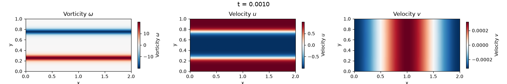

# Kevin-Helmholtz Instability

## Introduction

The Kelvin-Helmholtz instability is a fluid dynamics phenomenon that occurs at the interface of two fluids moving at different velocities. This instability leads to the formation of characteristic wave patterns and vortices.

This project aims to simulate the Kelvin-Helmholtz instability using numerical methods and parallel computing techniques. For this aim, we use the Vorticity-Streamfunction Formulation of 2D Navier-Stokes equations.

The 2D Navier-Stokes equations in the vorticity-streamfunction formulation are given by:

$$
\frac{\partial \omega}{\partial t} + (\mathbf{u} \cdot \nabla) \omega = \nu \nabla^2 \omega
$$

where:

- $\omega$ is the vorticity
- $\mathbf{u} = (u_x, u_y)$ is the velocity field
- $\nu$ is the kinematic viscosity.

The streamfunction $\psi$ is related to the velocity field by:

$$
\nabla^2 \psi = -\omega
$$
`
And the velocity components can be expressed in terms of the streamfunction as:

$$
u_x = \frac{\partial \psi}{\partial y}, \quad u_y = -\frac{\partial \psi}{\partial x}
$$

The vorticity can also be expressed in terms of the velocity field as:

$$
\omega = \nabla\times \mathbf{u} = \frac{\partial u_y}{\partial x} - \frac{\partial u_x}{\partial y}
$$

This equation can be decomposed into 3 components:

- the time derivative of the vorticity $\frac{\partial \omega}{\partial t}$,
- the advection term $A = (\mathbf{u} \cdot \nabla) \omega$,
- the diffusion term $D = \nu \nabla^2 \omega$.

A finite difference method is used to solve the problem. A structured cartesian grid is then used to discretized `omega`, `phi`, `ux` and `uy`.

Solving numerically these equations implies the following steps:

**Vorticity field computation:**

We compute the vorticity field $\omega$ at each time step by solving the vorticity transport equation. For this purpose, we use a finite difference method to discretize the spatial derivatives and an explicit Euler time-stepping scheme to advance the solution in time.

$$ \omega^{n+1}_i = \omega^n_i + \Delta t \left( A^n_i +  D^n_i \right) $$

The advection term $A^n = - \left( u_x^n \frac{\partial \omega^n}{\partial x} + u_y^n \frac{\partial \omega^n}{\partial y} \right)$ is computed using a central difference scheme:

$$A_i = -\left( u_x \frac{\omega_{i+1} - \omega_{i-1}}{2 \Delta x} + u_y \frac{\omega_{j+1} - \omega_{j-1}}{2 \Delta y} \right)$$

Same for the diffusion term $D^n$:

$$D^n_i = \nu \left( \frac{\partial^2 \omega^n}{\partial x^2} + \frac{\partial^2 \omega^n}{\partial y^2} \right)$$

that becomes using the current discretization method:

$$D_i = \nu \left( \frac{\omega_{i+1} - 2\omega_{i} + \omega_{i-1}}{\Delta x^2} + \frac{\omega_{j+1} - 2\omega_{j} + \omega_{j-1}}{\Delta y^2} \right)$$

**Computation of the streamfunction:**

The streamfunction $\psi$ is computed by solving the Poisson equation $\nabla^2 \psi = -\omega$. We use a Poisson solver based on the Fast Fourier Transform (FFT) to efficiently solve this equation in the frequency domain.

For this aim, we first compute the 2D FFT of the vorticity field $\omega$ to obtain its representation in the frequency domain called $\hat{\omega}$. Then, we solve the Poisson equation in the frequency domain by dividing $\hat{\omega}$ by the squared wave numbers $k^2 = k_x^2 + k_y^2$, where $k_x$ and $k_y$ are the wave numbers in the x and y directions, respectively. Finally, we compute the inverse 2D FFT of the result to obtain the streamfunction $\psi$ in the spatial domain.

**Velocity field computation:**

Compute the velocity field $\mathbf{u}$ from the streamfunction $\psi$ using the relations $u_x = \frac{\partial \psi}{\partial y}$ and $u_y = -\frac{\partial \psi}{\partial x}$. We use central difference schemes to approximate the spatial derivatives.

**Boundary conditions:**

We use full periodic boundary conditions. The periodic conditons are naturally managed in the discretized operators taking advantage of `np.roll`.

This step is repeated for each time step until the desired simulation time is reached. The resulting vorticity and velocity fields can be visualized to observe the evolution of the Kelvin-Helmholtz instability over time.

The domain is initialized the following vorticity:

$$\omega = \frac{1}{\delta} \left[ \cosh^{-2}\left(\frac{Y - 0.25 L_y}{\delta}\right) - \cosh^{-2}\left(\frac{Y - 0.75 L_y}{\delta}\right) \right] + A \sin\left(\frac{2\pi X}{L_x}\right)$$

The following video illustrates the evolution of the Kelvin-Helmholtz instability over time, showing the formation of characteristic wave patterns and vortices as the two fluids interact.

<video controls src="./assets/animation.mp4" title="Kelvin-Helmholtz instability"></video>


## Description of the project

### Sequential Code

A sequential version of the code is present at `python/seq/main.py`.

The code is in a single Python script and is organized into several parts for simplicity:

1) User defined global parameters
2) Argument parsing
3) Computation of internal global parameters
4) Contruction of the domain
5) Wave numbers for FFT poisson solver
6) Function definition
   - Functions of the spatial derivatives
   - Functions for the computation of the avection and diffusion terms
   - Functions for the Poisson solver
   -  Function to compute the energy
   -  Function to initialize omega
   -  Function to save the domain (snapshot) at a given timestep
7) Summary printing of the parameters
8) Main loop for the time stepping
9) Time measurement and printing of the total execution time

### Requirements

The execution of the sequential code and the tutorial require the following libraries:

- argparse
- os
- shutil
- numpy
- time
- mpi4py
- matplotlib

### How to run the sequential code

The sequential code can be easily executed using python and the default parameters:

```python
python main.py
```

Several options can be modified using command line arguments. For the list of available parameters, you can use the help page:

```python
python main.py -h

  -h, --help     show this help message and exit
  --Nx, --nx NX  Global number of grid points in the x direction
  --Ny, --ny NY  Global number of grid points in the y direction
  --Lx LX        Domain length in x
  --Ly LY        Domain length in y
  --T_end T_END  Final simulation time
  --dt DT        Time step
```

For instance, if you want a discretization of 1024 * 2048, you can change it with the following arguments:

```python
python main.py -NX 1024 -NY 2048
```

### Snapshots and visualization

As any simulation code, our sequential code has some diagnostics that enables to dump the state of the simulation at a given timestep. The function `save_snapshot` is used for this purpose.

It creates a Numpy container file with the following fields: `omega`, `ux`, `uy`, time (variable `t`), `dx`, `dy`, `Lx`, `Ly`, `nx`, `ny`. Numpy files are binary files and can not be read directly. However, simple Python code can be used to read them.

The frequency of the snapshots can be set using the global parameter `output_period`.

By default, the snapshots are stored in a folder called `diags` where the script is executed.

We provide some simple Python scripts to read and display the snapshots in the `./visualization` folder:

- `plot.py`: enables to plot a snapshot for a single timestep (using Matplotlib)

```python
# To get some help
python plot.py -h
# To plot an image
python plot.py diags/snapshot_000000.npz
```

The script generates this type of image with the voticity and the velocities:



- `animate.py`: enables to create an animation (using Matplotlib). Some options can be used to generate a mp4 video.

```python
# To get some help
python animate.py -h
# To plot an image
python animate.py diags
```

- `compare.py`: enables the comparison between two snapshots

```python
python compare.py seq/diags/snapshot_000000.npz mpi/diags/snapshot_000000.npz
```

## Instructions

The project is divided into 4 parts. Each part corresponds to a specific file:

1. [Introduction to sequential code](./instructions/1_sequential.md)
2. [Exploring the machine](./instructions/2_machine.md)
3. [Parallelization](./instructions/3_mpi.md)
4. [Performance analysis](./instructions/4_performance.md)

In addition to the instructions, a help file is available. This file will be updated as the project progresses and in response to your questions.

5. [Help page](./5_help.md)

## Assessment

You will be graded on your code and the production of a project report.

Each question is worth points based on its difficulty. Even if the code does not work, I will analyze the entire code step-by-step to see whether you have understood the concepts.

The purpose of the report is to answer the questions provided in the instructions. It must be clear and concise. There is no need to provide an introduction to the subject; simply answer the questions asked. You may use any format (TeX, .docx, etc.). The goal is efficiency and clarity.

You will submit your project by sending me an email with a link to a .zip or .tar archive containing:
- the parallel source code (the `mandelbulb.py` file)
- the report

Please note, do **not** include:
- simulation results
- other scripts

The project submission date will be announced during the course of the year.