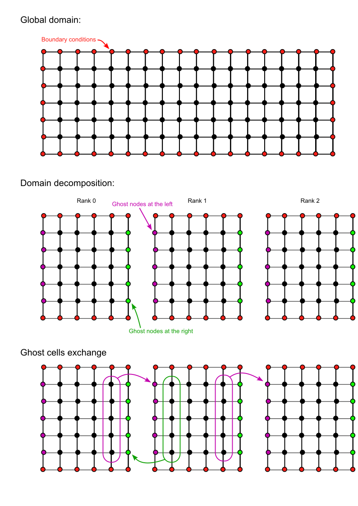

# III. Parallelization of the code via MPI

In this third part, we will parallelize the sequential program using the message-passing paradigm, specifically the MPI standard.

**Preparation :** Make a copy of the `sequential` folder and call it `mpi`. You should work in the `mpi` folder and keep the `sequential` one.

You will parallelize the code step by step. First, it is recommanded to comment the lines of code that are not yet parallelized and to uncomment it step by step as you progress. By this way, you can test the code without crashing.

**Question 3.1 - MPI initialization** 

a) Add in the library section the import of `mpi4py`.

b) After the section `Internal parameters`, we will create a new section called `MPI initialization`. In this section:

- initialiaze MPI
- get the total number of cores available
- get the rank for each MPI process

c) Add the MPI finalization at the end

d) Uncomment the `Parameters summary` section and add the code so that only rank 0 can print the messages. Add additional prints for the MPI properties

e) Uncomment and add the code so that only rank 0 can call the function `prepare_output_dir` that is used to create the snapshop directory

f) Run the code to test that the MPI init is working correctly

**Question 3.2 - Domain decomposition**

The next step is the domain decomposition. For simplicity, we will devide the domain into blocks only the `x` direction.



For this aim, each rank will have a local version of `omega`, `psi`, `ux` and `uy`.

For `omega` and `psi`, we will have to add extra column for the management of the ghost cells.

a) Add in the global parameters a variable for the number of ranks to use to divide the domain. Add it as well in the `command line arugment` section (`argparse`) so that you can change this parameter by command line.

b) Uncomment the section `domain definition`.

c) Compute for each rank, the local size `nx_local`, the first `ix_start` and last index `ix_end` of the local grid. Then create the local x axis with the extra ghost cells.

d) Update the definition of the meshgrid `X` and `Y` and the different arrays `omega`, `phi`, `ux` and `uy` so that it only represents the local subdomain and not the whole domain.

e) Add in the section `Parameters summary` the print of the local size and indexes, check that the domain is well divided.

f) Update the function `initial_vorticity` and check that `omega` is well initialized

**Question 3.4 - Parallel poisson solver:**

To parallize the poisson solver using MPI, we need to perform a parallel FFT. Unfortunately, we can perform a local FFT to each domain without affecting the numerical accuracy. There are therefore 2 solutions proposed for this project:

1) **Easy but not efficient:** You can use MPI to gather in rank 0 all subdomains for `omega`, perform the Poisson solver on Rank 0 and then redistribute the solution of `phi` to the different ranks.

2) **Efficient solution:** there is a parallel implementation of fft using MPI via the library `mpi4py_fft`.

Here is an example on how to use `mpi4py_fft`for our specific case:

```python
from mpi4py_fft import PFFT, newDistArray

# Create a Distributed FFT Plan

pfft = PFFT(comm, (Nx, Ny), axes=(0, 1), dtype=np.float64)

# Physical space (forward_output=False)
omega_dist = newDistArray(pfft, forward_output=False)
psi_dist = newDistArray(pfft, forward_output=False)

# Fourier space (forward_output=True)
omega_hat_dist = newDistArray(pfft, forward_output=True)
psi_hat_dist = newDistArray(pfft, forward_output=True)

# Get the local slice of the distributed array in the Fourier Space
sl = psi_hat_dist.local_slice()

# Extract local wave numbers using sl
kx_loc = kx[sl[0]]  # Local x wave numbers
ky_loc = ky[sl[1]]  # Local y wave numbers
KX_loc, KY_loc = np.meshgrid(kx_loc, ky_loc, indexing='ij')

# Local K² for Poisson solver
K2_mpi4py_loc = KX_loc**2 + KY_loc**2 

K2_mpi4py_loc[0, 0] = 1.0  # Avoid division by zero for the mean mode

# Copy local data to the distributed array
omega_dist[:] = omega_local  # omega_local: (nx_local, Ny)

# Forward FFT performed in parallel
pfft.forward(omega_dist, omega_hat_dist)

# Modify Fourier-space data (e.g., solve Poisson equation)
psi_hat_dist[:] = omega_hat_dist / K2_mpi4py_loc

# Backward FFT performed in parallel
pfft.backward(psi_hat_dist, psi_dist)

psi_local = np.array(psi_dist, copy=True)  # Convert to numpy array
```

a) Try to implement the `mpi4py_fft` solution in the function `solve_poisson`, if you have difficulties ot if you want to compare with another method, you can as implement the first one.

b) Compute the local `psi` using `solve_poisson` in the section `Initial conditions` and check that the result is correct.

**Question 3.4 - Ghost cell exchange:**

a) Create a function `exchange_ghosts` that use MPI functions to exchange the ghost nodes according to the figure above.

b) Call this function after the computation of `psi` in the initial conditions and check it works correctly. This stage, the main time loop is still commented.

c) Uncomment and update the function `d_dx` to perform the derivative only on the local subdomain.

d) Uncomment and update the velocity field `ux` and `uy` using `d_dx`. Check that the results are correct.

e) Update the computation of the energy so that it can be computed using MPI at the end of the initialization. The rank 0 should be able to get the final total value. Check that the result is the same as the sequential code.

**Question 3.5 - Main time loop**

You now have almost all the components to perform the time loop in parallel.

a) Uncomment the full time loop except the computation of the timers and the snapshops.

b) Then, make sure that all the prints are only handled by rank 0. You can make a first run in parallel and check that the energy is the same as in the sequential version.

c) We will now adapt the function `save_snapshot` to make it worlk with MPI. There are several methods to do that:

1) **Simple and inefficient method:** As for the FFT, the simple version consists on gathering all subdomain in rank 0 and to let this rank producing the snapshop using the same function. This method is however not scalable.

2) **Parallel writing:** Another solution consists in having all ranks creating their own file. Then, after the simulation, the visualization scripts have to be adapt to read the different pieces of the puzzle. This method is more scalable than the previous one but will rapidly reach a limit due to the capacity of the file system of your machine to create multiple files at the same time.

3) **Using parallel libraries for this aim such as HDF5 or Adios:** this is the best solution but out of the scope of this project.

For simplicity, implement only the first method. During the performance tests, we will deactivate the snapshots.

