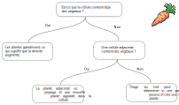
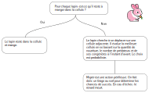
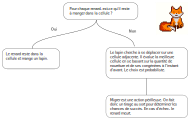

# Jeu de la vie avancé


## Présentation du concept

[Le jeu de la vie](https://fr.wikipedia.org/wiki/Jeu_de_la_vie) est un simulateur
simplifié de comportement cellulaire inventé
par le mathématicien John Horton Conway en 1970.
Le jeu présenté ici s'inspire de l'idée du jeu de la vie même si les propriétés
mathématiques du jeu d'origine ne sont pas conservées (Turing complet par exemple).
Le but de ce TP est d'utiliser un simulateur de vie ludique à 3 espèces en
se basant sur des règles simples d'interaction entre ces dernières.
Ce simulateur ne se veut en aucun cas une description réaliste ou un modèle scientifique
contrairement à d'autres TPs de ce cours.

Le jeu est donc composé de 3 espèces qui évolueront librement dans un domaine
fermé suivant des règles de survie propre à chacune d'elles.
Les 3 espèces sont les suivantes:
- la végétation
- les lapins
- les renards

L'idée principale est d'avoir 3 types d'espèce classique que sont les végétaux,
les proies herbivores et les prédateurs carnivores.

### Le domaine

Chaque espèce est modélisée par une grille cartésienne.
Le domaine est donc découpé en cellules.
Chaque cellule représente la densité de végétaux
ou la quantité d'individus dans ce sous-espace.
Nous raisonnons donc de manière très schématique.
Les individus sont partiellement modélisés individuellement
au sein d'une cellule puis se reconfondent avec l'ensemble.
Il n'y a pas de suivi individuel au cours de toute la simulation.
Il s'agit avant tout d'une approche statistique.
Les individus ne peuvent se déplacer que d'une cellule à une autre.

### Notion d'itérations

Le temps s'écoule de manière discrète sous forme d'itération.
A chaque itération, les individus ne peuvent exécuter qu'une série d'action dépendante de leur espèce.
Ces actions sont décrites dans les sous-sections suivantes.
Chaque espèce possède donc 2 grilles, une grille pour représenter le moment
présent et une autre pour représenter l'état du domaine à l'itération précédente.
Les individus ne peuvent utiliser que la grille au temps précédent pour décider d'une actions.

### Fonctionnement des végétaux

Les végétaux obéissent aux comportements décrits dans le diagramme suivant.



### Fonctionnement des lapins

Les lapins obéissent aux comportements décrits dans le diagramme suivant.



### Fonctionnement des renards

Les renards obéissent aux comportements décrits dans le diagramme suivant.



### Conditions aux bords

Le domaine est fermé ce qui fait que les individus ne peuvent ni entrer ni sortir de ce dernier.
On fonctionne en vase clos.

## Description du répertoire

Ce TP se compose de plusieurs répertoires :
- [cpp/sequential](./cpp/sequential) : ce dossier contient le fichier source du code séquentiel et le makefile pour le compiler.
- [scalings](./python) : ce dossier contient des scripts permettant d'afficher les courbes de scalabilité présentées à la fin de ce document.
- [visualization](./python) : ce dossier contient des scripts dédiés à la visualisation des résultats.
- [consignes](./consignes) : ce dossier contient les consignes du TP
- [.extra](./.extra) : ce dossier sert uniquement pour GitHub

## Le code séquentiel

### Description

Le code est écrit en C++.
Le programme est écrit dans une philosophie C et le C++ n'est là que pour simplifier certains aspects via la bibliothèque standard.
Il ne se compose que d'un unique fichier `main.cpp`.
La découverte de ce sujet constitue la première partie du TP.

### Les dépendances

Ce programme nécessite l'installation d'un compilateur C++.

Pour le TP, vous aurez besoin d'installer un compilateur équipé d'OpenMP.
C'est normalement le cas de la plupart des compilateurs récents.
C'est le cas sur les postes de travail de l'université.

Vous aurez aussi besoin d'installer une bibliothèque MPI.
Sur les postes de travail de l'université, OpenMPI est déjà installé.
Pour l'installer sur vos ordinateurs personnels, utilisez les instructions
dans le dossier [./documentation](../../documentation/mpi.md).

### Compilation et exécution

Pour compiler ce programme, vous pouvez tout simplement utiliser le makefile dans le dossier des sources en tapant dans votre terminal :
```bash
make
```

 Le makefile est là pour vous simplifier la vie.
 Il est possible aussi de compiler à la main.

Si jamais vous avez des problèmes de compilation, vous pouvez faire `make clean` avant de faire `make`, cela permet de nettoyer le dossier des anciens fichiers temporaires.
```bash
make clean
```

La compilation génère un fichier exécutable du nom de `executable`. Vous pouvez lancer le programme en faisant :
```bash
./executable
```

### Arguments en ligne de commande

Il est possible de changer certains paramètres numériques directement en ligne de commande :

```bash
./executable -nx 128 -ny 256 -it 1000
```

- `-nx`: nombre de cellules dans la direction x
- `-ny`: nombre de cellules dans la direction y
- `-it`: nombre d'itérations

### Visualisation

Le code génère plusieurs type de sorties (fichier sur le disque dur):
- fichier binaire représentant le contenu des grilles à une itération donnée (`diag_*.bin`).
- fichier ascii représentant le contenu des grilles à une itération donnée (`diag_*.dat`).
- fichier binaire contenant l'évolution en temps de certaines grandeurs réduites (du nom de `scalars.bin`)

Les fichiers sont toujours écrits dans un dossier `diags`.
Il est toujours préférable d'utiliser des fichiers binaires plutôt que des fichiers ascii car:
- ces derniers sont beaucoup moins lourds sur le disque
- sont plus rapides à écrire
- plus rapides à relire
- représentent la donnée brute sans transformation ou troncature

Des scripts Python vous sont fournis pour vous aider à visualiser ces données.
Vous pouvez aussi utiliser vos propres scripts dans le langage de votre choix.
Les scripts sont dans le dossier [visualization](./visualization):
- [plot_binary.py](./visualization/plot_binary.py)

```bash
python -i plot_binary.py <chemin vers un fichier diag_*.bin>
```

- [plot_ascii.py](./visualization/plot_ascii.py)

```bash
python -i plot_ascii.py <chemin vers un fichier diag_*.dat>
```

- [animate.py](./visualization/animate.py)

```bash
python -i animate.py <chemin vers un dossier diags>
```

- [plot_scalar.py](./visualization/plot_scalar.py)

```bash
python -i animate.py <chemin vers un fichier scalars.bin>
```

Voici un exemple d'image produite par la lecture du fichier `diag_100.bin` via le script `plot_binary.py`.


## Consignes de TP
