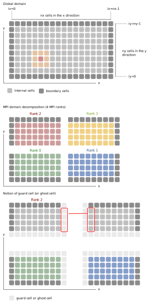

### III. MPI

Dans cette troisième partie, nous allons paralléliser le programme séquentiel en utilisant la méthode par passage de message et plus spécifiquement le standard MPI.

**Préparation :** Faites maintenant une copie du dossier `sequentiel` et appelez-le `mpi`.
On modifiera les sources de ce dossier pour y introduire la parallélisation MPI.

**Question 4.1 - makefile :** En premier lieu, il nous faut modifier le makefile pour pouvoir compiler avec MPI.
Pour cela ouvrez le fichier `makefile` et remplacer `g++` par `mpic++` en tant que compilateur C++ (`CPP`).
Supprimez les *flags* faisant référence à OpenMP : `-fopenmp`.
L'entête du makefile devrait ressembler à ça :
```makefile
# Fortran compiler (MPI wrapper)
CPP = mpic++
```

La variable `CPPFLAGS` se limite à l'optimisation de niveau 3 :
```makefile
# Optimization
CPPFLAGS += -O3
```

Il est tout à fait possible de compiler un code séquentiel avec le *wrappper* MPI puisqu'il s'agit simplement d'un *wrapper* faisant appel au compilateur standard (`g++` ici).
Compilez le code en faisant `make` pour vous assurer qu'il n'y a pas d'erreur dans le makefile.

**Question 3.1 - Initialisation de MPI :** Nous allons commencer par préparer le programme pour MPI.

a) Commencez par inclure le header MPI dans le fichier [main.cpp](../cpp/main.cpp).
Notez que dans un programme composé de plusieurs sources, il faudrait l'inclure dans chaque fichier où serait appelées des fonctions MPI.

b) Effectuez l'initialisation de MPI au début du fichier [main.cpp](../cpp/main.cpp).
Rajoutez la déclaration des nouveaux paramètres nécessaires à MPI là où tous les paramètres sont déclarés.
Placez l'initialisation de MPI après la déclaration des paramètre avant la configuration par défaut.

c) Toujours au début de [main.cpp](../cpp/main.cpp), ajoutez les fonctions permettant de récupérer le nombre de rang et le rang du processus en cours.
Aidez-vous du premier exercice sur MPI si besoin `1_initialization`.

d) Ensuite, rajoutez la fonction permettant de finaliser MPI tout de suite à la fin du programme.

e) Pour tester notre programme au fur et à mesure de l'implémentation, nous allons commenté la boucle en temps pour le moment.

f) Pour le moment compilez votre programme sans l'exécuter.
Si des erreurs de compilation apparaissent, corrigez les avant de passer à la suite.

**Question 3.2 - Action réservée au rang 0 :** Il est important de se rappeler que dans un programme MPI, le code que vous écrivez après l'initialisation de MPI est exécuté par tous les rangs. Cela diffère d'OpenMP pour lequel le code exécuté en parallèle dépend de l'emplacement des directives.
Néanmoins, la similitude peut être faite avec l'ouverture d'une région parallèle en OpenMP à partir de laquelle le code est exécuté par tous les *threads*.
A partir de là, il est important d'identifier les zones que l'on souhaite être exécutées que par un seul rang.

a) Faites en sorte que seulement le rang 0 puisse créer le dossier `diags`:
```C++
system("mkdir -p diags");
```

b) L'affichage d'information dans le terminal doit également
n'être effectué que par un rang pour la lisibilité.
Faites en sorte que seul le rang 0 puisse faire l'affichage des informations de sortie.
Bien sûr, pour le débogage, rien de vous empêche de demander à un autre rang d'afficher des informations.
N'oubliez pas l'affichage des *timers* à la fin du programme.

c) Dans le section de code `Terminal output summary`, rajoutez l'affichage des informations relatives à MPI.

d) Compilez le code et exécutez le avec 1 rang MPI pour voir le résultat.

**Question 3.3 - Timers :** Nous allons changer le calcul du temps en remplaçant la fonction `gettimeofday` et rendant le calcul compatible avec le parallélisme MPI.
Chaque rang possèdera son propre *timer*.
Etant donné que ce temps n'est pas forcément le même pour tous en fonction de la charge de travail à traiter, on affichera à la fin dans le bilan des *timers* le temps maximal, minimal et la moyenne sur l'ensemble des rangs.

a) En premier lieu, nous allons remplacer tous les appels à la fonction `gettimeofday` par la fonction MPI `MPI_Wtime()` plus adaptée.

Chaque processus MPI va donc faire un calcul local du temps passé dans chaque partie.
Le bilan des *timers* ne seront affichés que par un seul processus.
En revanche, nous allons faire quelques statistiques en affichant le temps minimal, moyen et maximal entre tous les processus pour plusieurs parties du code.

b) Mettre à jour la partie `Summary of the timers` afin d'afficher, par le processus de rang 0 uniquement,  le temps minimal, moyen et maximal calculés entre tous les processus.
Des communications seront nécessaires et vous devrez utiliser les fonctions MPI adéquates.
Il faut en utiliser le moins possible.

Pour l'affichage, vous pouvez utiliser cette portion de code pour remplacer l'entête:

```C++
std::cout << " ------------------------------------ "<< std::endl;
std::cout << " TIMERS"<< std::endl;
std::cout << " ------------------------------------ "<< std::endl;
std::cout << "            code part |   min (s)  | averag (s) |   max (s)  | percentage |"<< std::endl;
std::cout << " ---------------------|------------|------------|------------|------------|"<< std::endl;
```

N'oubliez pas que seul le rang 0 s'occupe de l'affichage.
Par ailleurs, pour le calcul du pourcentage, utilisez le temps moyen.

Pour le moment, seul l'initialisation et la boucle itératives complète sont comptabilisées.
Plus tard, nous ajouterons des *timers* plus précis.

f) Compilez le code et exécutez le en demandant un et plusieurs processeurs pour vérifier que tout fonctionne.
Par exemple:
```bash
mpirun -np 2 ./executable
```

**Question 4.6 - Topologie :** Nous allons découpé notre domaine global en sous-domaine.
Chaque sous-domaine sera géré par un rang MPI unique.
Il y aura donc autant de sous-domaines que rangs.
Pour cela, nous allons utiliser la notion de topologie cartésienne vue dans le cours.
Pour cette question, aidez vous de l'exercice MPI 7 sur la construction d'une topologie cartésienne.

Le modèle de décomposition utilisé ici est décrit dans la figure ci-dessous :



a) Ajoutez la déclaration des paramètres permettant de construire la topologie cartésienne au début de [main.cpp](../cpp/main.cpp).

b) L'appel aux fonctions MPI se fera après la lecture des paramètres en ligne de commande.
Dans la lecture des arguments en ligne de commande, rajoutez un argument `-r` pour récupérer le nombre de rangs dans chaque direction.

```C++
// ...
} else if (key == "-r") {
    ranks_per_direction[0]= atoi(argv[iarg+1]);
    ranks_per_direction[1]= atoi(argv[iarg+2]);
    iarg+=2;
}
```

c) Ajoutez une condition afin de vérifier que le nombre total de rangs est cohérent avec le nombre de rangs par direction spécifié par l'utilisateur. C'est à dire que le nombre de rangs dans la direction x multiplié par le nombre de rangs dans la direction y doit être égal au nombre total de rangs.

d) Ajoutez dans `Particles::initTopology` les fonctions permettant de créer une topologie cartésienne 2D (`MPI_Cart_create`, `MPI_Comm_rank` et `MPI_Cart_coords`).

e) Utilisez `MPI_Cart_shift` pour déterminer les voisins dans les directions `x` et `y`.

**Important :** Je vous rappelle que la convention choisie par les développeurs de MPI fait que la coordonnée continue est la dernière dimension.
Dans ce TP, l'axe continu (indice continu dans le déroulement des boucles) est l'axe des `x`.

f) Déclarez les nouveaux paramètres représentant le nombre de cellules (`nx_loc`, `ny_loc`) ainsi que l'origine de chaque sous-domaine.
