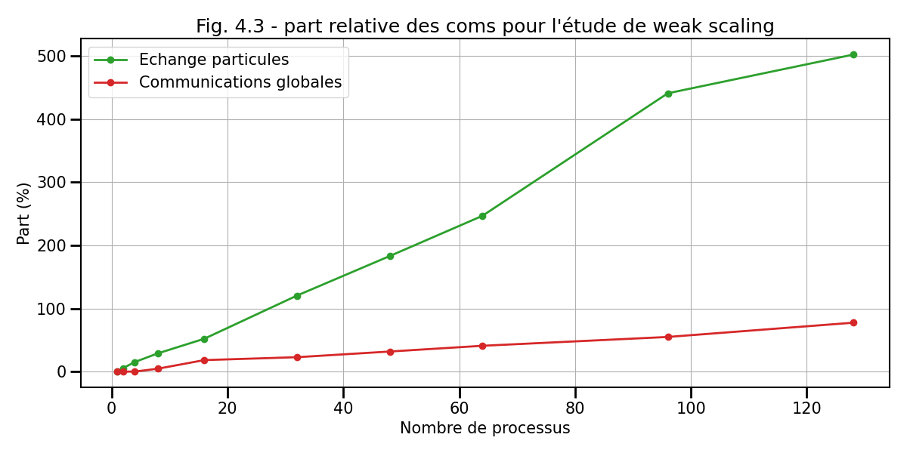

## IV. Etude de performance

Dans cette dernière partie, nous allons maintenant étudié la performance du code parallèle.
Pour cela nous allons regardé les deux types de passage à l'échelle que sont le *weak* ou *strong scaling*.
Dans chaque cas, vous serez amené à faire d'abord votre propre étude puis à étudier une étude faite sur un super-calculateur.

### 4.1. Weak scaling

Regardons dans un premier temps le passage à l'échelle faible ou *weak scaling*.
Pour rappel, ce type d'étude consiste à regarder comment évolue l'efficacité du 
code lorsque l'on augmente le nombre de processus tout en gardant la 
charge constante par unité de calcul.

### 4.2. Strong scaling

Regardons maintenant le passage à l'échelle fort ou *strong scaling*.
Pour rappel, ce type d'étude consiste à regarder comment évolue l'efficacité du 
code lorsque l'on augmente le nombre de processus tout en gardant la 
charge globale constante.