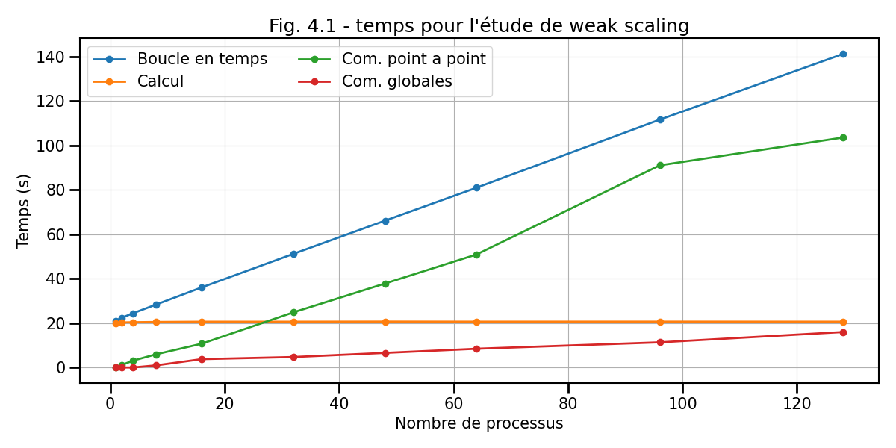
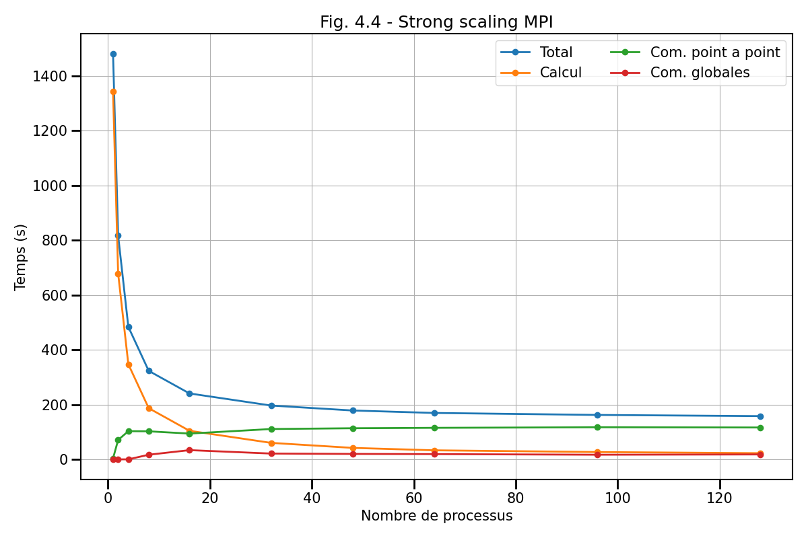
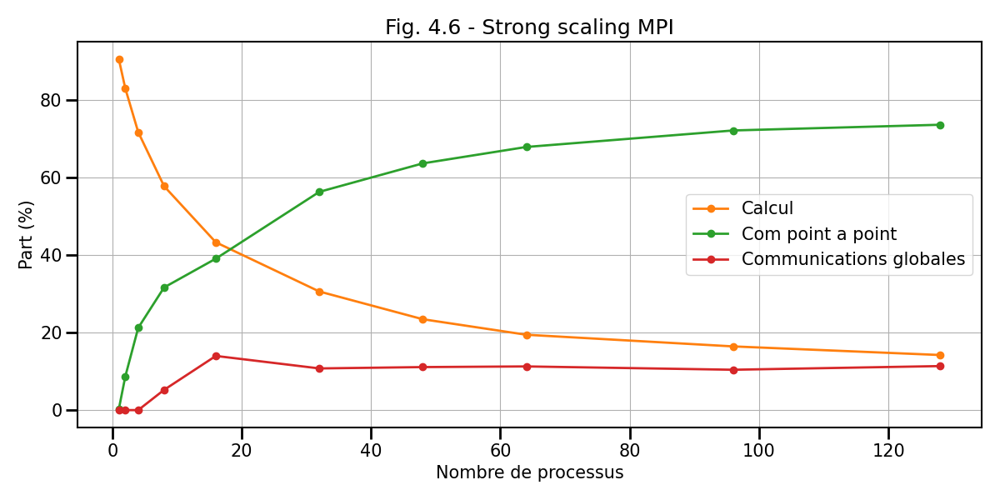

## IV. Etude de performance

Dans cette dernière partie, nous allons maintenant étudier la performance du code parallèle.
Pour cela nous allons regarder les deux types de passage à l'échelle que sont le *weak* ou *strong scaling*.
Dans chaque cas, vous serez amené à faire d'abord votre propre étude puis à étudier une étude faite sur un super-calculateur.

### 4.1. Weak scaling

Regardons dans un premier temps le passage à l'échelle faible ou *weak scaling*.
Pour rappel, ce type d'étude consiste à regarder comment évolue l'efficacité du
code lorsque l'on augmente le nombre de processus tout en gardant la
charge constante par unité de calcul.

a) Effectuez un test de weak scaling en choisissant les paramètres de votre choix (taille de grille, nombre de processus MPI...) et en les justifiant.

b) Affichez la courbe en temps et d'efficacité correspondante en y faisant apparaître le temps dans chaque partie:
- calcul
- communications point à point
- communications globales 

Nous allons maintenant étudier une étude réalisée sur quelques nœuds du de la partition ARM du calculateur TGCC équipé des processeurs Fujitsu A64FX.
Chaque domaine MPI a une dimension de 512 x 512 cellules pour chaque espèce.

c) Calculez quel est le coût mémoire théorique d'un domaine MPI en ne considérant que le poids des grilles (et pas toutes les petites variables)

d) Commentez ce *weak scaling* en vous aidant de toutes les courbes

### 4.2. Strong scaling

Regardons maintenant le passage à l'échelle fort ou *strong scaling*.
Pour rappel, ce type d'étude consiste à regarder comment évolue l'efficacité du
code lorsque l'on augmente le nombre de processus tout en gardant la
charge globale constante.

a) Effectuez un test de *strong scaling* en choisissant les paramètres de votre choix (taille de grille, nombre de processus MPI...) et en les justifiant.

b) Affichez la courbe en temps et d'efficacité correspondante en y faisant apparaître le temps dans chaque partie:
- calcul
- communications point à point
- communications globales

Nous allons maintenant regarder l'étude de *strong scaling* réalisée sur le calculateur TGCC.
On utilise un domaine de taille 6144 x 6144 cellules pour chaque espèce.

c) Commentez ce *weak scaling* en vous aidant de toutes les courbes

