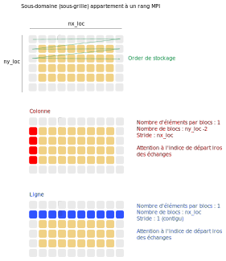

# Aide et conseils

## Conseils :
- je n'ai insisté là dessus en classe mais un code commence toujours par une feuille de papier et un crayon.
- Prenez le temps de dessiner les matrices et les blocs avec les cellules fantômes. 
- Réfléchissez au sens des différents Paramètres comme les indices `nx`, `ny`, `origin_x`, `nx_loc`... Et comment ils sont reliés entre eux.
- Gardez à l'esprit l'idée que la mémoire est toujours unidirectionnelle. Il y a donc une direction contiguë et une autre ave un *stride*. Reprenez les exercices si besoin.
- Faites vos développements par étape, une fonction après l'autre en commentant les parties du code restantes.
- compilez et exécutez après chaque étape pour voir
- Faites des tests sur des petites matrices pour commencer
- Utiliser les `cout` pour afficher des informations temporairement
- si ça ne marche pas, testez rapidement la fonction dans un petit programme externe tout simple.

## Aide pour le projet

### 1. Arguments en ligne de commande

On ajoute ainsi la lecture du nombre de rangs dans chaque direction 
dans la lecture des arguments en ligne de commande.

```C++
} else if (key == "-r") {
    ranks_per_direction[0]= atoi(argv[iarg+1]);
    ranks_per_direction[1]= atoi(argv[iarg+2]);
    iarg+=2;
} else 
...
```

### 2. Dimensionnement des blocs.

Voici la manière de dimensionner les blocs. 
Sans les cellules fantômes, les blocs ont une taille facile à calculer :

```C++
// Computation of the local (rank-level) number of cells
nx_loc = nx / ranks_per_direction[1];
ny_loc = ny / ranks_per_direction[0];
```

Cela nous permet d'en déduire l'origine du bloc par rapport à la matrice globale

```C++
// Origin of each rank in the global indexing
origin_x = rank_coordinates[1] * nx_loc;
origin_y = rank_coordinates[0] * ny_loc;
```

On ajoute ensuite les cellules fantômes :

```C++
// We add the boundaries and the ghost cells
nx_loc += 2;
ny_loc += 2;
```

Attention, il ne faut pas garder du coup le code suivant venant du mode séquentiel.

```C++
// We add the boundaries and the ghost cells
nx += 2;
ny += 2;
```


### 3. Création des types

Le type `MPI_Type_vector` est nécessaire pour décrire une colonne 
à cause du stride mais un type `MPI_Type_contiguous` est suffisant pour 
décrire une ligne bien qu'un `MPI_Type_vector` fonctionne aussi.

Le schéma suivant vous aidera à dimensionner vos types dérivés.



Attention ensuite à bien calculer l'indice de départ dans les fonctions d'échange.

### 4. Echange des cellules fantômes

Pour les échanges, vous devez utiliser les paramètres `rank_neighbors_mx`, 
`rank_neighbors_px`, `rank_neighbors_my`, `rank_neighbors_py` qui vous 
donne les rangs voisins.
