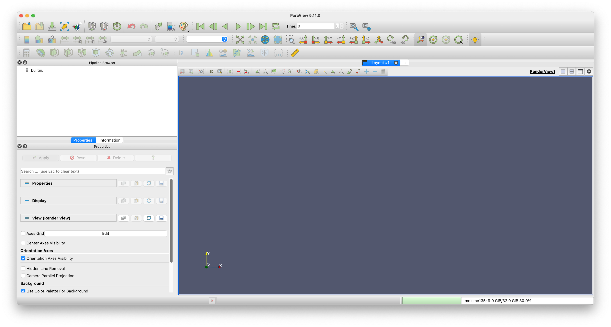
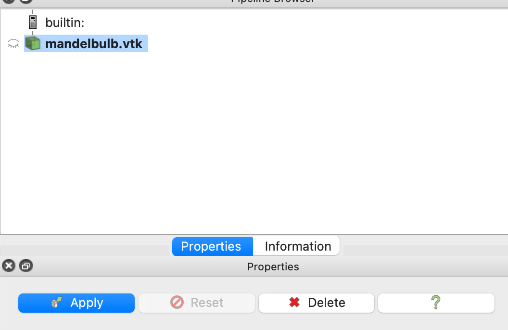
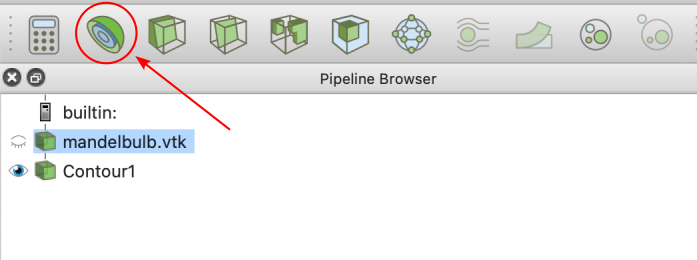
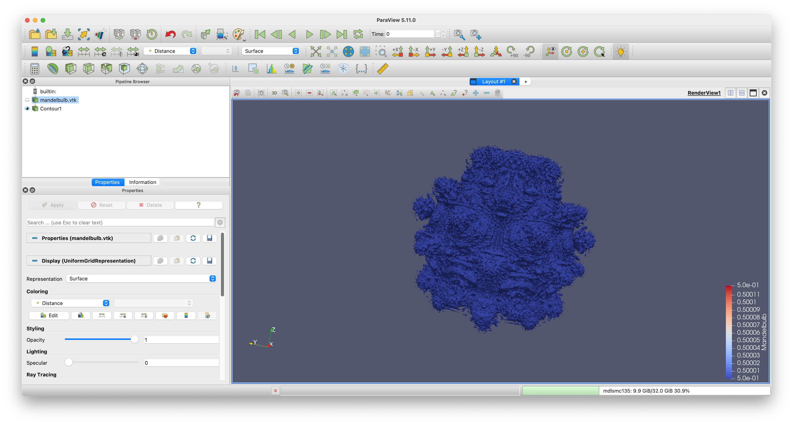
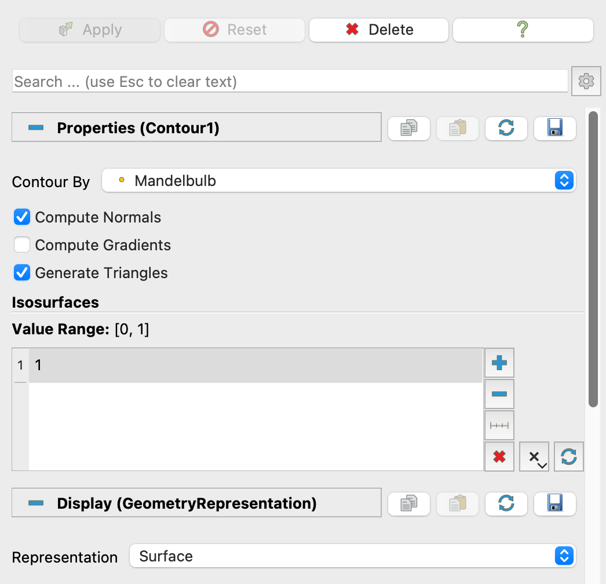
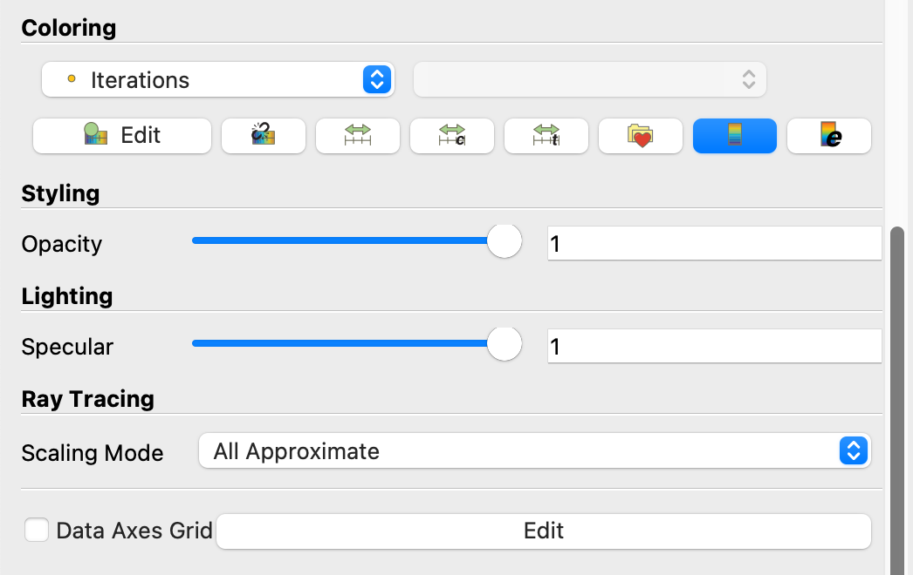
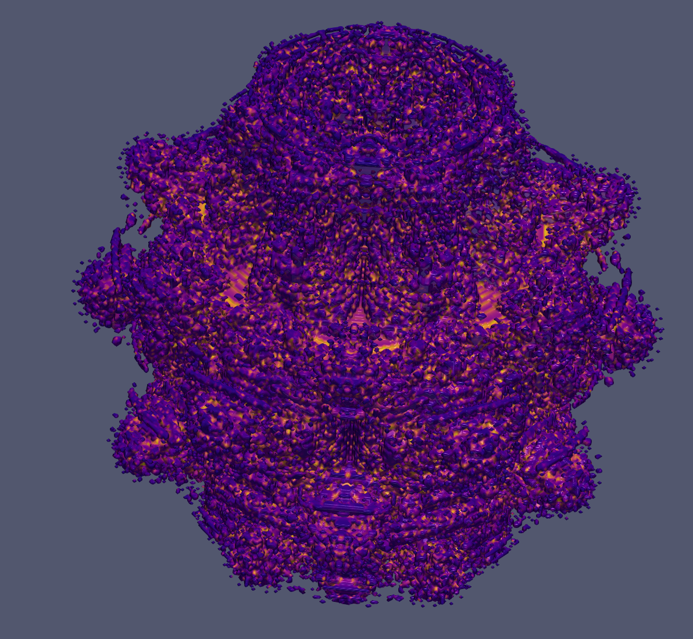

# I. Découverte du code séquentiel

Cette première partie a pour but de vous familiariser avec le code séquentiel fourni.
Vous pouvez le faire tourner sur Ruche en n'utilisant qu'un seul coeur ou sur votre ordinateur personnelle.

**Question 1.1 - première exécution :** Ouvrez le fichier `mandelbulb.py` et prenez le temps de le comprendre. Une fois que vous avez une bonne vision du fonctionnement du code séquentiel, compilez et exécutez-le avec les paramètres par défaut.

**Question 1.2 - visualisation :** L'exécution génère un fichier `mandelbulb.vtk` qu'il est possible de visualiser avec le logiciel `Paraview`. Nous allons voir comment visualiser les résultats de l'exécution étape par étape.

Paraview est un logiciel de visualisation et d'analyse de données 3D. Il est très utilisé dans le domaine de la simulation numérique pour visualiser les résultats de calculs. Il est gratuit et téléchargeable sur le site officiel de [Paraview](https://www.paraview.org/download/). Il est également possible de l'obtenir via les gestionnaires de paquets classiques. Sur beaucoup de supercalculateurs, il est aussi déjà installé.

- a) Si vous utilisez votre ordinateur personnel, téléchargez et installez Paraview. Puis ouvrez le logiciel. Vous obtenez une interface proche de celle-ci :

- b) Dans le menu `File`, cliquez sur `Open` et sélectionnez le fichier `mandelbulb.vtk` généré par le code séquentiel. Le nom du fichier apparaît dans la fenêtre `Pipeline Browser` à gauche de l'interface :

- c) Appuyez sur le bouton `Apply` pour visualiser le Mandelbulb. Pour le moment rien n'apparaît sauf un cube blanc représentant le domaine de calcul. On va maintenant choisir un type de représentation pour visualiser le Mandelbulb. Dans le menu en haut à gauche, cliquez sur le logo désignant des *Contour* our isosurfaces :

A ce moment là, le mandelbulb s'affiche avec une couleur par défaut.

- d) Il est maintenant possible de modifier la valeur de l'isovaleur pour visualiser le Mandelbulb avec plus ou moins de détails :

- e) On peut aussi adopter une couleur plus adaptée pour visualiser le Mandelbulb. Pour cela, dans le menu `Coloring`, sélectionnez `Iterations` au lieu de `Mandelbulb`. La couleur dépendra maintenant du nombre d'itérations nécessaires pour la zone considérée. 

Vous pouvez aussi choisir une palette de couleur plus adaptée en cliquant sur `Edit Color Map`. Dans l'exemple ci-dessous, on a choisi la palette `Plasma` :

Il existe de nombreuses autres options pour améliorer le rendu. A vous d'explorer en fonction de vos envies.

- f) Sauvegardez une image de votre visualisation en cliquant sur `File` puis `Save Screenshot` et placez-la dans votre rapport de projet.