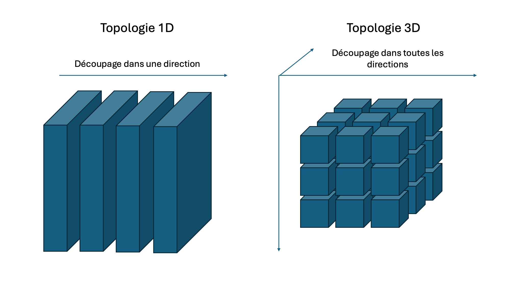
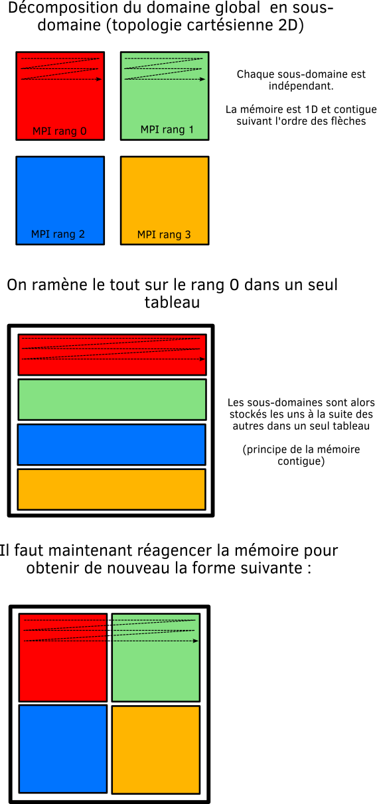

# III. Parallélisation du code via MPI

Dans cette troisième partie, nous allons paralléliser le programme séquentiel en utilisant la méthode par passage de message et plus spécifiquement le standard MPI.

**Préparation :** Faites maintenant une copie du dossier `sequential` et appelez-le `mpi`.
On modifiera le fichier `main.py` dans `mpi` pour y introduire le parallélisme.

L'introduction du parallélisme se fera étape par étape. Avant de démarrer, nous allons commenter les lignes de code qui ne sont pas encore parallélisées pour introduire la parallélisation MPI au fur et à mesure :

* l'affichage dans le terminal
* les *timers*
* la boucle de calcul
* La sortie des fichiers sur disque

**Question 3.1 - Initialisation de MPI :**

a) Commencez par inclure la bibliothèque MPI `mpi4py` au moment de l'importation des autres bibliothèques.

b) Mettez en place l’initialisation et la finalisation de MPI. On placera l'initialisation de MPI avant l'étape d'initialisation des paramètres.

c) Faites en sorte de pouvoir récupérer le nombre de rangs total et le rand de chaque processus.

d) Décommettez l'affichage du résumé dans le terminal, ajoutez les paramètres MPI et faites en sorte que seul le rang 0 fasse l'affichage.

f) Exécuter le programme avec un seul rang MPI pour vérifier que tout fonctionne jusque-là (cela évite de découvrir des erreurs plus tard).

**Question 3.2 - Création de la topologie cartésienne :**

Nous allons maintenant à la suite de l'initialisation de MPI construire notre topologie cartésienne. Cette topologie sera utilisée pour diviser le domaine en sous-domaines.

Vous avez le choix de choisir une topologie 1D (parallèlisme dans une seule direction) ou de tenter une topologie 3D (parallèlisme dans toutes les directions). Le choix d'une topologie 3D rapportera des points supplémentaires mais élève la difficulté.

a) Ajoutez un argument en ligne de commande `--ranks_per_dir` permettant de récupérer le nombre de rang MPI dans chaque direction `x`, `y` et `z`

b) Ajouter les paramètres nécessaires à la construction de la topologie cartésienne au début du programme et appelez les fonctions MPI pour la construire. Vous placerez cette étape après l'initialisation de MPI.

c) Calculez pour chaque rang MPI la taille du sous-domaine, l'indice du premier et dernier index de chaque sous-domaine par rapport au domaine global. Vous en aurez besoin pour allouer les tableaux locaux et définir la boucle locale.

d) Afin de vérifier que tout fonctionne, ajouter l'affichage des propriétés de chaque processus MPI dans la section `Terminal output summary`.

**Question 3.3 - Décomposition de domaine :**

Maintenant que la topologie cartésienne est en place, on va pouvoir découper le domaine en sous-domaines.
Le parallélisme par décomposition de domaine consiste à découper le domaine global en sous-domaines indépendants.
Chaque sous-domaine est géré par un processus MPI unique.
Il y a donc autant de sous-domaines que de processus MPI.
Dans le cas de ce TP, nous allons découper le domaine en sous-domaines de même taille.

a) Mettre à jour l'allocation des tableaux pour les adapter aux sous-domaines

b) Mettre à jour la boucle de calcul pour distribuer les calculs sur chaque sous-domaine.

c) Mettre à jour le calcul du temps en utilisant les fonctions MPI

d) Mettre à jour le calcul du volume du Mandelbulb en utilisant les fonctions MPI adéquates. Ajouter des *timers* pour mesurer le temps passer dans cette étape.

**Question 3.4 - Reconstitution du domaine global:**

Tous les codes parallélisés se retrouvent devant le même défi : comment rassembler toutes les pièces du puzzle pour les sorties de fichiers sur disque (aussi appelés diagnostiques). 

Il existe plusieurs méthodes :

1. Reconstituer le domaine sur l'un des rangs qui se chargent alors d'écrire le résultat sur disque
2. Chaque rand écrit son morceau de domaine dans un fichier qui lui est propre. Pour visualiser l'ensemble, il faut reconstituer le domaine a posteriori.
3. Chaque rang accède à un même fichier de manière parallèle. On appelle cela une écriture parallélisée.

De toute ces méthodes, la moins efficace est la première car elle nécessite des communications collectives couteuses. C'est un goulot d'étranglement qui aura un impact sur le passage à l'échelle. 

La méthode 2 et 3 ont des avantages et des inconvénients. Si le système de fichier est performant, la méthode 2 permet une indépendance complète des rangs. Cependant, l'étape de post-traitement peur s'avérer couteuse. La méthode 3 réduit l'étape de post-traitement et permet aussi certaines optimisations.

Afin de pouvoir mettre à jour les sorties de fichiers sur disque et visualiser les résultats de la version parallèle, nous allons opter pour la méthode 1.
Bien que moins efficace cette méthode reste pédagogique et surtout, ce cours n'aborde pas la méthode 3.
De plus nous ne la faisons qu'une fois à la fin des calculs et non à chaque itération.

a) Déclarer pour les grandeurs `domaine`, les `iteration` et la `distance`, 3 tableaux destinés à recueillir chaque sous-domaine dans le rang 0.

b) Utilisez la fonction `Gatherv` afin de reconstituer le domain global

c) Déclarer des tableaux pour chaque grandeur représentant le domaine global. Reconstituer ce domaine à partir des sous-domaines récupérés sur le rang 0. Le schéma ci-dessous pourra vous aider à comprendre le processus.

c) Faites en sorte que seul le rang 0 puisse écrire le fichier VTK.

**Question 3.5 - vérification des résultats** 

a) Vérifier que le Mandelbulb parallèle est le même que celui généré en séquentiel. Pour cela, calculez l'erreur $\Epsilon$ entre les deux. Soit $M_s$ le tableau du Mandelbulb séquentiel et $M_p$ le tableau de la version parallèle :

$
\Epsilon = \sum_{i,i,k}{\|A(i,j,k) - B(i,j,k)\|}
$

**Astuce:** Vous pouvez tout simplement écrire les tableaux numpy sur disque et calculer l'erreur en post-traitement à l'aide d'un script Python.

b) Utilisez Paraview pour visualiser le Mandelbulb obtenu grâce au code MPI.