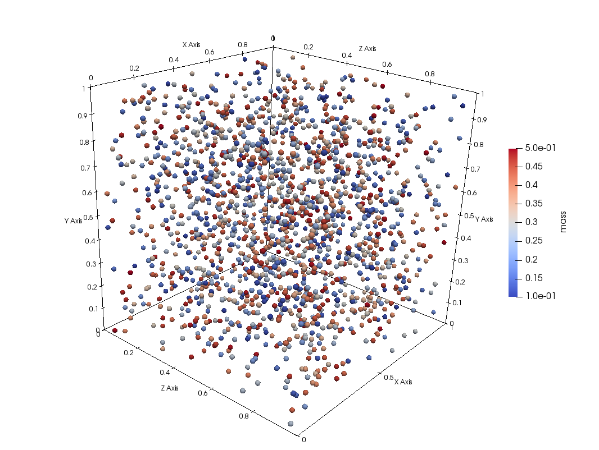

# Simulation de particules par la mécanique du point avec collisions



## Présentation des modèles

### Mouvement

Ce cas applicatif simule un ensemble de particules (sphère) par les équations classiques de Newton en 3D.
La simulation intègre l'effet des frottements et de la gravité.
Elle intègre également un module de collisions.

L'équation du mouvement qui s'applique à chaque particule est la suivante :
<p align="center"></p>

Où  est le vecteur gravité,  la masse de la particule,  un coefficient de freinage
et  le vecteur vitesse de la particule.

### Collisions

L'opérateur de collision modélise les particules comme des sphères ayant un rayon  donné.
Le modèle implémenté est inspiré des sources suivantes :
- https://www.plasmaphysics.org.uk/collision3d.htm
- https://www.plasmaphysics.org.uk/programs/coll3d_cpp.htm
- https://www.sjsu.edu/faculty/watkins/collision.htm
- https://studiofreya.com/3d-math-and-physics/simple-sphere-sphere-collision-detection-and-collision-response/
- https://sites.google.com/site/tipebillard/modelisation-des-frottements

Les collisions supposent que les moments et l'énergie sont conservés.
Soient deux particules entrant en collision, on utilise la notation  pour désigner la vitesse après la collision :
<p align="center"></p>
Et :
<p align="center"></p>

On appelle  le vecteur position d'une particule.
De fait, le changement de direction s'opère suivant la direction :
<p align="center"></p>
Et la modification sur le moment de la particule peut s'écrire :
<p align="center"></p>

On en déduit ainsi la valeur de  :

<p align="center"></p>
Et par ricochet les nouvelles vitesses après collision.

## Discrétisation et algorithmes

### Mouvement

On utilise  pour désigner la i-ème particule dans notre domaine.
On appelle  le temps courant et  le pas en temps.
La discrétisation des équations du mouvement se fait par une méthode explicite classique du type *leap-frog*.
On décompose le vecteur vitesse suivant ses 3 composantes .

<p align="center"></p>

De même, on décompose le vecteur position suivant ses 3 composantes .

<p align="center"></p>

### Collision

Cette partie décrit le fonctionnement de l'opérateur de collision.
On commencer par décrire quelques grandeurs.
On appelle  la vitesse relative entre deux particules :

<p align="center"></p>

Cela revient à se placer dans le repère de la première particule.

Et  la direction relative entre les deux positions :

<p align="center"></p>

Cela revient à placer la première particule au centre de notre repère.

La distance entre 2 particules est donnée par :

<p align="center"></p>

On dit qu'il y a collision entre deux particules lorsque la distance entre les deux centres de masse est inférieur à deux rayons 
et lorsque les deux centres continuent de se rapprocher.
Cela revient à dire que dans la direction relative des centres de masse, la vitesse projetée est positive :

<p align="center"></p>

Ces conditions imposent notre pas de temps  pour prendre en compte toutes les collisions.
Entre chaque pas de temps, la distance relative que deux particules peuvent parcourir ne doit pas dépasser deux rayons .
Dans le cas contraire certaines particules se traversent sans se collisionner.


Lorsqu'il y a collision, la vitesse des particules est actualisé suivant la méthode mathématique présentée au dessus.
On appelle la vitesse post-collsion .
Il faut ensuite actualiser les positions.
Etant donné que les particules se chevauchent au moment de la détection de la collision, il faut d'abord revenir en
arrière au moment où les particules rentrent en contact.

Pour cela, on utilise la vitesse avant collision pour déterminer le temps au moment de la collision .
Soit  le laps de temps entre le moment de la collision et le temps de simulation alors .
Le but est de déterminer ce famueux  afin de connaître les positions au moment de la collision.
Le moment de la collision est le moment où les particles rentrent en contact soit .

Cela revient à résoudre le système suivant :

<p align="center"></p>

On obtient une équation de second ordre :

<p align="center"></p>

La solutions sont nécessairement réelles si les particules se rapprochent. La bonne solution est celle qui est positivie.

On calcule donc la position au moment de la collision en faisant simplement : .
Il s'agit d'une approximation car on ne prend pas en compte la gravité et les frottements.
Une fois la position  connue, on calcule la position post-collision  grâce à la vitesse post-collision :

<p align="center"></p>

L'opérateur suppose que chaque particule ne collisionne qu'une fois avec une autre particule.
Pour cela, on utilise une algorithme à double boucles imbriquées où la seconde boucle démarre à partir de la particule .
Soit  le nombre total de particules.
```
Pour chaque particle i de 1 jusqu'à N :

    Si la particule i n'a pas déjà fait l'objet d'une collision :

        Pour chaque particule j de i+1 jusqu'à N :
            
            Si la particule j n'a pas déjà fait l'objet d'une collision :
            
                Si collision entre la particule i et j validée :
                
                    Actualisation des propriétés
                    
                    Les particules i et j sont marquées comme ayant subi une collision
```

On applique ensuite ce même opérateur plusieurs fois pour simuler les collisions multiples.

Il est possible de simuler des collisions inélastiques (perte d'énergie induite lors de la collision) en multipliant la nouvelle vitesse par un coefficient d'amortissement  de telle sorte que la nouvelle énergie de la particule vaut .

### Conditions aux bords

Les bords sont des murs réflécissants avec possibilité d'amortissement.
On définit une collision avec un mur au moment où la distance entre le mur et le centre de la particule est inférieur à .
Un mur est défini par une normal \overrightarrow{n} et un point \overrightarrow{p}. Par convention, la normale est orientée vers l'intéreur du domaine pour le calcul de la réflexion.
Comme pour les collisions entre particules, on calcule le temps au moment exact de la collision, c'est à dire quand la distance entre le mur et la particule vaut exactement .
Cela permet de calculer la position de la particule au moment de la collision avant d'actualiser sa vitesse et de calculer la position post-réflexion.

La vitesse post-réflexion  se calcule facilement par réflexion spéculaire :
<p align="center"></p>


## Description du répertoire

Ce TP se compose de plusieurs répertoires :
- [cpp/sequential](./cpp/sequential) : ce dossier contient l'ensemble des sources du code séquentiel.
- [cpp/patch](./cpp/patch) : ce dossier contient l'ensemble des sources du code séquentiel avec décomposition en sous-domaine (*patch*).
- [python](./python) : ce dossier contient des scripts dédiés à la visualization et à la comparaison des résultats (fichiers de sortie)
- [.extra](./.extra) : ce dossier sert uniquement pour GitHub

## Le code séquentiel

### Description

Le code est écrit en C++.
C'est un C++ simple n'utilisant pas de capacité avancée du C++.
Néanmoins, il est nécessaire d'être familier avec la notion de classe et de méthode.

Afin de préparer le terrain de la parallélisation, le code séquentiel a été développé en utilisant un modèle de décomposition de domaine.
Le domaine de simulation est découpé en sous-domaine que l'on appelle *patch* comme le montre la figure ci-dessous.
Chaque *patch* possède ses particules. Lorsque les particules changent de *patch*, il est nécessaire de les communiquer aux *patches* qui les reçoivent.
Dans une version séquentielle normale, la décomposition en sous-domaine est inutile.
Toutes les particules sont traitées comme appartenant au même domaine.
Néanmoins, la décomposition de domaine sera nécessaire dans les versions parallèles.


La version séquentielle avec *patch* se compose des fichiers et headers suivant :
- [main.cpp](./cpp/patch/main.cpp)
- [parameters.cpp](./cpp/patch/parameters.cpp) et [parameters.h](./cpp/patch/parameters.h) : ce fichier contient la description de structure décrivant les propriétés du domaine et de la simulation ainsi qu'une fonction permettant de lire les arguments en ligne de commande
- [particles.cpp](./cpp/patch/particles.cpp) et [particles.h](./cpp/patch/particles.h) : ce fichier décrit la classe `Particles`. Cette classe représente l'ensemble des patchs du domaine et donc l'ensemble des particules.
- [patch.cpp](./cpp/patch/patch.cpp) et [patch.h](./cpp/patch/patch.h) : ce fichier décrit la classe `Patch`. Cette classe représente un *patch* du domaine de simulation et donc que les particules de cette sous-région.
- [walls.cpp](./cpp/patch/walls.cpp) et [walls.h](./cpp/patch/walls.h) : ce fichier décrit la classe `Walls`. Celle classe représente un mur sur lequel les particules rebondissent.
- [timers.cpp](./cpp/patch/timers.cpp) et [timers.h](./cpp/patch/timers.h) : ce fichier décrit la classe `Timer`. Cette classe est utilisée pour mesurer et gérer le temps passé dans chaque fonction du code.

Dans la version par *patch*, on fait l'approximation que les collisions ne s'appliquent qu'au sein des *patches*.
Cela signifie que l'on néglige les collisions qui devraient avoir lieu entre particules de *patches* différents proches des frontières respectives.
La prise en compte de ce faible nombre de collisions nécessiteraient une complexication du code et des processus d'échange entrainant alors une complexification inutile de ce TP.

### Les processus d'échange entre *patch*

La procédure d'échange fonctionne avec les étapes suivantes :
1. Chaque *patch* identifie les particules qui doivent être transférer vers un voisin car elles ne sont plus dans ses limites spatiales.
Les particules qui sortent du *patch* sont déplacées dans des *buffers*.
Les buffers sont simplement des tableaux de particules pour mise en attente avant transfert.
Il existe un buffer par directions.
En 3D par exemple chaque patch a 26 voisins.
De fait, il y a 26 directions en incluant les faces, les arrêtes et les coins.
Dans le tableau principal des particules (celles du *patch*), les particules sont simplement marquées afin de les supprimer de manière optimisée à l'étape suivante.


2. La deuxième étape est la suppression des particules ayant quittée le *patch* du tableau principale. Il est préférable d'effectuer cette opération pour toutes les particules en une fois car l'algorithme utilisé est plus efficace.
La méthode consiste à remplir les cases mémoires vides des particules ayant quittée le *patch* par les particules de la fin du tableau.
3. Dans la troisème étape, chaque *patch* va chercher dans les *buffers* de ses voisins les particules qu'ils doivent recevoir.

### Les dépendences

Ce programme nécessite l'installation d'un compilateur C++.

Pour le TP, vous aurez besoin d'installer un compilateur équipé d'OpenMP.
C'est normalement le cas de la plupart des compilateurs récents.
C'est le cas sur les postes de travail de l'université.

Vous aurez aussi besoin d'installer MPI.
Sur les postes de travail de l'université, MPI est déjà installé.
Pour l'installer sur vos ordinateurs personnels, utilisez les instructions dans le dossier [./documentation](../../documentation/mpi.md).

Pour les sorties, vous aurez besoin d'HDF5.
Sur les ordinateurs de l'université, une version parallèle est installée dans l'espace commun : `/public/m2_dfe/hdf5-1.10.4/build`.
Pour l'installer sur vos ordinateurs personnels, utilisez les instructions dans le dossier [./documentation](../../documentation/hdf5.md).
Si vraiment HDF5 vous pose problème il est possible de désactiver cette sortie dans le code.

### Compilation et exécution

Pour compiler ce programme, vous pouvez tout simplement utiliser le makefile dans le dossier des sources en tapant dans votre terminal :
```bash
make
```

La compilation génère un fichier exécutable du nom de `executable`. Vous pouvez lancer le programme en faisant :
```bash
./executable
```

### Argument en ligne de commande

### Visualisation

Le code peut générer plusieurs types de fichiers :
- Fichier HDF5 visualisable via `Python` : pour cela, utilisez les scripts disponible dans le dossier [python](./python).
Vous avez besoin de python avec la biblithèque `matplotlib` et `h5py`.
- Fichier VTK : Les fichiers sont créés indépendament de la bilbiothèque VTK à la main pour ne pas imposer de nouvelle dépendance.
Ces fichiers peuvent être visualisés à l'aide des logiciels VisIt ou Paraview. Pour en apprendre plus sur l'utilisation de Paraview, rendez-vous sur cette [page](./paraview.md).

## Consignes de TP

Dans ce TP, vous aurez à modifier un programme séquentiel afin de le rendre parallèle avec OpenMP puis MPI.
Vous serez ensuite amené à étudier les performances des versions parallèles.
Le TP se compose de 5 sous-sections :
- Sous-section I : il s'agit de la découverte du code séquentiel
- Sous-section II :
- Sous-section III :
- Sous-section IV :
- Sous-section V :

En plus de travailler dans un code de calcul, il vous est demandé d'écrire un rapport détaillant votre démarche.
Le TP est divisé en questions successives vous invitant soit à modifier le code soit à compléter votre rapport, parfois les deux.
Pour le rapport, vous êtes libre de choisir le format et le logiciel qui vous convient (LateX, Word, LibreOffice...).

### I. Découverte du code séquentiel

La première partie de ce TP est la découverte du code dans sa version non parallèle.

**Fichier parameters.cpp / .h :**

Ouvrez le fichier [parameters.h](./patch/parameters.h) et regarder la structure du code.
Ce header contient la définition de plusieurs structures de données.
Ces structures contiennent les paramètres globaux du code permettant de décrire les propriétés de la simulation.
On trouve les structures suivantes :
- `TimeProperties` : tout ce qui se réfère au temps comme l'itération courante ou le temps final
- `DomainProperties` : propriété spatiale et physique du domaine comme sa taille par exemple ou le niveau de gravité.
  Dans la verison par *patch*, on y trouve aussi la façon de décomposer le domaine.
- `ParticleProperties` : propriété générale des particules
- `DiagProperties` : paramètres pour les diagnostiques diverses

Ces structures sont régulièrement passées en argument des fonctions ayant besoin des données globales.

**Fichier main.cpp :**

Ouvrez le fichier [main.cpp](./patch/main.cpp) et explorez la structure du code.
La première partie concerne l'initialisation de la simulation :
1. déclaration des variables
2. initialisation des proriétés de la simulation
3. initialisation des *timers*
4. initialisation de la topologie (décomposition du domaine) et des particules présentent dans chaque *patch*
5. création des conditions aux bords (murs)
6. affichage des informations principales dans le terminal pour récapituler la simulation
7. sortie de fichier avant le démarrage de la boucle en temps

La deuxième partie est la boucle en temps elle-même.
Elle se compose des étapes suivantes pour chaque itération en temps :
1. déplacement des particules suivant les équations du mouvement
```C++
particles.push(time_properties, domain_properties);
```
2. application de l'opérateur de collision
```C++
particles.multipleCollisions(collision_counter, time_properties, domain_properties, particle_properties);
```
3. application des conditions limites
```C++
particles.walls(time_properties, domain_properties, walls);
```
4. échange des particules entre *patch*
```C++
particles.exchange(domain_properties);
```
5. écriture sur le disque des fichiers de diagnostique (en fonction de la période demandée)
```C++
particles.writeDiags(time_properties, diag_properties);
```
6. Affichage d'informations dans le terminal (en fonction de la période demandée) incluant l'énergie cinétique totale des particules, le nombre total de particules, la vitesse maximale des particules et le nombre de collisions.


**Fichier particles.cpp / .h:**

Ouvrez les fichiers [particles.h](./patch/particles.h) et [particles.cpp](./patch/particles.cpp) pour explorer la structure du code.
Ce fichier contient la description de la classe `Particles`.
Cette classe représente l'ensemble des particules du domaine et contient donc l'ensemble des *patchs*.
Le header montre que la classe `Particles` contient un tableau d'objet `Patch`:
```C++
std::vector <Patch> patches;
```
On retrouve ensuite la définitions des fonctions qui s'appliquent sur les patchs et qui sont appelelées soient pour l'initilisation :
```C++
// Initialize the topology for each patch
void initTopology(struct DomainProperties domain_properties);

// Initialize the particles for each patch
void initParticles(struct DomainProperties domain_properties,
                    struct TimeProperties time_properties,
                    struct ParticleProperties particle_properties);
```
Soit dans la boucle en temps :
```C++
// Equation of movement applied to particles
void push(struct TimeProperties time, struct DomainProperties domain_properties);

// Applied the walls to the particles
void walls(struct TimeProperties time_properties, struct DomainProperties domain_properties, Walls walls);

// Perform the binary collisions
unsigned int collisions(struct TimeProperties time, struct ParticleProperties particle_properties);

// Multiple collison iterations
void multipleCollisions(unsigned int & collision_counter, struct TimeProperties time, struct DomainProperties domain_properties, struct ParticleProperties particle_properties);

// Exchange particles between patches
void exchange(struct DomainProperties domain_properties);

// Return the total energy in the domain (all patches)
void getTotalEnergy(double & total_energy);

// Return the maximal particle velocity in the domain (all patches)
void getMaxVelocity(double & max_velocity);

// Return the total number of particles
void getTotalParticleNumber(unsigned int & total);

// Output specifically the vtk files
void writeVTK(unsigned int iteration);

// Write all type of diags
void writeDiags(struct TimeProperties time_properties, struct DiagProperties diag_properties);
```

**Fichier patch.cpp / .h :**

Ouvrez les fichiers [patch.h](./patch/patch.h) et [particles.cpp](./patch/patch.cpp) pour explorer la structure du code.
Ces fichiers décrivent la classe `Patch`, c'est à dire une portion du domaine global.
Chaque patch contient des tableaux pour décrire les propriétés des particules :
```C++
// Arrays for the particle positions
std::vector <double> x;
std::vector <double> y;
std::vector <double> z;

// Arrays for the particle velocities
std::vector <double> vx;
std::vector <double> vy;
std::vector <double> vz;

// Array for the mass
std::vector <double> mass;

// Array to tag the particles that leave the domain
std::vector <bool> mask;
```

Chaque patch contient ses propres informations, notamment concernant son emplacement dans la topologie générale :
```C++
// Patch index
unsigned int id;

// Patch index in each direction in the cartesian topology
unsigned int id_x;
unsigned int id_z;
unsigned int id_y;

// Patch length in each direction
double patch_x_length;
double patch_y_length;
double patch_z_length;

// Flag to rapidly get if the patch is at the boundary
bool at_mx_boundary;
bool at_my_boundary;
bool at_mz_boundary;
bool at_px_boundary;
bool at_py_boundary;
bool at_pz_boundary;

// Indexes of the neightbors
std::vector <int> neighbor_indexes;

// Local boundaries of the patch
double xmin;
double xmax;
double ymin;
double ymax;
double zmin;
double zmax;
```

On retrouve aussi les fonctions internes aux patchs.
Il y a celle permettant l'initialisation :
```C++
// Topology
// This function initializes the patch topology :
// - number of patches in each direction
// - id and coordinates of all patches
void initTopology(struct DomainProperties domain_properties, unsigned int id);

// Initialization functions
void initParticles(struct DomainProperties domain_properties, struct TimeProperties time, struct ParticleProperties particle_properties);
```

Puis les fonctions permmettant de pousser les particules, de gérer les conditions limites et les collisions :
```C++
// Equation of movement applied to particles
void push(struct TimeProperties time, struct DomainProperties domain_properties);

// Applied the walls to the particles
void walls(struct TimeProperties time_properties, Walls walls);

// Perform the binary collisions
unsigned int collisions(struct TimeProperties time, struct ParticleProperties particle_properties);

// Multiple collison iterations
unsigned int multipleCollisions(struct TimeProperties time, struct ParticleProperties particle_properties);
```

On y trouve les fonctions destinées à l'échange de particules :
```C++
// Determine particles to exchange
void computeExchangeBuffers(struct DomainProperties domain_properties);

// Delete the particles leaving particles marked by the mask vector
void deleteLeavingParticles();

// Each patch copies the neighbor buffer in their inner particle list
void receivedParticlesFromNeighbors(std::vector<Patch> & patches);
```

Et enfin les fonctions permettant d'effectuer des bilans (réductions) :
```C++
// Return the total energy in the domain
double getTotalEnergy();

// Return the maximal particle velocity
double getMaxVelocity();

// Return the number of particles
unsigned int getParticleNumber();
```

Ces fonctions sont appelées dans la classe `Particles` (voir [Particles.cpp](./cpp/patch/Particles.cpp)).

**Question 1.1 - première exécution :** Maintenant que vous avez une vision globale du code séquentiel. Compilez et exécutez-le avec
les paramètres par défaut.

**Question 1.2 :** L'exécution a généré des fichiers dans le dossier `diags`. Il y a plusieurs types de fichiers.
Les fichiers avec l'extension `.vtk` doivent être ouvert avec le logiciel `Paraview` ou `VisIt`.
[Une petit documentation sur Paraview](./paraview.md) vous aidera à visualiser les résultats.

- a) Utilisez soit les scripts Python fournis dans le dossier [python](./python) pour visualiser les résultats (utilisez le [README](./python/README.md) pour plus d'information) ou Paraview.

- b) Placez dans le rapport plusieurs images à différentes itérations de simulation.

### IV. MPI

Dans cette troisième partie, nous allons paralléliser le programme séquentiel en utilisant la méthode par passage de message et plus spécifiquement la bibliothèque MPI.

**Préparation :** Faites maintenant une copie du dossier `sequentiel` et appelez-le `mpi`.
On modifiera les sources de ce dossier pour y introduire la parallélisation MPI.

**Question 4.1 - makefile :** En premier lieu, il nous faut modifier le makefile pour pouvoir compiler avec MPI.
Pour cela ouvrez le fichier `makefile` et remplacer `g++` par `mpic++` en tant que compilateur C++ (`CPP`).
Supprimez les *flags* faisant référence à OpenMP : `-fopenmp`.
L'entête du makefile devrait ressembler à ça :
```makefile
# Fortran compiler (MPI wrapper)
CPP = mpic++
```

La variable `CPPFLAGS` se limite à l'optimisation de niveau 3 :
```makefile
# Optimization
CPPFLAGS += -O3
```

Il est tout à fait possible de compiler un code séquentiel avec le *wrappper* MPI puisqu'il s'agit simplement d'un *wrapper* faisant appel au compilateur standard (`g++` ici).
Compilez le code en faisant `make` pour vous assurez qu'il n'y a pas d'erreur dans le makefile.

**Question 4.2 - Création d'une nouvelle structure :** Avant d'initiliser MPI, nous allons créer une
nouvelle structure dans [parameters.h](./cpp/patch/parameters.h).
Appelez cette nouvelle structure `MPIProperties`.
Rajoutez-y une variable pour stocker le nombre total de rangs MPI et une variable pour le rang en cours.
Aidez-vous des autres structures pour créer cette dernière.

**Question 4.3 - Initialisation de MPI :** Nous allons commencer par préparer le programme à MPI.
Pour cela, commencez par inclure le header MPI dans le fichier [main.cpp](./cpp/patch/main.cpp).
Notez qu'il faudra l'inclure dans chaque fichier où sera appelées des fonctions MPI.

Effectuez l'initialisation de MPI au début du fichier [main.cpp](./cpp/patch/main.cpp).
Ajoutez les fonctions permettant de récupérer le nombre de rang et le rang du processus en cours.
Les variables très locales comme l'erreur MPI par exemple peuvent être déclarées localement.
Aidez-vous du premier exercice sur MPI si besoin `1_initialization`.
Ensuite, rajouter la fonction permettant definaliser MPI tout de suite à la fin du programme.
