# Simulation de particules par la mécanique du point avec collisions


## Présentation des modèles

### Mouvement

Ce cas applicatif simule un ensemble de particules (sphère) par les équations classiques de Newton en 3D.
La simulation intègre l'effet des frottements et de la gravité.
Elle intègre également un module de collisions.

L'équation du mouvement qui s'applique à chaque particule est la suivante :
<p align="center"></p>

Où  est le vecteur gravité,  la masse de la particule,  un coefficient de freinage
et  le vecteur vitesse de la particule.

### Collisions

L'opérateur de collision modélise les particules comme des sphères ayant un rayon  donné.
Le modèle implémenté est inspiré des sources suivantes :
- https://www.plasmaphysics.org.uk/collision3d.htm
- https://www.plasmaphysics.org.uk/programs/coll3d_cpp.htm
- https://www.sjsu.edu/faculty/watkins/collision.htm
- https://studiofreya.com/3d-math-and-physics/simple-sphere-sphere-collision-detection-and-collision-response/
- https://sites.google.com/site/tipebillard/modelisation-des-frottements

Les collisions supposent que les moments et l'énergie sont conservés.
Soient deux particules entrant en collision, on utilise la notation  pour désigner la vitesse après la collision :
<p align="center"></p>
Et :
<p align="center"></p>

On appelle  le vecteur position d'une particule.
De fait, le changement de direction s'opère suivant la direction :
<p align="center"></p>
Et la modification sur le moment de la particule peut s'écrire :
<p align="center"></p>

On en déduit ainsi la valeur de  :

<p align="center"></p>
Et par ricochet les nouvelles vitesses après collision.

## Discrétisation et algorithmes

### Mouvement

On utilise  pour désigner la i-ème particule dans notre domaine.
On appelle  le temps courant et  le pas en temps.
La discrétisation des équations du mouvement se fait par une méthode explicite classique du type *leap-frog*.
On décompose le vecteur vitesse suivant ses 3 composantes .
L'équation du mouvement discrétisée devient :

<p align="center"></p>

De même, on décompose le vecteur position suivant ses 3 composantes .

<p align="center"></p>

### Collision

Cette partie décrit le fonctionnement de l'opérateur de collision.
On commencer par décrire quelques grandeurs.
On appelle  la vitesse relative entre deux particules :

<p align="center"></p>

Cela revient à se placer dans le repère de la première particule.

Et  la direction relative entre les deux positions :

<p align="center"></p>

Cela revient à placer la première particule au centre de notre repère.

La distance entre 2 particules est donnée par :

<p align="center"></p>

On dit qu'il y a collision entre deux particules lorsque la distance entre les deux centres de masse est inférieure à deux rayons 
et lorsque les deux centres continuent de se rapprocher.
Cela revient à dire que dans la direction relative des centres de masse, la vitesse projetée est positive :

<p align="center"></p>

Ces conditions imposent notre pas de temps  pour prendre en compte toutes les collisions.
Entre chaque pas de temps, la distance relative que deux particules peuvent parcourir ne doit pas dépasser deux rayons .
Dans le cas contraire certaines particules se traversent sans se collisionner.


Lorsqu'il y a collision, la vitesse des particules est actualisée suivant la méthode mathématique présentée au-dessus.
On appelle la vitesse post-collision .
Il faut ensuite actualiser les positions.
Etant donné que les particules se chevauchent au moment de la détection de la collision, il faut d'abord revenir en
arrière au moment où les particules rentrent en contact.

Pour cela, on utilise la vitesse avant collision pour déterminer le temps au moment de la collision .
Soit  le laps de temps entre le moment de la collision et le temps de simulation alors .
Le but est de déterminer ce fameux  afin de connaître les positions au moment de la collision.
Le moment de la collision est le moment où les particules rentrent en contact soit .

Cela revient à résoudre le système suivant :

<p align="center"></p>

On obtient une équation de second ordre :

<p align="center"></p>

Les solutions sont nécessairement réelles si les particules se rapprochent. La bonne solution est celle qui est positive.

On calcule donc la position au moment de la collision en faisant simplement : .
Il s'agit d'une approximation car on ne prend pas en compte la gravité et les frottements.
Une fois la position  connue, on calcule la position post-collision  grâce à la vitesse post-collision :

<p align="center"></p>

L'opérateur suppose que chaque particule ne collisionne qu'une fois avec une autre particule.
Pour cela, on utilise un algorithme à double boucles imbriquées où la seconde boucle démarre à partir de la particule .
Soit  le nombre total de particules.
```
Pour chaque particule i de 1 jusqu'à N :

    Si la particule i n'a pas déjà fait l'objet d'une collision :

        Pour chaque particule j de i+1 jusqu'à N :

            Si la particule j n'a pas déjà fait l'objet d'une collision :

                Si collision entre la particule i et j validée :

                    Actualisation des propriétés

                    Les particules i et j sont marquées comme ayant subi une collision
```

On applique ensuite ce même opérateur plusieurs fois pour simuler les collisions multiples.

Il est possible de simuler des collisions inélastiques (perte d'énergie induite lors de la collision) en multipliant la nouvelle vitesse par un coefficient d'amortissement  de telle sorte que la nouvelle énergie de la particule vaut .

### Conditions aux bords

Les bords sont des murs réfléchissants avec possibilité d'amortissement.
On définit une collision avec un mur au moment où la distance entre le mur et le centre de la particule est inférieur à .
Un mur est défini par une normal  et un point . Par convention, la normale est orientée vers l'intérieur du domaine pour le calcul de la réflexion.
Comme pour les collisions entre particules, on calcule le temps au moment exact de la collision, c'est à dire quand la distance entre le mur et la particule vaut exactement .
Cela permet de calculer la position de la particule au moment de la collision avant d'actualiser sa vitesse et de calculer la position post-réflexion.

La vitesse post-réflexion  se calcule facilement par réflexion spéculaire :
<p align="center"></p>


## Description du répertoire

Ce TP se compose de plusieurs répertoires :
- [cpp/sequential](./cpp/sequential) : ce dossier contient l'ensemble des sources du code séquentiel.
- [cpp/patch](./cpp/patch) : ce dossier contient l'ensemble des sources du code séquentiel avec décomposition en sous-domaine (*patch*).
- [scalings](./python) : ce dossier contient des scripts permettant d'afficher les courbes de scalabilité présentées à la fin de ce document.
- [visualization](./python) : ce dossier contient des scripts dédiés à la visualisation.
- [.extra](./.extra) : ce dossier sert uniquement pour GitHub

## Le code séquentiel

### Description

Le code est écrit en C++.
C'est un C++ simple n'utilisant pas de capacité avancée du C++.
Néanmoins, il est nécessaire d'être familier avec la notion de classe et de méthode.

Afin de préparer le terrain du parallélisme, le code séquentiel a été développé en utilisant un modèle de décomposition de domaine.
Le domaine de simulation est découpé en sous-domaine que l'on appelle *patch* comme le montre la figure ci-dessous.
Chaque *patch* possède ses particules. Lorsque les particules changent de *patch*, il est nécessaire de les communiquer aux *patches* qui les reçoivent.
Dans une version séquentielle normale, la décomposition en sous-domaine est inutile.
Toutes les particules sont traitées comme appartenant au même domaine.
Néanmoins, la décomposition de domaine sera nécessaire dans les versions parallèles.


La version séquentielle avec *patch* se compose des fichiers et headers suivant :
- [main.cpp](./cpp/patch/main.cpp)
- [parameters.cpp](./cpp/patch/parameters.cpp) et [parameters.h](./cpp/patch/parameters.h) : ce fichier contient la description de structure décrivant les propriétés du domaine et de la simulation ainsi qu'une fonction permettant de lire les arguments en ligne de commande
- [particles.cpp](./cpp/patch/particles.cpp) et [particles.h](./cpp/patch/particles.h) : ce fichier décrit la classe `Particles`. Cette classe représente l'ensemble des patchs du domaine et donc l'ensemble des particules.
- [patch.cpp](./cpp/patch/patch.cpp) et [patch.h](./cpp/patch/patch.h) : ce fichier décrit la classe `Patch`. Cette classe représente un *patch* du domaine de simulation et donc que les particules de cette sous-région.
- [walls.cpp](./cpp/patch/walls.cpp) et [walls.h](./cpp/patch/walls.h) : ce fichier décrit la classe `Walls`. Celle classe représente un mur sur lequel les particules rebondissent.
- [timers.cpp](./cpp/patch/timers.cpp) et [timers.h](./cpp/patch/timers.h) : ce fichier décrit la classe `Timer`. Cette classe est utilisée pour mesurer et gérer le temps passé dans chaque fonction du code.

Dans la version par *patch*, on fait l'approximation que les collisions ne s'appliquent qu'au sein des *patches*.
Cela signifie que l'on néglige les collisions qui devraient avoir lieu entre particules de *patches* différents proches des frontières respectives.
La prise en compte de ce faible nombre de collisions nécessiteraient une complexification du code et des processus d'échange entrainant alors une complexification inutile de ce TP.

### Les processus d'échange entre *patch*

La procédure d'échange fonctionne avec les étapes suivantes :
1. Chaque *patch* identifie les particules qui doivent être transférer vers un voisin car elles ne sont plus dans ses limites spatiales.
Les particules qui sortent du *patch* sont déplacées dans des *buffers*.
Les buffers sont simplement des tableaux de particules pour mise en attente avant transfert.
Il existe un buffer par directions.
En 3D par exemple chaque patch a 26 voisins.
De fait, il y a 26 directions en incluant les faces, les arrêtes et les coins.
Dans le tableau principal des particules (celles du *patch*), les particules sont simplement marquées afin de les supprimer de manière optimisée à l'étape suivante.


2. La deuxième étape est la suppression des particules ayant quittée le *patch* du tableau principale. Il est préférable d'effectuer cette opération pour toutes les particules en une fois car l'algorithme utilisé est plus efficace.
La méthode consiste à remplir les cases mémoires vides des particules ayant quittée le *patch* par les particules de la fin du tableau.
3. Dans la troisième étape, chaque *patch* va chercher dans les *buffers* de ses voisins les particules qu'ils doivent recevoir.

### Les dépendances

Ce programme nécessite l'installation d'un compilateur C++.

Pour le TP, vous aurez besoin d'installer un compilateur équipé d'OpenMP.
C'est normalement le cas de la plupart des compilateurs récents.
C'est le cas sur les postes de travail de l'université.

Vous aurez aussi besoin d'installer MPI.
Sur les postes de travail de l'université, MPI est déjà installé.
Pour l'installer sur vos ordinateurs personnels, utilisez les instructions dans le dossier [./documentation](../../documentation/mpi.md).

### Compilation et exécution

Pour compiler ce programme, vous pouvez tout simplement utiliser le makefile dans le dossier des sources en tapant dans votre terminal :
```bash
make
```

La compilation génère un fichier exécutable du nom de `executable`. Vous pouvez lancer le programme en faisant :
```bash
./executable
```

### Argument en ligne de commande

Il est possible de changer les paramètres numériques directement en ligne de commande :

```bash
./executable -patch 3 3 3 -t 20 -it 500 -print 100 -diags 500 -np 5000 -air_damping 0 -gravity 0 0 0 -wall_damping 0 -collision_damping 0 -periodicity 1 -collision 1 -velocity 1E-5 0.1 -x 0 4 -y 0 4 -z 0 4 -r 0.01
```

- `-patch`: nombre de patchs dans chaque direction
- `-t`: temps total
- `-it`: nombre d'itérations
- `-np`: nombre de particules dans le domaine
- `-r`: rayon d'une particule
- `-collision_damping`: friction (perte d'énergie) due aux collisions (par défaut 0)
- `-wall_damping`: friction lors de la collision avec les murs (par défaut 0)
- `-air_damping`: coefficient de frottement de l'air
- `-velocity`: vitesse min et max pour l'initialisation
- `-mass`: masse de chaque particule
- `-x`: bornes du domaine en x
- `-y`: bornes du domaine en y
- `-z`: borne du domaine en z
- `-gravity`: vecteur gravité
- `-print`: période d'affichage dans le terminal en nombre d'itérations
- `-diags`: période de sortie des fichiers en nombre d'itérations
- `-collision`: nombre de collisions par particule à chaque pas de temps


### Visualisation

Le code peut générer plusieurs types de fichiers :
- Fichier VTK : Les fichiers sont créés indépendamment de la bibliothèque VTK à la main pour ne pas imposer de nouvelle dépendance.
Ces fichiers peuvent être visualisés à l'aide des logiciels VisIt ou Paraview. Pour en apprendre plus sur l'utilisation de Paraview, rendez-vous sur cette [page](./visualization/README.md).
- Fichiers binaires : ces fichiers sont un enregistrement binaire des propriétés des particules.
  On peut visualiser ces données avec `matplotlib` en utilisant le script [plot_binary_matplotlib.py](./python/plot_binary_matplotlib.py).
  On peut aussi générer une image 3D grâce au paquet Python Mayavi en utilisant le script [plot_binary_mayavi.py](./python/plot_binary_mayavi.py).
- Fichier HDF5 visualisable via `Python` : pour cela, utilisez les scripts disponible dans le dossier [python](./python).
  Vous avez besoin de python avec la bibliothèque `matplotlib` et `h5py`. Cette sortie est néanmoins désactivée par défaut car elle nécessite l'installation de HDF5.

## Consignes de TP

Dans ce TP, vous aurez à modifier un programme séquentiel afin de le rendre parallèle avec OpenMP puis MPI.
Vous serez ensuite amené à étudier les performances des versions parallèles.
Le TP se compose de 5 sous-sections :
- Sous-section I : il s'agit de la découverte du code séquentiel
- Sous-section II : cette partie concerne la découverte de la machine parallèle
- Sous-section III : cette partie est l'implémentation de la version OpenMP
- Sous-section IV : cette partie est l'implémentation de la version MPI
- Sous-section V : cette partie est l'étude de la performance des codes parallèles

En plus de travailler dans un code de calcul, il vous est demandé d'écrire un rapport détaillant votre démarche.
Le TP est divisé en questions successives vous invitant soit à modifier le code soit à compléter votre rapport, parfois les deux.
Pour le rapport, vous êtes libre de choisir le format et le logiciel qui vous convient (LateX, Word, LibreOffice...).

### I. Découverte du code séquentiel

La première partie de ce TP est la découverte du code dans sa version non parallèle.

**Fichier parameters.cpp / .h :**

Ouvrez le fichier [parameters.h](./cpp/patch/parameters.h) et regarder la structure du code.
Ce header contient la définition d'une structure de données pour des paramètres globaux du nom de `Parameters`.
Les paramètres globaux du code permettent de décrire les propriétés de la simulation.
On trouve les sections suivantes :
- `Time properties` : tout ce qui se réfère au temps de calcul
- `Domain properties` : propriété spatiale et physique du domaine comme sa taille par exemple ou le niveau de gravité.
  Dans la verison par *patch*, on y trouve aussi la façon de décomposer le domaine.
- `Particle properties` : propriété générale des particules
- `Diag properties` : paramètres pour les diagnostiques diverses

Cette structure est régulièrement passée en argument des fonctions ayant besoin des données globales.

**Fichier main.cpp :**

Ouvrez le fichier [main.cpp](./cpp/patch/main.cpp) et explorez la structure du code.
La première partie concerne l'initialisation de la simulation :
1. déclaration des variables
2. initialisation des propriétés de la simulation
3. initialisation des *timers*
4. initialisation de la topologie (décomposition du domaine) et des particules présentes dans chaque *patch*
5. création des conditions aux bords (murs)
6. affichage des informations principales dans le terminal pour récapituler la simulation
7. sortie de fichier avant le démarrage de la boucle en temps

La deuxième partie est la boucle en temps elle-même.
Elle se compose des étapes suivantes pour chaque itération en temps :
1. déplacement des particules suivant les équations du mouvement
```C++
particles.push(params);
```
2. application de l'opérateur de collision
```C++
particles.multipleCollisions(params);
```
3. application des conditions limites
```C++
particles.walls(params, walls);
```
4. échange des particules entre *patch*
```C++
particles.exchange(params);
```
5. écriture sur le disque des fichiers de diagnostique (en fonction de la période demandée)
```C++
particles.writeDiags(params);
```
6. calcul des grandeurs globales (réduction)
```C++
particles.getTotalEnergy(params, total_energy);

particles.getMaxVelocity(params, max_velocity);

particles.getTotalParticleNumber(params, particle_number, imbalance);

particles.getTotalCollisionNumber(params, collision_counter);

particles.getTotalExchangeNumber(params, exchange_counter);
```
7. Affichage d'informations dans le terminal (en fonction de la période demandée) incluant l'énergie cinétique totale des particules, le nombre total de particules, la vitesse maximale des particules et le nombre de collisions.


**Fichier particles.cpp / .h:**

Ouvrez les fichiers [particles.h](./cpp/patch/particles.h) et [particles.cpp](./cpp/patch/particles.cpp) pour explorer la structure du code.
Ce fichier contient la description de la classe `Particles`.
Cette classe représente l'ensemble des particules du domaine et contient donc l'ensemble des *patchs*.
Le header montre que la classe `Particles` contient un tableau d'objet `Patch`:
```C++
std::vector <Patch> patches;
```
On retrouve ensuite la définition des fonctions qui s'appliquent sur les patchs et qui sont appelées soient pour l'initialisation :
```C++
// Initialize the topology for each patch
void initTopology(struct Parameters params);

// Initialize the particles for each patch
void initParticles(struct Parameters params);
```
Soit dans la boucle en temps :
```C++
// Equation of movement applied to particles
void push(struct Parameters params);

// Applied the walls to the particles
void walls(struct Parameters params, Walls walls);

// Perform the binary collisions
unsigned int collisions(struct Parameters params);

// Multiple collison iterations
void multipleCollisions(struct Parameters params);

// Exchange particles between patches
void exchange(struct Parameters params);

// Return the total energy in the domain (all patches)
void getTotalEnergy(struct Parameters params, double & total_energy);

// Return the maximal particle velocity in the domain (all patches)
void getMaxVelocity(struct Parameters params, double & max_velocity);

// Return the total number of particles
void getTotalParticleNumber(struct Parameters params, int & total, int & imbalance);

// Return the total number of collisions
void getTotalCollisionNumber(struct Parameters params, int & total);

// Return the total number of exchange
void getTotalExchangeNumber(struct Parameters params, int & total);

// Output specifically the vtk files
void writeVTK(struct Parameters params, unsigned int iteration);

// Write all type of diags
void writeDiags(struct Parameters params, unsigned int iteration);
```

**Fichier patch.cpp / .h :**

Ouvrez les fichiers [patch.h](./cpp/patch/patch.h) et [particles.cpp](./cpp/patch/patch.cpp) pour explorer la structure du code.
Ces fichiers décrivent la classe `Patch`, c'est à dire une portion du domaine global.
Chaque patch contient des tableaux pour décrire les propriétés des particules :
```C++
// Arrays for the particle positions
std::vector <double> x;
std::vector <double> y;
std::vector <double> z;

// Arrays for the particle velocities
std::vector <double> vx;
std::vector <double> vy;
std::vector <double> vz;

// Array for the mass
std::vector <double> mass;

// Array to tag the particles that leave the domain
std::vector <bool> mask;
```

Chaque patch contient ses propres informations, notamment concernant son emplacement dans la topologie générale :
```C++
// Patch index
unsigned int id;

// Patch index in each direction in the cartesian topology
unsigned int id_x;
unsigned int id_z;
unsigned int id_y;

// Patch length in each direction
double patch_x_length;
double patch_y_length;
double patch_z_length;

// Flag to rapidly get if the patch is at the boundary
bool at_mx_boundary;
bool at_my_boundary;
bool at_mz_boundary;
bool at_px_boundary;
bool at_py_boundary;
bool at_pz_boundary;

// Indexes of the neightbors
std::vector <int> neighbor_indexes;

// Local boundaries of the patch
double xmin;
double xmax;
double ymin;
double ymax;
double zmin;
double zmax;
```

On retrouve aussi les fonctions internes aux patchs.
Il y a celle permettant l'initialisation :
```C++
// Topology
// This function initializes the patch topology :
// - number of patches in each direction
// - id and coordinates of all patches
void initTopology(struct Parameters params, unsigned int id);

// Initialization functions
void initParticles(struct Parameters params);
```

Puis les fonctions permettant de pousser les particules, de gérer les conditions limites et les collisions :
```C++
// Equation of movement applied to particles
void push(struct Parameters params);

// Applied the walls to the particles
void walls(struct Parameters params, Walls walls);

// Perform the binary collisions
unsigned int collisions(struct Parameters params);

// Multiple collison iterations
unsigned int multipleCollisions(struct Parameters params);
```

On y trouve les fonctions destinées à l'échange de particules :
```C++
// Determine particles to exchange
void computeExchangeBuffers(struct Parameters params);

// Delete the particles leaving particles marked by the mask vector
void deleteLeavingParticles();

// Each patch copies the neighbor buffer in their inner particle list
void receivedParticlesFromNeighbors(std::vector<Patch> & patches);
```

Et enfin les fonctions permettant d'effectuer des bilans (réductions) :
```C++
// Return the total energy in the domain
double getTotalEnergy();

// Return the maximal particle velocity
double getMaxVelocity();

// Return the number of particles
unsigned int getParticleNumber();

// Return the number of collision
int getCollisionNumber();
```

Ces fonctions sont appelées dans la classe `Particles` (voir [Particles.cpp](./cpp/patch/Particles.cpp)).

**Question 1.1 - première exécution :** Maintenant que vous avez une vision globale du code séquentiel, compilez et exécutez-le avec les paramètres par défaut.

**Question 1.2 :** L'exécution a généré des fichiers dans le dossier `diags`.
Il y a plusieurs types de fichiers.
Les fichiers avec l'extension `.vtk` doivent être ouvert avec le logiciel `Paraview` ou `VisIt`.
[Cette page dans le dossier visulization](./visualization/README.md) vous aidera à visualiser les résultats.

- a) Utilisez soit les scripts Python fournis dans le dossier [python](./python) pour visualiser les résultats (utilisez le [README](./python/README.md) pour plus d'information) ou Paraview.

**Rapport :** Placez dans le rapport plusieurs images à différentes itérations de simulation.

## II. Découverte de la machine de calcul

**Question 2.1 - Architecture de la machine parallèle :** Avant de travailler sur la parallélisation du code, il est important de regarder
les propriétés de la machine parallèle que vous allez utiliser.

- a) La première chose à faire est de récupérer ces informations.
  Pour cela, vous pouvez utiliser la commande suivante :

```bash
cat /proc/cpuinfo
```

Cette commande vous donne toutes les informations qui concernent votre processeur.
La ligne `model name` vous permet de récupérer le nom commercial du processeur et de faire une recherche Internet par exemple.
La ligne `cpu cores` vous donne le nombre de coeurs.
Vous noterez que les mêmes informations sont affichées un certain nombre de fois, autant de fois qu'il y a de *threads* pour être exact.
Un *thread* au sens d'Intel est une sous unité de calcul du coeur.
Il y a en général 2 *threads* par coeur qui partagent les ressources mémoires du coeur (à la fois le cache L2 mais aussi la bande passante !).
Lorsque l'on désire utiliser les *threads* comme des unités de calcul, on parle d'*hyperthreading*.

- b) Récupérez le nom du modèle du processeur. Utilisez un moteur de recherche pour trouver la page associée sur le site Intel.

- c) Donnez le nombre de coeurs total et le nombre de *threads* de votre processeur.

- d) Donnez la taille du cache L3.

- e) Sous Gnome, un autre moyen d'avoir des informations sur votre processeur est d'utiliser l'utilitaire graphique `Moniteur système` qui se substitue à la commande `top`.
Combien de CPUs sont affichés ? A quoi correspondent-ils ?
Prenez une capture d'écran et mettez la dans votre rapport.

### III. OpenMP

Dans cette nouvelle partie, nous allons paralléliser le programme en utilisant la bibliothèque OpenMP
fonctionnant par directives.

**Préparation :** Pour cette partie, faites une copie du dossier `patch` contenant le code pour la version séquentielle par *patch* que vous allez appeler `omp`.
Dans la partie suivante du TP, il vous sera demandé de modifier les sources dans le dossier `omp`.

**Question 3.1 - modification du makefile :** Ouvrez le makefile et rajouter l'option permettant de compiler les directives OpenMP :

```Makefile
CPPFLAGS += -O3 -std=c++11 -fopenmp
LDFLAGS += -fopenmp
```

**Question 3.2 - région parallèle :** La première étape consiste à ouvrir correctement la ou les régions parallèles.

a) En premier lieu placez dans [main.cpp](./cpp/patch/main.cpp) la directive d'ouverture et de fermeture d'une région
parallèle en OpenMP (`omp parallel`).

b) Faites en sorte que le passage des paramètres soit partagé par défaut (`shared`) et prenez soin de définir en privé (`private`)
les quelques paramètres qui en ont besoin.

**Rapport :** Justifiez le choix de l'emplacement de la directive dans le code et le choix des paramètres passés en `private`.

c) Compilez avec OpenMP (sans exécuter) pour vérifier.

**Question 3.3 - temps :** Pour mesurer le temps, il va être nécessaire de remplacer les fonctions `gettimeofday` par la fonction OpenMP
spécifique `time = omp_get_wtime()` (https://www.openmp.org/spec-html/5.0/openmpsu160.html).
Le temps est géré par les *timers* dans le fichier [timers.cpp](./cpp/patch/timers.cpp).
N'oubliez pas que la fonction `time = omp_get_wtime()` renvoie des secondes.

a) Avant tout, rajouter la ligne permettant d'inclure la bibliothèque OpenMP dans [timers.h](./cpp/patch/timers.h)

b) Modifiez maintenant les fonctions dans la classe `timers` pour utiliser `time = omp_get_wtime()`.

c) Faites-en sorte que seul le thread *master* puisse récupérer le temps afin d'éviter la concurrence mémoire sur les *timers*.

c) Compilez avec OpenMP (sans exécuter) pour vérifier.

**Question 3.4 - parallélisation de la boucle :** On va maintenant paralléliser la boucle en temps.
Ici, on répartira les *patchs* sur les différents threads.

a) Dans la boucle en temps de [main.cpp](./cpp/patch/main.cpp), identifiez les portions de code qui ne peuvent être
exécutées en parallèle et nécessitent l'utilisation d'une directive `omp single` ou `omp master`.

**Rapport :** Justifiez soigneusement vos choix

b) Les différentes étapes de la boucle en temps sont définies dans [particles.cpp](./cpp/patch/particles.cpp).
Rajoutez la directive permettant de paralléliser les boucles sur les patchs dans les fonctions le permettant.
Ajoutez également la clause permettant de choisir le *scheduler* au runtime :
```
#pragma omp for schedule(runtime)
```

**Rapport :** Justifiez soigneusement vos choix

c) Les fonctions permettant de calculer certains paramètres globaux que sont :
- `particles.getTotalEnergy(params, total_energy);` pour obtenir l'énergie totale
- `particles.getMaxVelocity(params, max_velocity);` pour obtenir la vitesse de la particule la plus rapide
- `particles.getTotalParticleNumber(params, particle_number, imbalance);` pour obtenir le nombre total de particules
- `particles.getTotalCollisionNumber(params, collision_counter);` pour obtenir le nombre total de collisions nécessite également un traitement supplémentaire.
Ce sont des fonctions de réduction.
Parallélisez les boucles de ces fonctions tout rajoutant la clause permettant de gérer la réduction.

**Attention :** j'ai remarqué quelques problèmes avec ces réductions soient à la compilation soit à l'exécution.
Il est possible de les remplacer par un `omp master` ou l'utilisation de région critique en cas de problème.

d) Compilez avec OpenMP (sans exécuter) pour vérifier que vous n'avez pas d'erreur.

**Questions 3.5 - exécution :** Nous allons maintenant vérifier que le programme OpenMP fonctionne bien.

a) Exportez dans votre environnement les variables pour le nombre de *threads* OpenMP (par exemple `OMP_NUM_THREADS=4`) et
le type *scheduler* ainsi que le nombre de *chunks*. Choisissez pour commencer `OMP_SCHEDULE="static"`. Exécutez le code.

b) Comparez les résultats avec le code séquentiel.

**Questions 3.6 - visualisation des résultats :** Visualisez les fichiers de sortie pour vous assurer que les résultats sont identiques
avec la version séquentielle.

### IV. MPI

Dans cette troisième partie, nous allons paralléliser le programme séquentiel en utilisant la méthode par passage de message et plus spécifiquement la bibliothèque MPI.
Pour cela, nous ferons en sorte que chaque *patch* soit traité par un processus MPI.
Un *patch* sera donc associé à un rang MPI systématiquement.

**Préparation :** Faites maintenant une copie du dossier `patch` et appelez-le `mpi`.
On modifiera les sources de ce dossier pour y introduire la parallélisation MPI.

**Question 4.1 - makefile :** En premier lieu, il nous faut modifier le makefile pour pouvoir compiler avec MPI.
Pour cela ouvrez le fichier `makefile` et remplacer `g++` par `mpic++` en tant que compilateur C++ (`CPP`).
Supprimez les *flags* faisant référence à OpenMP : `-fopenmp`.
L'entête du makefile devrait ressembler à ça :
```makefile
# Fortran compiler (MPI wrapper)
CPP = mpic++
```

La variable `CPPFLAGS` se limite à l'optimisation de niveau 3 :
```makefile
# Optimization
CPPFLAGS += -O3
```

Il est tout à fait possible de compiler un code séquentiel avec le *wrappper* MPI puisqu'il s'agit simplement d'un *wrapper* faisant appel au compilateur standard (`g++` ici).
Compilez le code en faisant `make` pour vous assurer qu'il n'y a pas d'erreur dans le makefile.

**Question 4.2 - Amélioration de la structure `Parameters` :** Avant d'initialiser MPI, nous allons rajouter les variables pour le parallélisme MPI
dans la structure `Parameters` décrite dans [parameters.h](./cpp/patch/parameters.h).
Rajoutez-y une variable pour stocker le nombre total de rangs MPI (par exemple `number_of_ranks`) et une variable pour le rang en cours (`ranks`).
Notez que vous aurez à rajouter de nouvelles variables au dur et à mesure du développement.

**Question 4.3 - Initialisation de MPI :** Nous allons commencer par préparer le programme à MPI.

a) Commencez par inclure le header MPI dans le fichier [main.cpp](./cpp/patch/main.cpp).
Notez qu'il faudra l'inclure dans chaque fichier où sera appelées des fonctions MPI.

b) Effectuez l'initialisation de MPI au début du fichier [main.cpp](./cpp/patch/main.cpp).

c) Toujours au début de [main.cpp](./cpp/patch/main.cpp), ajoutez les fonctions permettant de récupérer le nombre de rang et le rang du processus en cours.
Les variables très locales comme l'erreur MPI par exemple peuvent être déclarées localement.
Aidez-vous du premier exercice sur MPI si besoin `1_initialization`.

d) Ensuite, rajoutez la fonction permettant de finaliser MPI tout de suite à la fin du programme.

e) Pour tester notre programme au fur et à mesure de l'implémentation, nous allons commenter les appels aux fonctions non parallélisées avec MPI dans [main.cpp](./cpp/patch/main.cpp).
Identifiez les fonctions à commenter dans l'initialisation et la boucle en temps.
**Rapport :** Justifiez votre choix dans votre rapport.

f) Compilez et exécutez votre programme avec un seul rang pour tester son fonctionnement.

**Question 4.4 - Action réservée au rang 0 :** Il est important de se rappeler que dans un programme MPI, le code que vous écrivez après l'initialisation de MPI est exécuté par tous les rangs. Cela diffère d'OpenMP pour lequel le code exécuté en parallèle dépend de l'emplacement des directives.
Néanmoins, la similitude peut être faite avec l'ouverture d'une région parallèle en OpenMP à partir de laquelle le code est exécuté par tous les *threads*.
A partir de là, il est important d'identifier les zones que l'on souhaite être exécutées que par un seul rang.

a) Dans le fichier [main.cpp](./cpp/patch/main.cpp) c'est le cas des parties suivantes :
- la création du dossier `diags` :
```C++
system("mkdir -p diags");
```
- l'affichage des informations dans le terminal
Pour éviter que tous les rangs n'effectuent ces actions, ajoutez une condition pour qu'uniquement le rang 0 les fasse.

b) En plus de cela, rajoutez l'affichage du nombre de rangs dans l'onglet `Topology` :
```C++
std::cout << " Topology:" << std::endl;
std::cout << "  - number of ranks: " << params.number_of_ranks << std::endl;
```

c) Compilez le code pour vérifier que vous n'avez pas fait d'erreur.
Vous pouvez également l'exécuter avec un seul rang.

**Question 4.5 - Timers :** Avant de rentrer dans le coeur du sujet, nous allons préparer le calcul du temps avec MPI.
La définition des *timers* change du fait de l'utilisation de MPI.
Ici le temps enregistré sera le temps propre à chaque rang.
Etant donné que ce temps n'est pas forcément le même pour tous en fonction de la charge de travail à traiter, il est intéressant d'afficher le temps maximal, minimal et la moyenne sur l'ensemble des rangs.

a) Ouvrez le fichier [timers.cpp](./cpp/patch/timers.cpp).

b) En premier lieu, nous allons remplacer tous les appels à la fonction `gettimeofday` par la fonction MPI `MPI_WTIME()` plus adaptée.

Chaque processus MPI va donc faire un calcul local du temps passé dans chaque partie.
Les bilans temporels ne seront affichés que par un seul processus.
En revanche, nous allons faire quelques statistiques en affichant le temps minimal, moyen et maximal entre tous les processus pour chaque partie du code.

c) Au début de la fonction `Timers::print` de [timers.cpp](./cpp/patch/timers.cpp), déclarez les tableaux `minimum_times`, `average_times` et `maximum_times`.

d) Ajoutez les fonctions MPI permettant de calculer la valeur maximale, minimale et la moyenne des valeurs accumulées dans le tableau `accumulated_times`.

e) Améliorez l'affichage des *timers* en y ajoutant ces temps là au lieu du temps accumulé :
```C++
std::cout << " ------------------------------------ "<< std::endl;
std::cout << " TIMERS"<< std::endl;
std::cout << " ------------------------------------ "<< std::endl;
std::cout << "            code part |   min (s)  | averag (s) |   max (s)  | percentage |"<< std::endl;
std::cout << " ---------------------|------------|------------|------------|------------|"<< std::endl;
```

N'oubliez pas que seul le rang 0 s'occupe de l'affichage.

f) Décommentez l'appel aux *timers* pour l'initialisation et l'affichage final. Compilez le code et exécutez le en demandant qu'un processeur.
```bash
mpirun -np 1 ./executable
```

**Question 4.6 - Topologie :** Pour simplifier le développement, l'idée est de faire en sorte que chaque rang MPI ne possède qu'un patch.
De fait, il n'y aura plus plusieurs patchs dans la classe `Particles` mais un seul.
Avec le paradigme MPI, `Particles` représente maintenant les particules du rang courant puisque
que la classe est dupliquée sur chaque rang (mémoire distribuée).
Il est même possible en fonction des choix de chacun de faire disparaitre la classe `Particles`.

a) Dans [Particles.cpp](./cpp/patch/particles.cpp), modifiez le constructeur pour ne laisser qu'un seul patch.

Nous allons maintenant récrire la fonction `Particles::initTopology` dans [particles.cpp](./cpp/patch/particles.cpp) et `Patch::initTopology` dans [patch.cpp](./cpp/patch/patch.cpp) pour créer une topologie MPI à partir des fonctions dédiées.

b) Commencez par modifier les arguments de ces fonctions pour que la structure de donnée `Parameters` soit passée par référence:
```C++
void Patch::initTopology(struct Parameters params);
void Particles::initTopology(struct Parameters & params);
```
On passe la structure par référence car on modifiera certaines données dans ces fonctions.

c) Ajoutez une condition afin de vérifier que le nombre de *patchs* est égal au nombre de rangs MPI spécifiés.

d) Ajoutez dans `Particles::initTopology` les fonctions permettant de créer une topologie cartésienne 3D (`MPI_Cart_create`, `MPI_Comm_rank` et `MPI_Cart_coords`).
Pour le moment on ne s'occupe pas des voisins.
Vous ajouterez les paramètres adéquates dans la structure de donnée `Parameters`.
Le nombre de processus MPI dans chaque direction ,  et  est donné par les paramètres `params.n_patches_x`, `params.n_patches_y` et `params.n_patches_z`
car chaque processus MPI ne possède qu'un patch.
Vous pouvez vous aider de l'exercice 6.

e) Ici nous n'utiliserons pas `MPI_Cart_shift` pour déterminer les voisins car nous avons besoin des voisins en diagonal que nous ne donne pas cette fonction.
Pour ce faire, nous allons simplement générer une carte de la topologie sur l'ensemble des processeurs comme dans l'exercice 6 en utilisant `MPI_Cart_coords`.
Ajoutez la carte de la topologie dans la structure `Parameters`.

**Important :** Je vous rappelle que la convention choisie par les développeurs de MPI fait que la coordonnée continue est la dernière dimension.
Dans ce TP, l'axe continu (indice continu dans le déroulement des boucles) est l'axe des .

f) Affichez dans le fichier [main.cpp](./cpp/patch/main.cpp) la topologie à la fin du résumé des paramètres numériques (comme pour l'exercice 6 sur MPI).
Vous pouvez vous inspirer du code suivant :
```C++
std::cout <<  " Topology map: "<< std::endl;

for(int iz = 0; iz < params.ranks_per_direction[0] ; iz++) {
    std::cout << " z = " << iz << std::endl;
    std::cout <<  " ---------------------------> x"<< std::endl;
    for(int iy = 0; iy < params.ranks_per_direction[1] ; iy++) {
        for(int ix = 0; ix < params.ranks_per_direction[2] ; ix++)
        {

            std::cout << " | " << std::setw(3) << params.topology_map[iz*params.ranks_per_direction[1]
            * params.ranks_per_direction[2] + iy*params.ranks_per_direction[2] + ix] ;

        }
        std::cout << "" << std::endl;
    }
    std::cout << " v" << std::endl;
    std::cout << " y" << std::endl;
}
std::cout << std::endl;
```

g) Nous allons maintenant modifier la fonction `Patch::initTopology` ([patch.cpp](./cpp/patch/patch.cpp)) pour prendre en compte les coordonnées MPI dans la configuration de chaque *patch*.
Commencez par mettre à jour la définition des variables suivante :
- `this->id` qui représente l'index du patch
- `id_x`, `id_y`, `id_z` qui représente les coordonnées du patch dans la topologie
Le calcul de la taille du *patch* et des bornes maximales et minimales reste inchangé :

```C++
this->patch_x_length = (params.xmax - params.xmin) / params.n_patches_x;
this->patch_y_length = (params.ymax - params.ymin) / params.n_patches_y;
this->patch_z_length = (params.zmax - params.zmin) / params.n_patches_z;

xmin = id_x * patch_x_length;
xmax = (id_x+1) * patch_x_length;
ymin = id_y * patch_y_length;
ymax = (id_y+1) * patch_y_length;
zmin = id_z * patch_z_length;
zmax = (id_z+1) * patch_z_length;
```

h) Il faut maintenant mettre à jour le calcul des voisins dans le tableau `neighbor_indexes[k]`.
On peut voir que cette partie du code utilise la fonction `Patch::getNeighborIndex`.
Cette fonction renvoie l'index ou le rang du *patch* de coordonnées relatives `id_x + x_shift`, `id_y + y_shift` et `id_z + z_shift`.
On tourne ainsi autour du *patch* courant pour déterminer les rangs voisins.
La fonction `Patch::getNeighborIndex` utilise la fonction `Patch::patchCoordinatesToIndex` qui à partir des coordonnées donne le rang du patch dans la topologie.
Mettez à jour cette fonction pour prendre en compte la topologie `params.topology_map`.
Dans la fonction `Patch::getNeighborIndex`, faites en sorte que `MPI_PROC_NULL` soit la valeur du rang renvoyé par défaut:
```C++
int Patch::getNeighborIndex(struct Parameters params, int x_shift, int y_shift, int z_shift) {

    int index = MPI_PROC_NULL;

    if ((id_x + x_shift >= 0) && (id_x + x_shift < params.n_patches_x ) &&
        (id_y + y_shift >= 0) && (id_y + y_shift < params.n_patches_y ) &&
        (id_z + z_shift >= 0) && (id_z + z_shift < params.n_patches_z )) {

        int index_2;
        patchCoordinatesToIndex(params, index_2, id_x + x_shift, id_y + y_shift, id_z + z_shift);
        index = index_2;
    }
    return index;
}
```
`MPI_PROC_NULL` est compris par MPI comme étant un rang inexistant.
Pour compiler, vous devrez mettre à jour l'ensemble des appels à `Patch::getNeighborIndex`.

i) Expliquez pourquoi la fonction `Patch::patchIndexToCoordinates` qui renvoyait les coordonnées d'un *patch* à partir de son index n'a plus lieu d'être ici ?

La dernière partie de la fonction `Patch::initTopology` pour établir si le *patch* se trouve au bord ne requiert pas de modification.

j) Décommentez l'appel à la fonction `Particles::initTopology` dans [main.cpp](./cpp/patch/main.cpp).
Compilez et exécutez le code avec plusieurs processus MPI cette fois.
N'oubliez pas de spécifier un nombre de *patchs* cohérent avec le nombre total de processus MPI demandé.

**A ce stade, vous avez maintenant correctement initialisé la topologie avec MPI.**

**Question 4.7 - diagnostiques :**
Avant de rendre parallèle la gestion des particules, nous allons nous occuper des diagnostiques.
L'écriture parallèle étant hors programme, nous adoptons ici une méthode peu efficace mais pédagogique qui consiste à ne laisser qu'un processus écrire les données.
L'écriture des particules dans un fichier se fera par le processus 0.
Les autres processus devront envoyer la liste de leurs particules au rang 0.
Le rang 0 devra donc réceptionner l'ensemble dans un tableau destiné à être ensuite écrit dans un fichier.
L'écriture devra respecter les formats utilisés pour la compatibilité avec les scripts.

a) **Mise à jour de la fonction Particles::writeDiags :** Cette fonction appelle deux autres fonctions destinées à écrire sous forme de fichiers la liste des particules et leurs propriétés :
- `Particles::writeVTK` : écriture des fichiers VTK pour Paraview
- `Particles::writeBinary` : écriture des fichiers binaires pour les scripts Python

Vous allez devoir modifier l'ensemble de ces fonctions.
Cette étape ressemble fortement à ce qui a été fait dans l'exercice 6 sur MPI.
Dans `Particles::writeDiags`, créez un tableau pour contenir la liste des particules que contient chaque rang MPI. Utilisez la bonne fonction MPI pour mettre à jour les valeurs sur le rang 0.
Ce tableau est nécessaire pour les futures communications. Il permet au rang 0 de connaître le nombre de particules à recevoir des autres rangs.

b) **Mise à jour de la fonction Particles::writeDiags - suite :** Créez un entier pour contenir la somme de toutes les particules, par exemple :
```C++
int total;
```
Calculez la somme des particules dans tout le domaine sur le processeur 0.

c) **Mise à jour de la fonction Particles::writeDiags - suite :** Allouer des tableaux locaux à la fonction pour stocker les propriétés de l'ensemble des particules qui seront rapatriées sur le processeur 0. Les tableaux seront alloués sur tous les rangs mais la taille sera de 0 dans les rangs supérieurs à 0. Par exemple :
```C++
double * x = new double[total];
```
vous pouvez aussi utiliser la `std::vector` si vous préférez.

- Utilisez les bonnes fonctions MPI pour ramener toutes les propriétés sur le processeur 0.
- Modifiez l'interface des fonctions `Particles::writeVTK` et `Particles::writeBinary` pour passer en argument les propriétés agrégées des particules. Par exemple :
```C++
void Particles::writeVTK(unsigned int iteration, int number_of_particles,
                        double * x, double * y, double * z,
                        double * vx, double * vy, double * vz, double * mass)
```
- Modifiez le coeur de ces fonctions pour écrire les nouveaux tableaux passés en argument.
Dans ces fonctions, il n'est plus nécessaire de boucler sur l'ensemble des *patchs*.
On boucle maintenant sur la liste des particules contenue dans le rang 0.
Par exemple pour les positions dans `Particles::writeVTK`, cela devient :
```C++
// Particle positions
vtk_file << std::endl;
vtk_file << "POINTS "<< number_of_particles << " float" << std::endl;
for(unsigned int ip = 0 ; ip < number_of_particles ; ip++) {
  vtk_file << x[ip] << " " << y[ip] << " " << z[ip] << std::endl ;
}
```
De même cela permet de simplifier la fonction `Particles::writeBinary` où l'écriture des `x` se résume à une ligne de code :
```C++
binary_file.write((char *) &x[0], sizeof(double)*number_of_particles);
```
- Faites en sorte que seul le rang 0 ne s'occupe de l'écriture.
- N'oubliez pas de supprimer les tableaux alloués dynamiquement à la fin de la fonction `Particles::writeDiags` pour éviter les fuites mémoires. Par exemple :
```C++
delete [] x;
```

d) **Mise à jour de la fonction Particles::writeDiags - suite :** décommentez l'appel à la fonction
`Particles::writeDiags` juste avant le démarrage de la boucle en temps.
Cette sortie permet d'obtenir l'état de la simulation avant le démarrage de la boucle en temps.
Compilez et exécutez le code avec plusieurs processus et regardez que le domaine est bien initialisé.

e) **Mise à jour de la fonction Particles::getTotalParticleNumber :** La fonction `Particles::getTotalParticleNumber` est utilisée à plusieurs endroits dans le code pour connaître la somme des particules de tous les rangs dans la simulation ainsi que la différence de charge entre le rang MPI possédant le plus de particules et celui en possédant le moins.
Modifiez cette fonction pour la rendre compatible avec MPI en utilisant la fonction MPI adéquate.
Décommentez l'appel à cette fonction dans [main.cpp](./cpp/patch/main.cpp).

f) **Mise à jour de la fonction Particles::getTotalCollisionNumber :** La fonction `Particles::getTotalCollisionNumber` est utilisée pour connaître la somme des collisions survenues dans tous les rangs de la simulation lors de la dernière itération.
Modifiez cette fonction pour la rendre compatible avec MPI en utilisant la fonction MPI adéquate.
Décommentez l'appel à cette fonction dans [main.cpp](./cpp/patch/main.cpp).

g) **Mise à jour de la fonction particles::getTotalEnergy :** Cette fonction calcule l'énergie cinétique totale contenue dans le système.
Modifiez cette fonction pour la rendre compatible avec MPI en utilisant la fonction MPI adéquate.
Décommentez l'appel à cette fonction dans [main.cpp](./cpp/patch/main.cpp).

h) **Mise à jour de la fonction particles::getMaxVelocity :** Cette fonction calcule l'énergie cinétique totale contenue dans le système.
Modifiez cette fonction pour la rendre compatible avec MPI en utilisant la fonction MPI adéquate.
Décommentez l'appel à cette fonction dans [main.cpp](./cpp/patch/main.cpp).

i) Décommentez l'appel à `Particles::writeDiags` au sein de la boucle en temps. Compilez et exécutez le code avec plusieurs processus pour voir si tout fonctionne.

**Question 4.8 - la boucle de calcul :** On va maintenant réactiver le contenu de la boucle de calcul que l'on a commenté au début de la modification du programme.

a) La plupart des fonctions de la boucle ne nécessite que très peu de modifications car elles sont locales au rang MPI. C'est le cas de `particles::push`, `particles::multipleCollisions`, `particles::walls`.
Il faut simplement supprimer la boucle sur les *patchs* car chaque rang MPI n'a qu'un seul *patch*.

b) Il va maintenant falloir modifier les procédures d'échange pour les particules.
Dans la version séquentielle par *patch*, la procédure est divisée en 3 parties :
- `Patch::computeExchangeBuffers` : On détermine les particules qui sortent du patch courant et on les copie dans des buffers.
  Il y a un buffer par direction d'échange.
  Cette fonction n'a pas besoin d'être modifiée.
  Elle permet maintenant d'identifier les particules qui sortent du rang MPI pour aller vers un autre.
- `Patch::deleteLeavingParticles` : On supprime ensuite les particules du tableau principal qui sortent des limites du rang MPI en cours.
  Comme pour la précédente, cette fonction n'a pas besoin d'être modifiée.
- `Patch::receivedParticlesFromNeighbors` : Cette dernière étape de la procédure d'échange est la communication des particules stockées dans les buffers vers les rangs destinataires.
  C'est cette étape qu'il faudra modifier pour y introduire les fonctions MPI permettant l'échange des particules entre rangs voisins.
  Etant donné que la topologie MPI est proche de la philosophie des *patchs*, on pourra réutiliser l'idée générale pour la gestion des voisins.
  Modifiez `Patch::receivedParticlesFromNeighbors` pour mener à bien les échanges MPI de particules.
  Notez qu'ici il existe plusieurs méthodes possibles plus ou moins efficaces, vous êtes libre de choisir la méthode et les fonctions MPI que vous souhaitez utiliser.

**Rapport :** Expliquez votre démarche en détaillant votre stratégie et vos choix des fonctions MPI.

c) **Mise à jour de Particles::exchange :** Supprimez les boucles sur les *patchs* comme pour les autres fonctions appelées dans la boucle en temps.

**Question 4.9 - vérification :** compilez et exécutez le code en utilisant plusieurs configurations et nombres de processeurs.
Vérifiez que les résultats sont corrects.

**Rapport :** Placer dans le rapport un exemple de simulations en utilisant tous les coeurs de votre ordinateur. Placez des images des résultats en choisissant la méthode de visualisation de votre choix.

### V. Etude de performance

**Dans cette section, vous devrez répondre aux questions dans votre rapport**

Les études de passage à l'échelle ont été menées pour vous sur le super-calculateur
RUCHE du [mésocentre du Moulon](http://mesocentre.centralesupelec.fr/) du Plateau de Saclay en utilisant les codes parallélisés avec OpenMP et MPI.
Chaque noeud de ce super-calculateur est un bi-socket.
Chaque socket est équipé d'un processeur Intel Xeon Gold 6230 (génération Cascade Lake) de 20 coeurs.

Pour chaque étude, trois grandeurs en fonction du nombre de processus vous sont présentées :
- le temps passé en seconde
- l'efficacité
- la part en pourcentage sur le temps total passé dans la boucle en temps.

Pour chaque figure, on s'intéresse à la fois à la boucle en temps total mais aussi aux différents opérateurs qui la composent :
- collisions
- Equation du mouvement
- Echange des particules
- Calcul des grandeurs globales (opérations de réduction)

Pour la version OpenMP, les opérations de réductions (grandeurs globales) sont placées dans des régions *single*.

**Etude de weak scaling pour le code OpenMP**

On rappelle que pour une étude de *weak scaling*, la taille du domaine (et donc la charge totale) varie avec le nombre de processus mais la charge par processus reste constante.
Pour cette étude, chaque processus ne s'occupe que d'un seul patch.
Chaque patch possède 2000 particules et a pour taille adimensionnelle .
On utilise un *SCHEDULER* OpenMP `STATIC`: `OMP_SCHEDULE=STATIC`.
A titre d'exemple, la commande utilisée pour lancer le code sur 8 coeurs est la suivante :
```bash
export OMP_NUM_THREADS=8
./executable -patch 2 2 2 -t 10 -it 500 -diags 1000 -print 100 -np 16000 -air_damping 0 -gravity 0 0 0 -wall_damping 0 -collision_damping 0.01 -collision 1 -velocity 0.5 0.5 -x 0 2 -y 0 2 -z 0 2 -r 0.01 -mass 0.5 0.5 -overlap 0
```

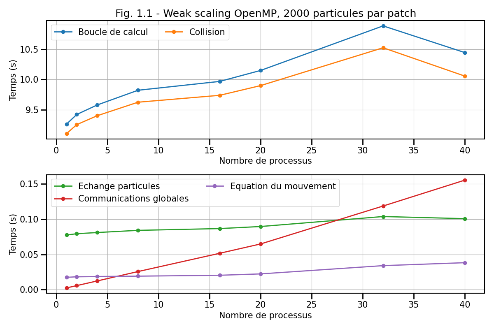

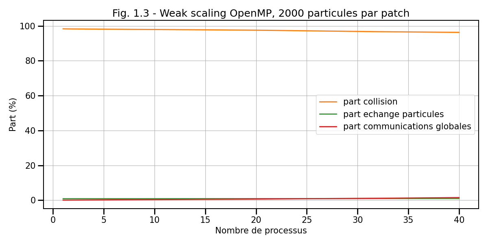

**Première étude de strong scaling pour le code OpenMP**

On rappelle que pour une étude de *strong scaling*, La charge totale reste constante de telle sorte que la charge par processus varie.
Ici, le domaine total garde donc la même taille avec le même nombre total de particules.
Pour cette étude, chaque processus ne s'occupe que d'un seul patch.
Le domaine a pour taille adimensionnelle  avec un nombre total de 32000 particules.
On utilise un *SCHEDULER* OpenMP `STATIC`: `OMP_SCHEDULE=STATIC`.
A titre d'exemple, la commande utilisée pour lancer le code sur 8 coeurs est la suivante :
```bash
export OMP_NUM_THREADS=8
./executable -patch 2 2 2 -t 10 -it 500 -diags 1000 -print 100 -np 32000 -air_damping 0 -gravity 0 0 0 -wall_damping 0 -collision_damping 0 -collision 1 -velocity 0.5 0.5 -x 0 4 -y 0 4 -z 0 4 -r 0.01 -mass 0.5 0.5 -overlap 0
```

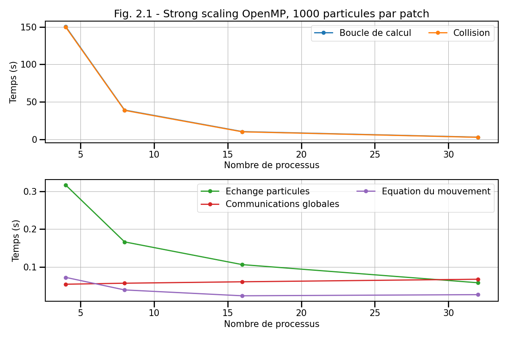

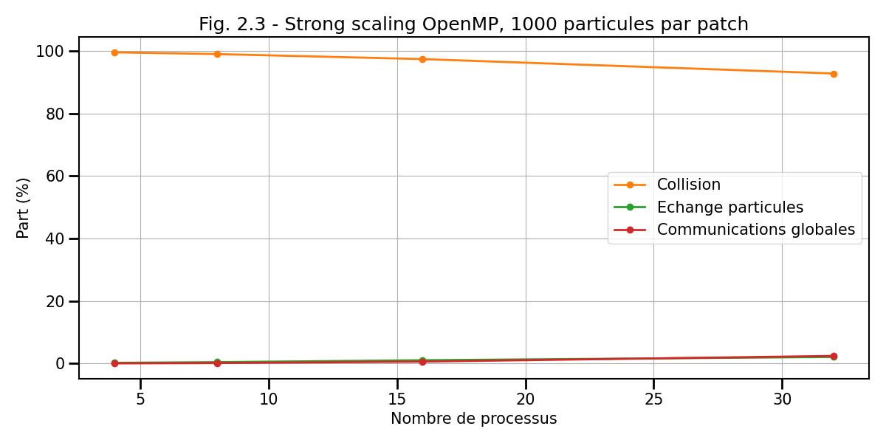

**Deuxième étude de strong scaling pour le code OpenMP**

Cette deuxième étude de *strong scaling* pour le code OpenMP diffère du premier dans la mesure où ici le nombre de *patchs* total est gardé constant pour tout nombre de processus de telle sorte que le nombre de *patchs* à traiter pour chaque processus varie.
Le nombre total de particules reste lui constant comme pour l'étude précédente.
On utilise un nombre fixe de 32 *patchs* contenant chacun 1000 particules.
A titre d'exemple, la commande utilisée pour lancer le code sur 8 coeurs est la suivante :
```bash
export OMP_NUM_THREADS=8
./executable -patch 4 4 2 -t 10 -it 500 -diags 1000 -print 100 -np 32000 -air_damping 0 -gravity 0 0 0 -wall_damping 0 -collision_damping 0 -collision 1 -velocity 0.5 0.5 -x 0 4 -y 0 4 -z 0 4 -r 0.01 -mass 0.5 0.5 -overlap 0
```


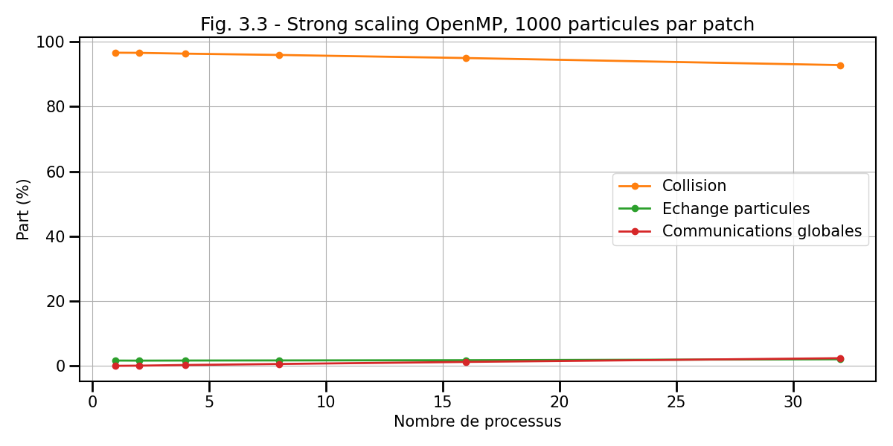

**Première étude de weak scaling pour le code MPI**

Cette étude de *weak scaling* concerne maintenant le code MPI.
Chaque processus MPI ne traite qu'un patch et un patch possède 500 particules.
Chaque patch a une taille de .
A titre d'exemple, la commande utilisée pour lancer le code sur 8 coeurs est la suivante :
```bash
mpirun -np 8 ./executable -patch 2 2 2 -t 10 -it 500 -diags 1000 -print 100 -np 4000 -air_damping 0 -gravity 0 0 0 -wall_damping 0 -collision_damping 0 -collision 1 -velocity 0.5 0.5 -x 0 2 -y 0 2 -z 0 2 -r 0.01 -exchange 1 -mass 0.5 0.5 -overlap 0
```

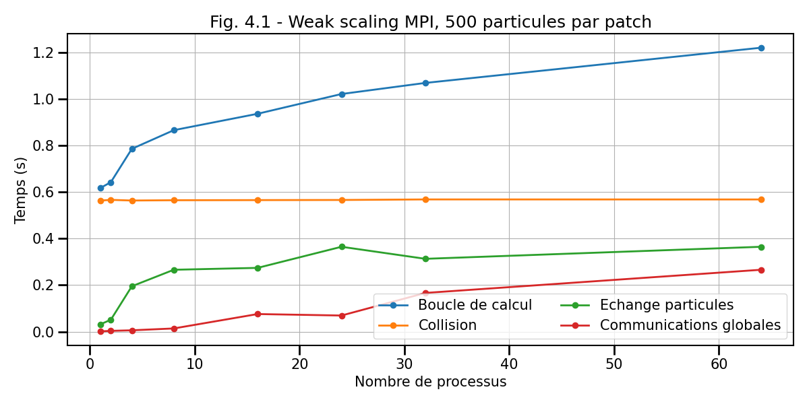
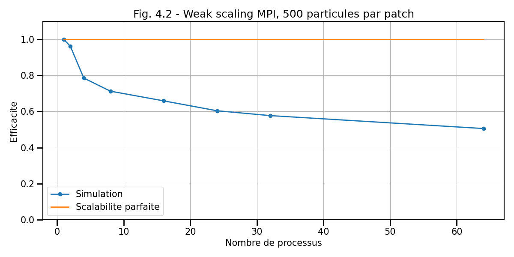
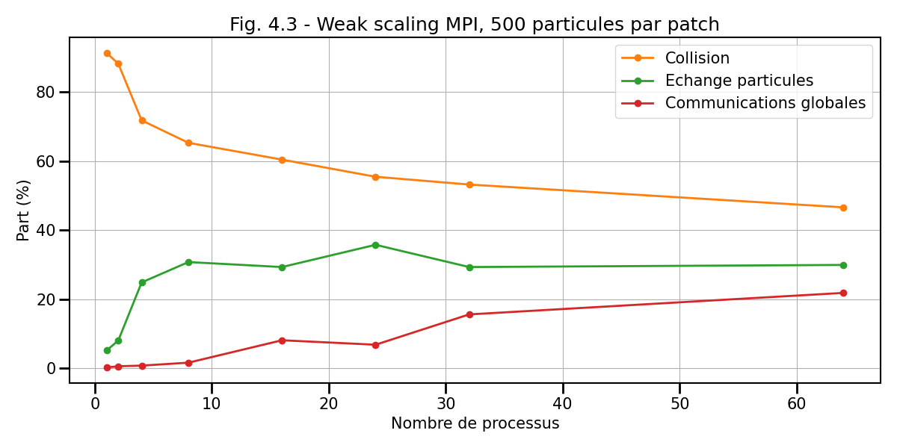

**Deuxième étude de weak scaling pour le code MPI**

Dans cette deuxième étude, le nombre de particules par *patch* est monté à 2000.
A titre d'exemple, la commande utilisée pour lancer le code sur 8 coeurs est la suivante :
```bash
mpirun -np 8 ./executable -patch 2 2 2 -t 10 -it 500 -diags 1000 -print 100 -np 16000 -air_damping 0 -gravity 0 0 0 -wall_damping 0 -collision_damping 0 -collision 1 -velocity 0.5 0.5 -x 0 2 -y 0 2 -z 0 2 -r 0.01 -exchange 1 -mass 0.5 0.5 -overlap 0
```

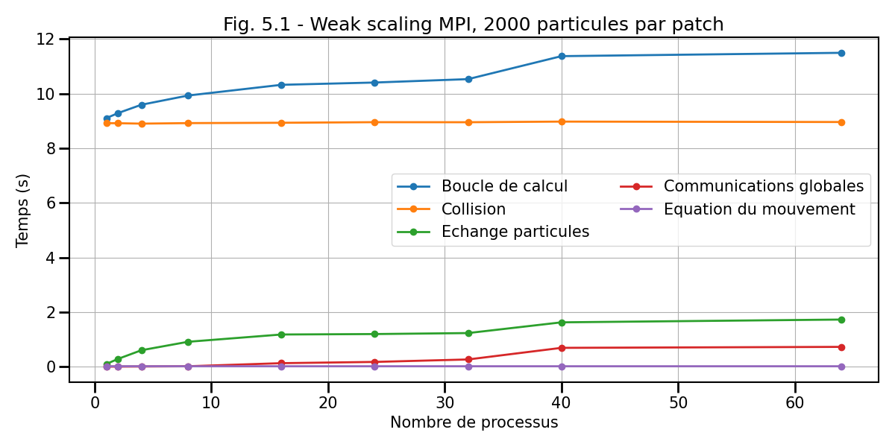


**Etude de strong scaling pour le code MPI**

Cette dernière étude concerne le *strong scaling* de la version MPI.
Un rang ne peut traiter qu'un patch.
Le nombre de particules par *patch* dépend du nombre de rangs MPI.
```bash
mpirun -np 8 ./executable -patch 2 2 2 -t 10 -it 500 -diags 1000 -print 100 -np 32000 -air_damping 0 -gravity 0 0 0 -wall_damping 0 -collision_damping 0 -collision 1 -velocity 0.5 0.5 -x 0 4 -y 0 4 -z 0 4 -r 0.01 -exchange 1 -mass 0.5 0.5 -overlap 0
```

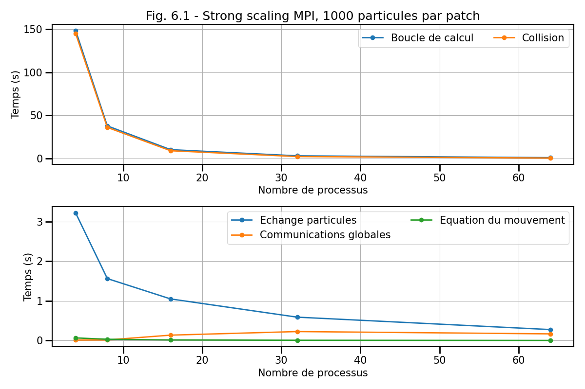
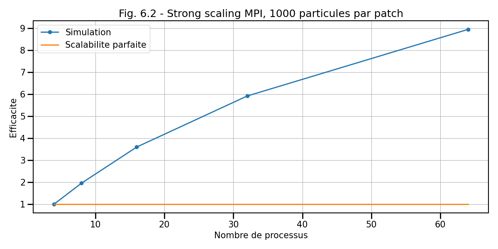
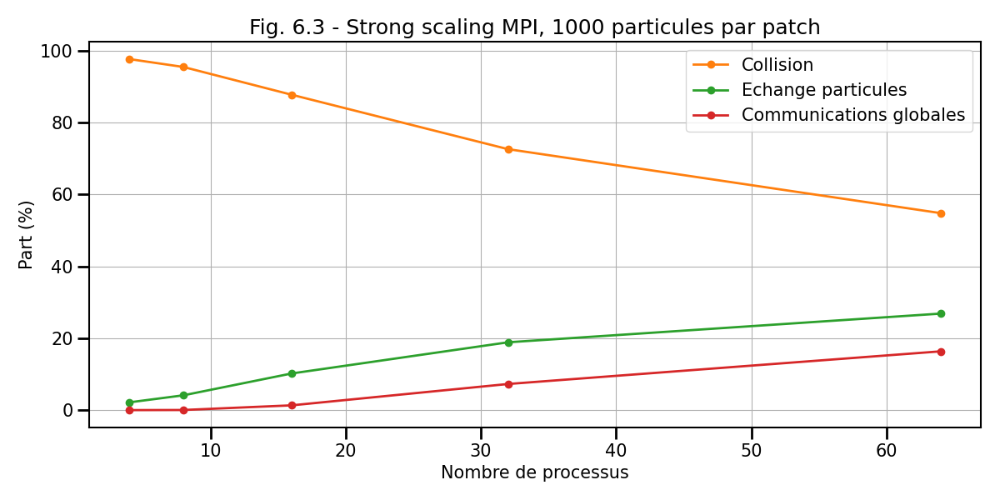

**Question 5.1 - Weak Scaling OpenMP :**

a) Justifiez pourquoi le SCHEDULER `STATIC` est le plus adéquate pour les études OpenMP ?

b) Quels sont les composantes dominantes des parties parallèles et non-parallèles (suivant la définition d'Amdahl) dans cette étude ?

c) Quel est le comportement du temps passé dans les collisions et le pousseur ? Ce comportement vous paraît-il cohérent avec un *weak scaling* ? Expliquez.

d) Quel est le comportement du temps passé dans les échanges de particules et les communications globales ? Ce comportement vous paraît-il cohérent avec un *weak scaling* ? Expliquez.

e) Que peut-on dire du passage à l'échelle du programme OpenMP en observant notamment l'efficacité (Fig 1.2) ?

f) Intuitez quel pourrait être le comportement de l'étude (de l'efficacité notamment) pour un nombre de processus supérieur à 40 et pourquoi ?

**Question 5.2 - Strong Scaling OpenMP :** L'étude de *Strong scaling* se décompose en 2 parties, une première étude avec un *patch* par processus (le nombre de *patch* varie mais le nombre de particules restent constant) et une seconde avec un nombre total de *patchs* fixe. Dans la seconde étude, les processus sont donc amenés à traités plusieurs *patchs*. Pour 32 coeurs, les deux études sont similaires.

a) Comparez le temps passé dans chacune des études et expliquez la différence notamment lorsque le nombre de processus est inférieur à 32 coeurs.

b) Comment peut-on qualifier le comportement de la première étude de *Strong Scaling* (voir Fig. 2.2). Expliquez ce comportement.

c) Expliquez le comportement linéaire de la deuxième étude de *Strong scaling* (Fig. 3.2).

**Question 5.3 - Weak Scaling MPI :** On s'intéresse maintenant au code MPI.
Le *weak scaling* se compose de 2 études. La différence entre les deux est simplement le nombre de particules par patch : 500 pour la première, 2000 pour la seconde.

a) Quelles différences majeures peut-on observer sur les temps entre les deux études (Figs. 4.1 et 5.1) ?

b) Expliquez les conséquences et la différence sur l'efficacité (Figs. 4.2 et 5.2).

c) Que peut-on dire de la relation entre nombre de particules par *patch* et capacité du code à passer à l'échelle ?

**Question 5.4 - Strong Scaling MPI :**

a) Comment peut-on qualifier le comportement de l'étude de *Strong Scaling* (voir Fig. 6.2). Expliquez ce comportement.

**Question 5.5 - Comparaison :**

a) Donnez quelles études de *strong scaling* et *weak scaling* sont comparables entre le modèle OpenMP et le modèle MPI.

b) Comparez le temps et l'efficacité entre les études comparables.

## Aide et astuces

**Précisions sur le question 3.4c :**

Ici je vous demande de rendre parallèle des fonctions qui renvoient un scalaire à partir d'une réduction d'un ensemble de données localisées sur chaque processus. Dans l'exemple de code ci-dessous qui correspond à la fonction `Particles::getTotalCollisionNumber` renvoyant le nombre de collision total pour l'itération en cours, on a une boucle sur les patchs. Chaque patch renvoie le nombre de collisions propre à son domaine (dans la variable `local`) via la fonction `patches::getCollisionNumber`. Il faut ensuite sommer la contribution de chaque patch pour obtenir le nombre de collisions total (dans la variable `total`).

```C++
// Return the total number of collisions
void Particles::getTotalCollisionNumber(struct Parameters params, int & total) {
    
    total = 0;
    
    int local;
    
    for (int i_patch = 0 ; i_patch < n_patches ; i_patch++) {
       local = patches[i_patch].getCollisionNumber();
       total += local;
    }
}
```

A vous de trouver comment rendre cette fonction compatible avec OpenMP. Vous vous doutez qu'on peut la rendre parallèle en utilisant la clause `reduction`. Cependant comme je le note dans la question j'ai observé des erreurs avec l'opération de réduction avec certains compilateurs. De fait, je vous autorise à rendre cette partie séquentielle si nécessaire.

**Précisions question 4.5 :**

1. Faut-il modifier `timers.h` ?

Il n'est pas nécessaire de modifier timers.h mais vous pouvez pour y ajouter les tableaux pour les temps min, max et moyens. Les appels aux fonctions MPI pour la gestion des timers doivent se faire dans timers.cpp par contre. Aussi, elles doivent figurer dans la fonction timers::print car c'est à ce moment là qu'on fait le bilan. Dans le tableau  accumulated_times, chaque index représente le temps cumulé pour une partie spécifique du code. Le premier index est pour l'initialisation, le deuxième pour la boucle ne temps et ainsi de suite en fonction de comment vous créer les timers dans `main.cpp`. il faut donc appliquer les fonctions MPI pour chaque index.

Je vous mets un squelette pour la fonction `timers::print` qui pourra vous aider :

```C++
void Timers::print(struct Parameters params) {

    double percentage;
    
    std::vector <double> maximum_times(names.size());
    std::vector <double> minimum_times(names.size());
    std::vector <double> average_times(names.size());
    
    // Fonctions MPI et autres à compléter
    // ...
    // ...
    
    if (params.rank == 0) {
        std::cout << " ------------------------------------ "<< std::endl;
        std::cout << " TIMERS"<< std::endl;
        std::cout << " ------------------------------------ "<< std::endl;
        std::cout << "            code part |   min (s)  | averag (s) |   max (s)  | percentage |"<< std::endl;
        std::cout << " ---------------------|------------|------------|------------|------------|"<< std::endl;

        std::cout << " " << std::setw(20) << names[0] ;
        std::cout << " | " << std::fixed << std::setprecision(6) << std::setw(10) << minimum_times[0];
        std::cout << " | " << std::fixed << std::setprecision(6) << std::setw(10) << average_times[0] ;
        std::cout << " | " << std::fixed << std::setprecision(6) << std::setw(10) << maximum_times[0] ;
        std::cout << " | " << std::fixed << std::setprecision(2) << std::setw(8)  << "       - %";
        std::cout << " | " ;
        std::cout << std::endl;

        for (int i = 1 ; i < names.size() ; i++) {
            
            percentage = average_times[i] / (average_times[1]) * 100;
            
            std::cout << " " << std::setw(20) << names[i] ;
            std::cout << " | " << std::fixed << std::setprecision(6) << std::setw(10) << minimum_times[i];
            std::cout << " | " << std::fixed << std::setprecision(6) << std::setw(10) << average_times[i] ;
            std::cout << " | " << std::fixed << std::setprecision(6) << std::setw(10) << maximum_times[i] ;
            std::cout << " | " << std::fixed << std::setprecision(2) << std::setw(8)  << percentage << " %";
            std::cout << " | " ;
            std::cout << std::endl;
        }
    }
}
```
