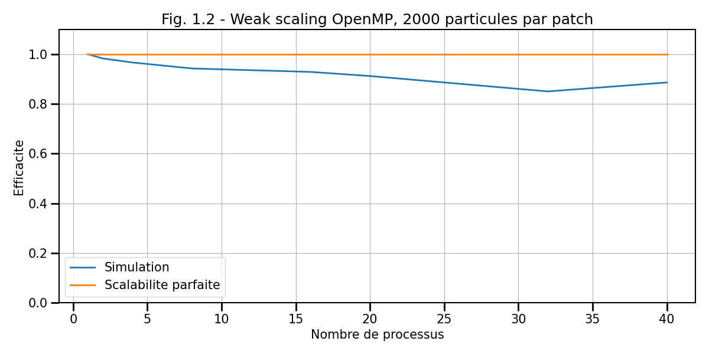
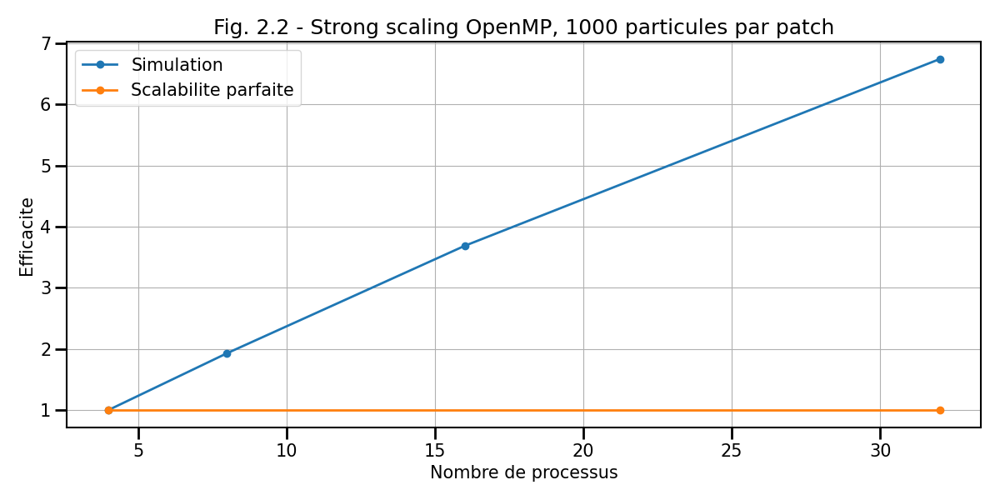
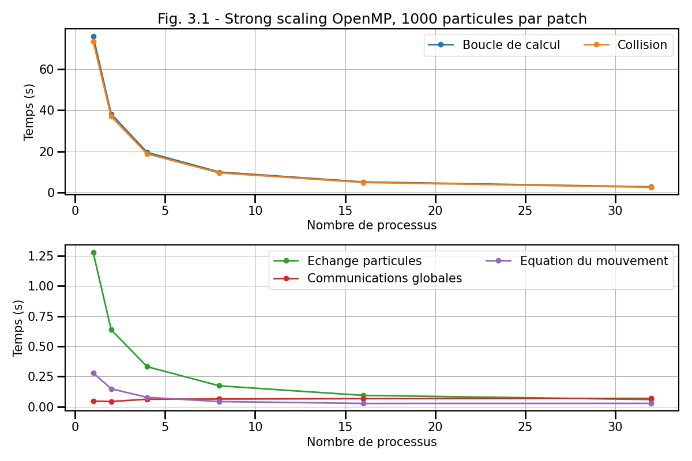
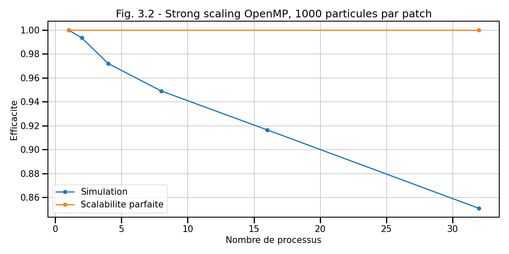
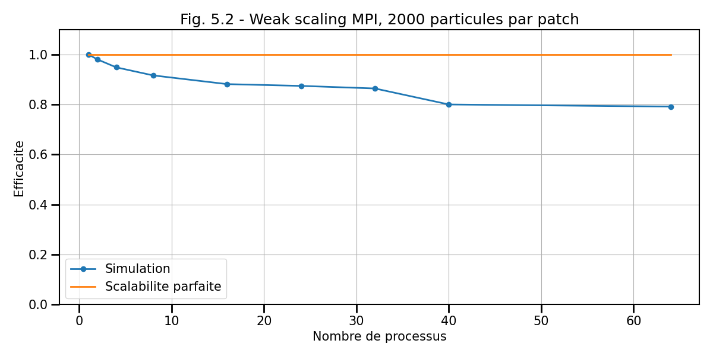
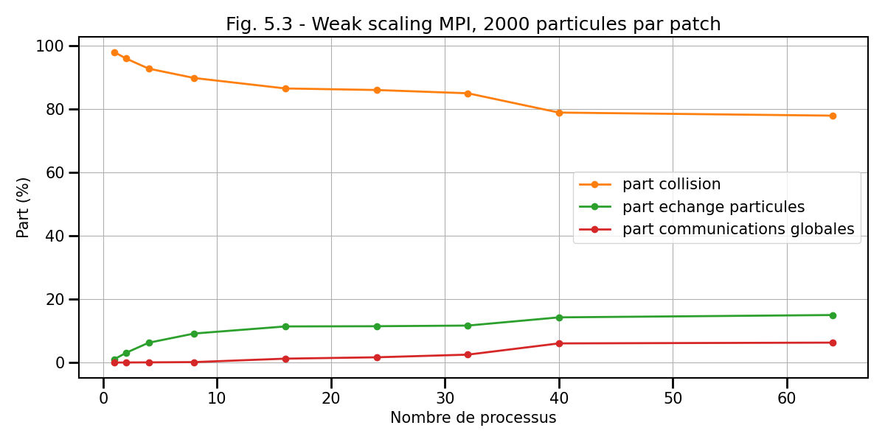

### V. Etude de performance

**Dans cette section, vous devrez répondre aux questions dans votre rapport**

Les études de passage à l'échelle ont été menées pour vous sur le super-calculateur
RUCHE du [mésocentre du Moulon](http://mesocentre.centralesupelec.fr/) du Plateau de Saclay en utilisant les codes parallélisés avec OpenMP et MPI.
Chaque noeud de ce super-calculateur est un bi-socket.
Chaque socket est équipé d'un processeur Intel Xeon Gold 6230 (génération Cascade Lake) de 20 coeurs.

Pour chaque étude, trois grandeurs en fonction du nombre de processus vous sont présentées :
- le temps passé en seconde
- l'efficacité
- la part en pourcentage sur le temps total passé dans la boucle en temps.

Pour chaque figure, on s'intéresse à la fois à la boucle en temps total mais aussi aux différents opérateurs qui la composent :
- collisions
- Equation du mouvement
- Echange des particules
- Calcul des grandeurs globales (opérations de réduction)

Pour la version OpenMP, les opérations de réductions (grandeurs globales) sont placées dans des régions *single*.

**Etude de weak scaling pour le code OpenMP**

On rappelle que pour une étude de *weak scaling*, la taille du domaine (et donc la charge totale) varie avec le nombre de processus mais la charge par processus reste constante.
Pour cette étude, chaque processus ne s'occupe que d'un seul patch.
Chaque patch possède 2000 particules et a pour taille adimensionnelle $[1, 1, 1]$.
On utilise un *SCHEDULER* OpenMP `STATIC`: `OMP_SCHEDULE=STATIC`.
A titre d'exemple, la commande utilisée pour lancer le code sur 8 coeurs est la suivante :
```bash
export OMP_NUM_THREADS=8
./executable -patch 2 2 2 -t 10 -it 500 -diags 1000 -print 100 -np 16000 -air_damping 0 -gravity 0 0 0 -wall_damping 0 -collision_damping 0.01 -collision 1 -velocity 0.5 0.5 -x 0 2 -y 0 2 -z 0 2 -r 0.01 -mass 0.5 0.5 -overlap 0
```





**Première étude de strong scaling pour le code OpenMP**

On rappelle que pour une étude de *strong scaling*, La charge totale reste constante de telle sorte que la charge par processus varie.
Ici, le domaine total garde donc la même taille avec le même nombre total de particules.
Pour cette étude, chaque processus ne s'occupe que d'un seul patch.
Le domaine a pour taille adimensionnelle $[4, 4, 4]$ avec un nombre total de 32000 particules.
On utilise un *SCHEDULER* OpenMP `STATIC`: `OMP_SCHEDULE=STATIC`.
A titre d'exemple, la commande utilisée pour lancer le code sur 8 coeurs est la suivante :
```bash
export OMP_NUM_THREADS=8
./executable -patch 2 2 2 -t 10 -it 500 -diags 1000 -print 100 -np 32000 -air_damping 0 -gravity 0 0 0 -wall_damping 0 -collision_damping 0 -collision 1 -velocity 0.5 0.5 -x 0 4 -y 0 4 -z 0 4 -r 0.01 -mass 0.5 0.5 -overlap 0
```





**Deuxième étude de strong scaling pour le code OpenMP**

Cette deuxième étude de *strong scaling* pour le code OpenMP diffère du premier dans la mesure où ici le nombre de *patchs* total est gardé constant pour tout nombre de processus de telle sorte que le nombre de *patchs* à traiter pour chaque processus varie.
Le nombre total de particules reste lui constant comme pour l'étude précédente.
On utilise un nombre fixe de 32 *patchs* contenant chacun 1000 particules.
A titre d'exemple, la commande utilisée pour lancer le code sur 8 coeurs est la suivante :
```bash
export OMP_NUM_THREADS=8
./executable -patch 4 4 2 -t 10 -it 500 -diags 1000 -print 100 -np 32000 -air_damping 0 -gravity 0 0 0 -wall_damping 0 -collision_damping 0 -collision 1 -velocity 0.5 0.5 -x 0 4 -y 0 4 -z 0 4 -r 0.01 -mass 0.5 0.5 -overlap 0
```





**Première étude de weak scaling pour le code MPI**

Cette étude de *weak scaling* concerne maintenant le code MPI.
Chaque processus MPI ne traite qu'un patch et un patch possède 500 particules.
Chaque patch a une taille de $[1, 1, 1]$.
A titre d'exemple, la commande utilisée pour lancer le code sur 8 coeurs est la suivante :
```bash
mpirun -np 8 ./executable -patch 2 2 2 -t 10 -it 500 -diags 1000 -print 100 -np 4000 -air_damping 0 -gravity 0 0 0 -wall_damping 0 -collision_damping 0 -collision 1 -velocity 0.5 0.5 -x 0 2 -y 0 2 -z 0 2 -r 0.01 -exchange 1 -mass 0.5 0.5 -overlap 0
```


**Deuxième étude de weak scaling pour le code MPI**

Dans cette deuxième étude, le nombre de particules par *patch* est monté à 2000.
A titre d'exemple, la commande utilisée pour lancer le code sur 8 coeurs est la suivante :
```bash
mpirun -np 8 ./executable -patch 2 2 2 -t 10 -it 500 -diags 1000 -print 100 -np 16000 -air_damping 0 -gravity 0 0 0 -wall_damping 0 -collision_damping 0 -collision 1 -velocity 0.5 0.5 -x 0 2 -y 0 2 -z 0 2 -r 0.01 -exchange 1 -mass 0.5 0.5 -overlap 0
```





**Etude de strong scaling pour le code MPI**

Cette dernière étude concerne le *strong scaling* de la version MPI.
Un rang ne peut traiter qu'un patch.
Le nombre de particules par *patch* dépend du nombre de rangs MPI.
```bash
mpirun -np 8 ./executable -patch 2 2 2 -t 10 -it 500 -diags 1000 -print 100 -np 32000 -air_damping 0 -gravity 0 0 0 -wall_damping 0 -collision_damping 0 -collision 1 -velocity 0.5 0.5 -x 0 4 -y 0 4 -z 0 4 -r 0.01 -exchange 1 -mass 0.5 0.5 -overlap 0
```


**Question 5.1 - Weak Scaling OpenMP :**

a) Justifiez pourquoi le SCHEDULER `STATIC` est le plus adéquate pour les études OpenMP ?

b) Quels sont les composantes dominantes des parties parallèles et non-parallèles (suivant la définition d'Amdahl) dans cette étude ?

c) Quel est le comportement du temps passé dans les collisions et le pousseur ? Ce comportement vous paraît-il cohérent avec un *weak scaling* ? Expliquez.

d) Quel est le comportement du temps passé dans les échanges de particules et les communications globales ? Ce comportement vous paraît-il cohérent avec un *weak scaling* ? Expliquez.

e) Que peut-on dire du passage à l'échelle du programme OpenMP en observant notamment l'efficacité (Fig 1.2) ?

f) Intuitez quel pourrait être le comportement de l'étude (de l'efficacité notamment) pour un nombre de processus supérieur à 40 et pourquoi ?

**Question 5.2 - Strong Scaling OpenMP :** L'étude de *Strong scaling* se décompose en 2 parties, une première étude avec un *patch* par processus (le nombre de *patch* varie mais le nombre de particules restent constant) et une seconde avec un nombre total de *patchs* fixe. Dans la seconde étude, les processus sont donc amenés à traités plusieurs *patchs*. Pour 32 coeurs, les deux études sont similaires.

a) Comparez le temps passé dans chacune des études et expliquez la différence notamment lorsque le nombre de processus est inférieur à 32 coeurs.

b) Comment peut-on qualifier le comportement de la première étude de *Strong Scaling* (voir Fig. 2.2). Expliquez ce comportement.

c) Expliquez le comportement linéaire de la deuxième étude de *Strong scaling* (Fig. 3.2).

**Question 5.3 - Weak Scaling MPI :** On s'intéresse maintenant au code MPI.
Le *weak scaling* se compose de 2 études. La différence entre les deux est simplement le nombre de particules par patch : 500 pour la première, 2000 pour la seconde.

a) Quelles différences majeures peut-on observer sur les temps entre les deux études (Figs. 4.1 et 5.1) ?

b) Expliquez les conséquences et la différence sur l'efficacité (Figs. 4.2 et 5.2).

c) Que peut-on dire de la relation entre nombre de particules par *patch* et capacité du code à passer à l'échelle ?

**Question 5.4 - Strong Scaling MPI :**

a) Comment peut-on qualifier le comportement de l'étude de *Strong Scaling* (voir Fig. 6.2). Expliquez ce comportement.

**Question 5.5 - Comparaison :**

a) Donnez quelles études de *strong scaling* et *weak scaling* sont comparables entre le modèle OpenMP et le modèle MPI.

b) Comparez le temps et l'efficacité entre les études comparables.
