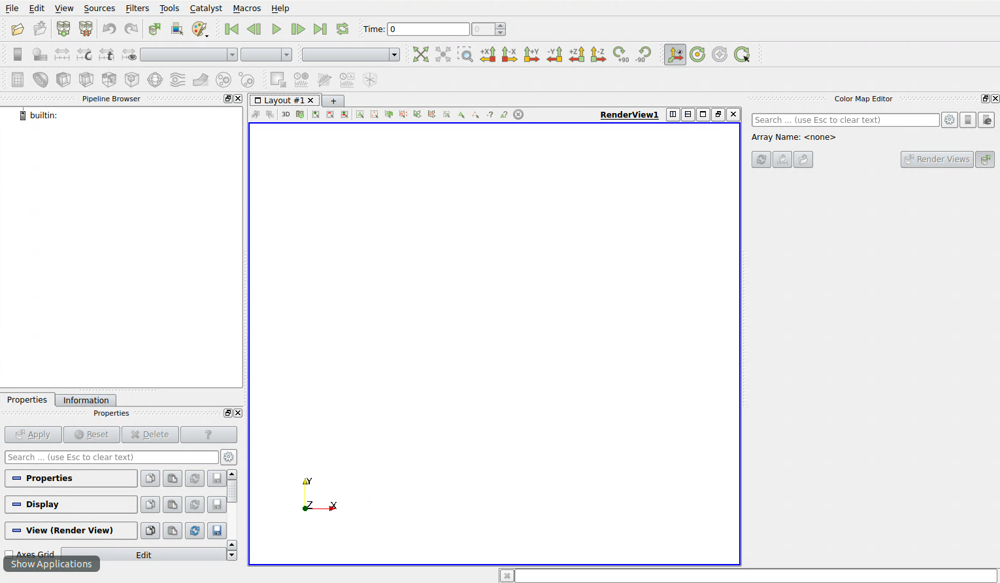
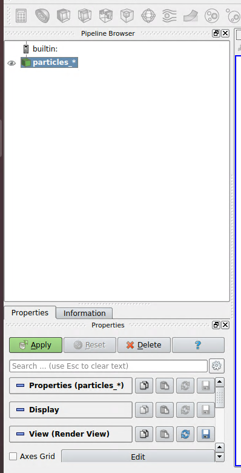
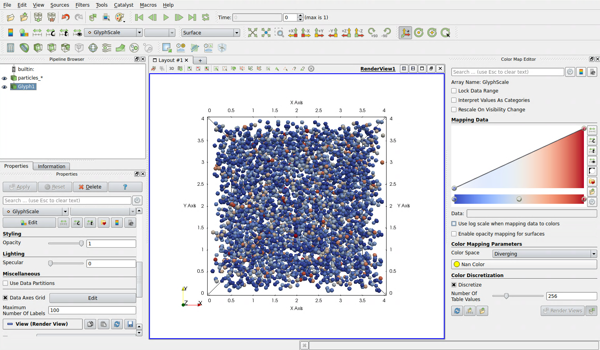

# Analyse des fichiers de sortie

## Scripts Python

L'éxecution du code genère plusieurs type de fichiers dans un dossier `diags`
qui sera créé au début de chaque *run* :
- fichiers hdf5 (`.h5`)
- fichiers bianire (`.bin`)
- fichiers vtk pour Paraview (`.vtk`)

Les fichiers de sortie portent le nom suivant `particles_<numéro d'itération>.bin`.
Ce dossier contient des scripts Python dédiés à l'analyse des résultats.
Ils permettent d'ouvrir les fichiers de sortie pour visualiser les résultats :

- `plot_binary_matplotlib.py` : ce fichier permet de lire et d'afficher les données d'un fichier binaire (`.bin`) spécifié en ligne de commande. Il utilise la bibliothèque Matplotlib. Le rendu 3D n'est pas parfait mais ce script a l'avantage d'être utilisable avec quasiment tous les environnements Python. Ce script est d'ailleurs compatible python 2 et 3.
```bash
# Dans le dossier de simulation, cette commande affichera
# les particules à l'itération 100 si le fichier binaire existe.
python ../python/plot_binary_matplotlib.py diags/particles_100.bin
```

- `plot_binary_mayavi.py` : ce script permet de visualiser les fichiers binaires `.bin` en utilisant la bibliothèque d'affichage scientifique 3D [Mayavi](http://docs.enthought.com/mayavi/mayavi/). Ce script nécessite donc Mayavi et Python 3.
```bash
# Dans le dossier de simulation, cette commande affichera
# les particules à l'itération 100 si le fichier binaire existe.
python ../python/plot_binary_mayavi.py diags/particles_100.bin
```

- `plot_hdf5.py` : ce script permet de lire et d'afficher les données issues d'un fichier HDF5 (`.h5`). Il utilise également Matplotlib.
```bash
# Dans le dossier de simulation, cette commande affichera
# les particules à l'itération 100 si le fichier binaire existe.
python ../python/plot_hdf5.py diags/particles_100.h5
```

## Paraview

Les fichiers VTK (avec l'extension `.vtk`) peuvent être ouverts avec le logiciel Paraview.

Commencez par ouvrir Paraview, vous obtenez l'interface suivante :



Cliquez sur l'icone d'ouverture de fichier et ouvrez les fichiers VTK en groupe (Paraview détecte les fichiers ayant le même nom avec un numéro d'itération).
Dans le panneau de gauche `builtin` apparaît alors les données sélectionnées.
Cliquez ensuite sur le bouton `Apply` dans la boîte à gauche en bas nommée `properties` comme ci-dessous :



En faisant cela vous confirmez vouloir utiliser ces données dans Paraview.

Nous allons maintenant sélectionner une manière de visualiser ces données.
Nous souhaitons visualiser chaque particule sous la forme d'une petite sphère.
Pour cela, nous allons sélectionner le mode `Glyph` en haut à gauche.

Dans le panneau `properties` :
- Sélectionner `sphere` dans `Glyph Type`
- Dans `Scalar`, vous pouvez choisir au choix l'énergie ou la masse des particules pour la couleur de ces dernières.
- Diminuez le `Scale factor` pour réduire la taille des sphères, par exemple `0.1`
- Dans `Glyph mode`, choisissez `All points` afin d'afficher toutes les particules et non juste une sélection.
- Activer le `Data Axe Grid` pour afficher les axes

Vous devriez obtenir quelque chose proche de la capture ci-dessous :


