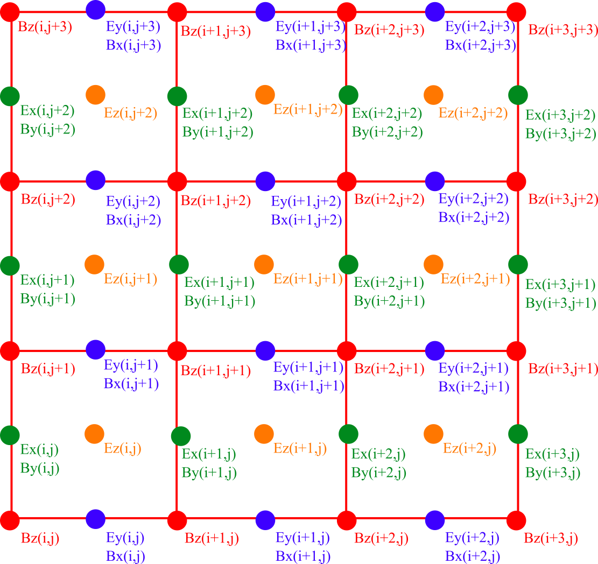
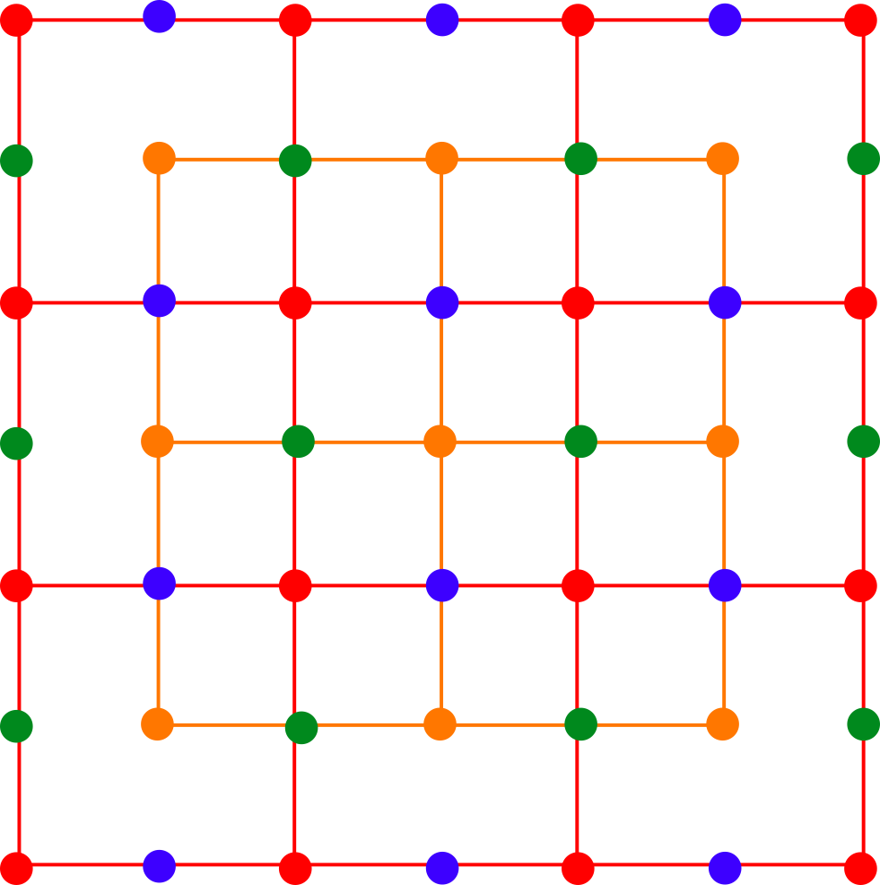
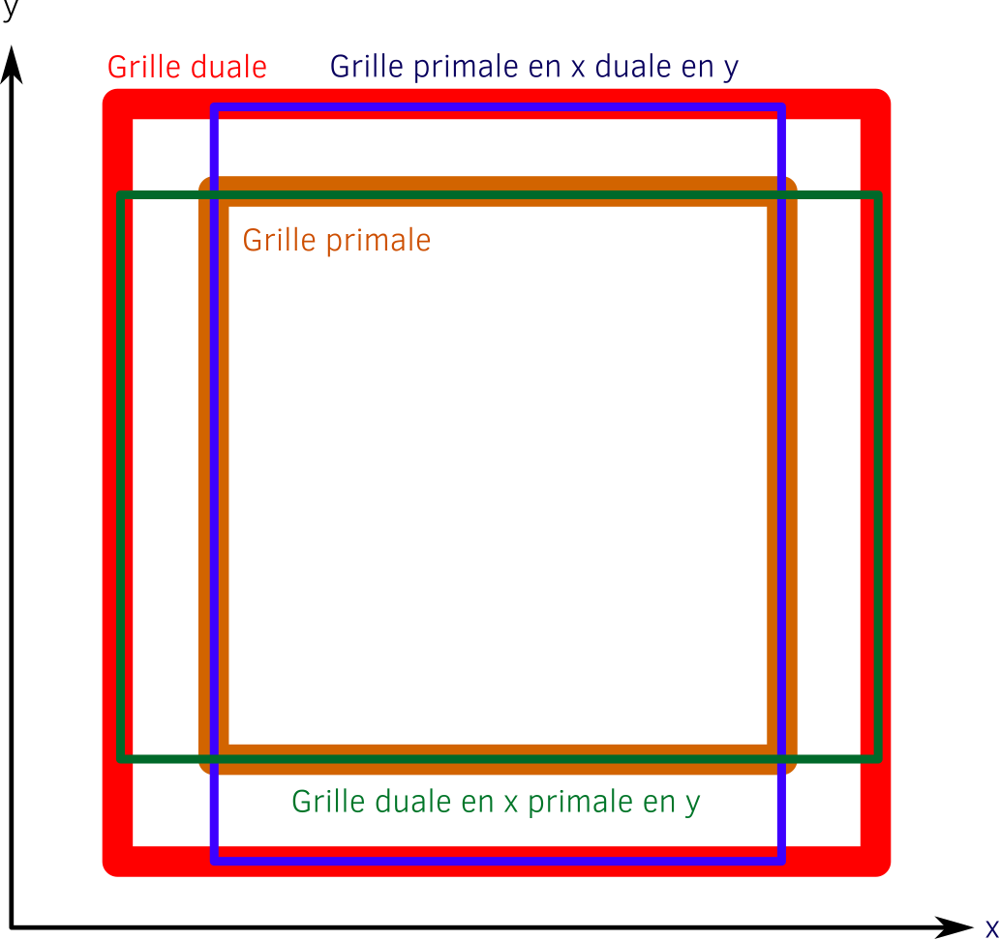

# Simulation des équations de Maxwell via la méthode aux différences finis explicite centrée de Yee

## Présentation du modèle

Nous nous intéressons dans ce projet à la simulation des équations Maxwell par l'utilisation d'une méthode aux différences finies très connue du nom de FDTD pour Finite-Difference Time-Domain publié par K. Yee dans les années 60 et toujours utilisée aujourd'hui dans les codes de calcul pour sa rapidité et sa simplicité.

On rappelle les équations de Maxwell dans le vide :

Maxwell Ampere :

Maxwell Faraday :

Maxwell Gauss :

Maxwell Flux :

Dans le cadre de la discrétisation de Yee, on ne s'intéresse qu'à Maxwell Ampere et Faraday. On commence par normaliser les équations pour éliminer les constantes et réduire l'amplitude des champs (ce qui est toujours préférable en informatique).

En 2D, la discrétisation donne les équations suivantes pour Maxwell Ampère :
        

Où  est l'iteration en temps,  et  respectivement la discrétisation en espace suivant les directions  et .

Puis pour Maxwell Faraday :

Le modèle discrétisé peut être représenté par le schéma suivant :

Ici, les composantes de champ sont représentées par des noeuds colorés :

- rouge : 
- vert :  et 
- orange : 
- bleu :  et 

On remarque que les grilles qui composent les noeuds ne sont pas donc pas toutes superposées mais sont décalées en espace de  et/ou . En anglais, on parle de grille *staggered*. En 2D, certaines composantes existent à la même position mais ce n'est pas le cas en 3D.
Les champs électriques et magnétiques sont également décalés en temps de .

La grille représentée par les noeuds rouge du champ  est appelée grille duale.
C'est la grille la plus large.

Dans la figure ci-dessous, nous avons représenté la grille définie par les noeuds oranges du champ .
il s'agit de la grille primale.

Le grille primale est celle qui contient le moins de noeuds.
Par définition, si la grille primale a une taille de  alors la grille duale a une taille de .

Toutes les autres composantes sont une combinaison dual / primal.
Par exemple, la grille définie par les noeuds bleus (composantes  et ) est primale dans la direction  mais duale dans la direction . elle a donc une taille .
De la même manière, la grille définie par les noeuds verts (composante  et ) est au contraire duale dans la direction  et primale dans la direction .
La figure ci-dssous résume la notion de grille primale et duale :

Il faut maintenant se pencher sur les conditions limites d'une telle discrétisation. 

