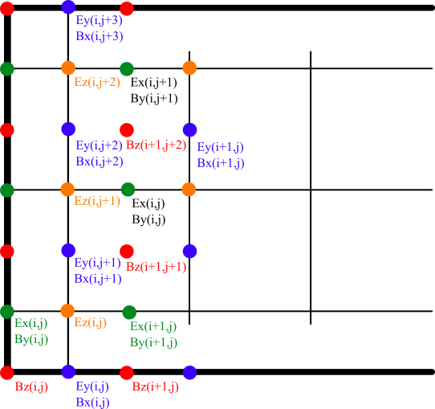
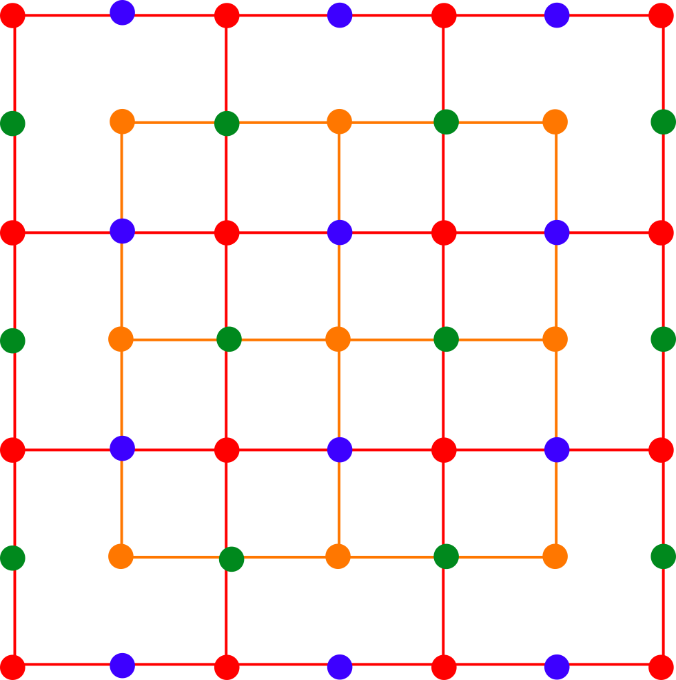
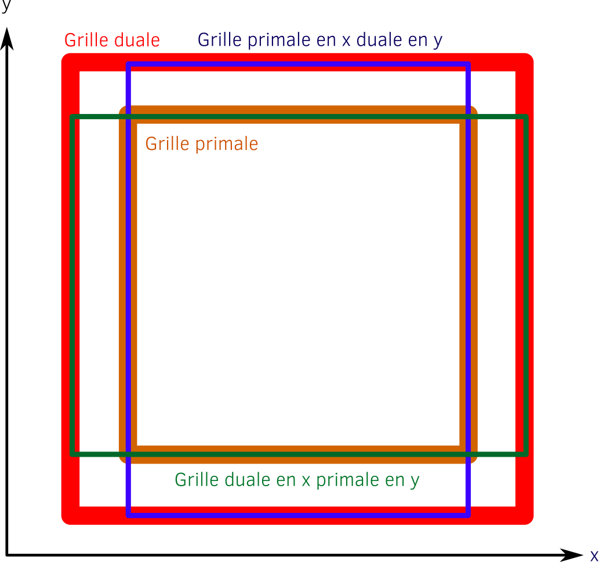
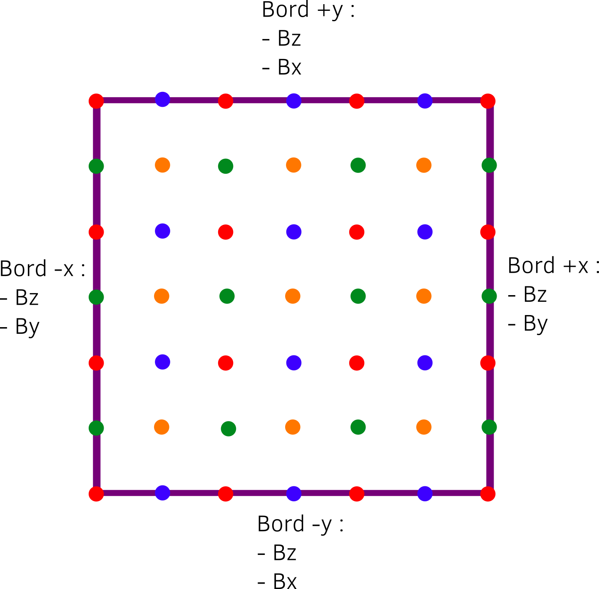
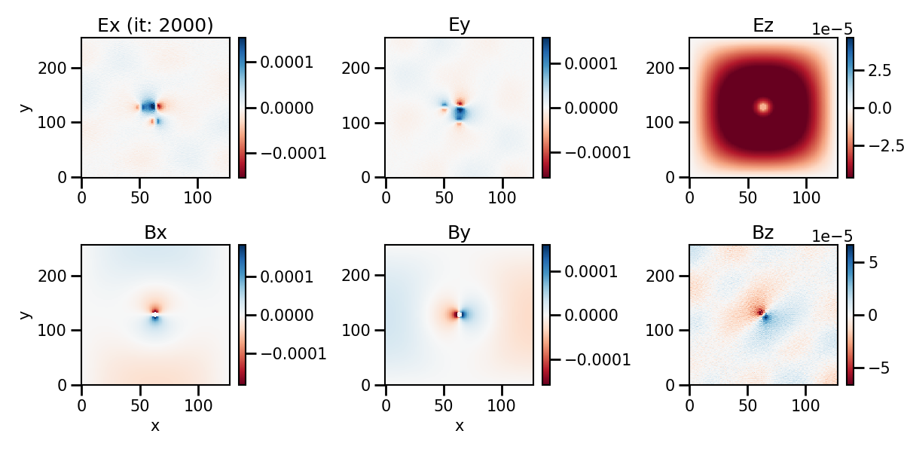

# Simulation des équations de Maxwell via la méthode aux différences finis explicite centrée de Yee

Ce TP s'intéresse à la modélisation des équations de Maxwell par la méthode aux différences finies de Yee.

## Table des matières

1. [Description du répertoire](#description) 
2. [Présentation du modèle](#modele)
3. [Le code séquentiel](#code_sequentiel)
4. [Consignes](#consignes)

## Description du répertoire <a id="description"></a>

Ce TP se compose de plusieurs répertoires :
- [consignes](./consignes) : ce dossier contient les consignes du TP
- [cpp/sequential](./cpp/sequential) : ce dossier contient le fichier source du code séquentiel et le makefile pour le compiler.
- [visualization](./python) : ce dossier contient des scripts dédiés à la visualisation des résultats.
- [scalings](./python) : ce dossier contient des scripts permettant d'afficher les courbes de scalabilité
- [.extra](./.extra) : ce dossier sert uniquement pour GitHub

## Présentation du modèle <a id="modele"></a>

### Schéma de Yee

Nous nous intéressons dans ce projet à la simulation des équations Maxwell par l'utilisation d'une méthode aux différences finies très connue du nom de FDTD pour Finite-Difference Time-Domain publié par K. Yee dans les années 60 et toujours utilisée aujourd'hui dans les codes de calcul pour sa rapidité et sa simplicité.

On rappelle les équations de Maxwell dans le vide :

Maxwell Ampere :

$$
\frac{1}{c^2} \frac{\partial E}{\partial t}  = - \mu_0 \vec{J} + \nabla \times \vec{B}
$$

Maxwell Faraday :

$$
\frac{\partial B}{\partial t} = - \nabla \times \vec{E}
$$

Maxwell Gauss :

$$
\nabla \cdot \vec{E} = 0
$$

Maxwell Flux :

$$
\nabla \cdot \vec{B} = 0
$$

Dans le cadre de la discrétisation de Yee, on ne s'intéresse qu'à Maxwell Ampere et Faraday. On commence par normaliser les équations pour éliminer les constantes et réduire l'amplitude des champs (ce qui est toujours préférable en informatique).

$$
\frac{\partial E}{\partial t} = - \vec{J} + \nabla \times vec{B}
\frac{\partial B}{\partial t} = - \nabla \times vec{E}
$$

En 2D, la discrétisation donne les équations suivantes pour Maxwell Ampère :
        
$$
Ex_{i,j}^{n} = Ex_{i,j}^{n-1} + \frac{\Delta t}{\Delta y} \left( Bz_{i,j+1}^{n-1/2}  - Bz_{i,j}^{n-1/2}\right)
$$

$$
Ey_{i,j}^{n} = Ey_{i,j}^{n-1} + \frac{\Delta t}{\Delta x} \left( Bz_{i+1,j}^{n-1/2}  - Bz_{i,j}^{n-1/2}\right)
$$

$$
Ez_{i,j}^{n} = Ez_{i,j}^{n-1} + \frac{\Delta t}{\Delta x} \left( By_{i+1,j}^{n-1/2}  - By_{i,j}^{n-1/2}\right) - \frac{\Delta t}{\Delta y} \left( Bx_{i,j+1}^{n-1/2}  - Bx_{i,j}^{n-1/2}\right) 
$$

Où $n = t / \Delta t $ est l'iteration en temps, $i$ et $j$ respectivement la discrétisation en espace suivant les directions $x$ et $y$.

Puis pour Maxwell Faraday :

$$
Bx_{i,j}^{n-1/2} = Bx_{i,j}^{n+1/2}  - \frac{\Delta t}{\Delta y} \left( Ez_{i,j}^{n}  - Ez_{i,j-1}^{n}\right) 
$$

$$
By_{i,j}^{n-1/2} = By_{i,j}^{n+1/2}  + \frac{\Delta t}{\Delta x} \left( Ez_{i,j}^{n}  - Ez_{i-1,j}^{n}\right) 
$$

$$
Bz_{i,j}^{n-1/2} = Bz_{i,j}^{n+1/2}  + \frac{\Delta t}{\Delta y} \left( Ex_{i,j}^{n}  - Ex_{i,j-1}^{n}\right) 
                                     - \frac{\Delta t}{\Delta x} \left( Ey_{i,j}^{n}  - Ey_{i-1,j}^{n}\right) 
$$

Le modèle discrétisé peut être représenté par le schéma suivant :



Ici, les composantes de champ sont représentées par des noeuds colorés :

- rouge : $B_z$
- vert : $Ex$ et $By$
- orange : $Ez$
- bleu : $Ey$ et $Bx$

On remarque que les grilles qui composent les noeuds ne sont pas donc pas toutes superposées mais sont décalées en espace de $0.5 \Delta x$ et/ou $0.5 \Delta y$. En anglais, on parle de grille *staggered*. En 2D, certaines composantes existent à la même position mais ce n'est pas le cas en 3D.
Les champs électriques et magnétiques sont également décalés en temps de $0.5 \Delta t$.

La grille représentée par les noeuds rouge du champ $Bz$ est appelée grille duale.
C'est la grille la plus large.

Dans la figure ci-dessous, nous avons représenté la grille définie par les noeuds oranges du champ $E_z$.
il s'agit de la grille primale.



Le grille primale est celle qui contient le moins de noeuds.
Par définition, si la grille primale a une taille de $n_{xp} \times n_{yp}$ alors la grille duale a une taille de $n_{xd} = n_{xp} + 1 \times n_{yd} = n_{yp} + 1$.

Toutes les autres composantes sont une combinaison dual / primal.
Par exemple, la grille définie par les noeuds bleus (composantes $Ey$ et $Bx$) est primale dans la direction $x$ mais duale dans la direction $y$. elle a donc une taille $n_{xp} \times n_{yd}$.
De la même manière, la grille définie par les noeuds verts (composante $Ex$ et $By$) est au contraire duale dans la direction $x$ et primale dans la direction $y$.
La figure ci-dssous résume la notion de grille primale et duale :



### Conditions limites

Il faut maintenant se pencher sur les conditions limites.
Les composantes de champs qui nécessitent d'être traitées sont aux bords sont situées sur la ligne violette de la figure ci-dessous :



De plus, les équations nous disent que les inconnus aux bords sont toutes des composantes du champ magnétique.
En effet les champs électriques aux bords se calculent à partir des champs magnétiques connus.

Dans le code, on utilise des conditions réfléchissantes (ou conditions de Neumann).

### Notion d'antenne

Une façon de générer un champ électromagnétiest est d'émuler le comportement d'une antenne.
Une antenne peut être modélisée par une charge qui se déplace en oscillant le long d'un segment.
Il faut alors calculer le courant généré par cette antenne et l'ajouter aux équations de Maxell-Ampère.

Soit $\vec{x}_A(t)$ l'évolution dans l'espace d'une charge $q_A$ et donc $\vec{v}_A(t)$ sa vitesse.
Le courant est donné par :

$$
\vec{J}_A = q_A \vec{v}_A(t)
$$

Pour une antenne, on utilise :

$$
\vec{x}_A = \vec{x}_{A,0} + L_{A} \cos{ \left( 2 \pi t / T_{A} \right) }
$$

Avec $L_A$ la longueur de l'antenne et $T_A$ sa période.


## Le code séquentiel <a id="code_sequentiel"></a>

Le code est écrit en langage C++ mais n'utilise pas de foctionnalité avancée.
Il ne se compose que d'un unique fichier `main.cpp`.

### Description du code

Le code se compose d'une phase d'initialisation puis d'une boucle ne temps (*main loop*) :

```c++
for (iteration = 1 ; iteration <= iterations ; iteration++) {
    //...
}
```

Dans la partie d'initialisation, on fait dans l'ordre :
- la déclaration des paramètres
- l'initialisation par défaut
- la lecture des arguments en ligne de commande
- l'initialisation des tableaux et des variables internes
- sortie des grilles dans des fichiers au temps 0

Puis dans la boucle en temps :
- résolution des équations de Maxwell-Ampère
- ajout des courants géénrés par les antennes
- résolution des équantions de Maxwell-Faraday
- conditions aux bords
- sortie des fichiers de diagntostique (pour chaque grille)
- affichage dans le terminal de l'état de la simulation

Puis après la boucle en temps :
- l'affichage des *timers*, c'est à dire le temps passé dans le divers parties du code
- destruction des tableaux

### Les dépendances

Ce programme nécessite l'installation d'un compilateur C++.

Vous n'avez besoin que d'une bibliothèque MPI.
Sur les postes de travail de l'université, OpenMPI est déjà installé.
Pour l'installer sur vos ordinateurs personnels, utilisez les instructions
dans le dossier [./documentation](../../documentation/mpi.md).

### Compilation et exécution

Pour compiler ce programme, vous pouvez utiliser les commandes suivantes en fonction de vos compilateurs :

Pour g++:
```bash
g++ -O3 main.cpp -o exe
```

Pour Intel (sur Ruche par exemple):
```bash
icpc -O3 main.cpp -o exe
```

La compilation génère un fichier exécutable du nom de `exe`. Vous pouvez lancer le programme en faisant :
```bash
./exe
```

### Arguments en ligne de commande

Il est possible de changer certains paramètres numériques directement en ligne de commande :

```bash
./executable -nx 128 -ny 256 -it 1000
```

- `-nx`: nombre de cellules dans la direction x
- `-ny`: nombre de cellules dans la direction y
- `-it`: nombre d'itérations
- `-d` : fréquence des sorties de fichier en nombre d'itérations
- `-p` : fréquence des affichages dans le terminal en nombre d'itérations

### Visualisation

Le code génère des sorties (fichier sur le disque dur) au format binaire contenant les grilles de champs à un temps donné.
Les fichiers sont toujours écrits dans un dossier `diags`.

Des scripts Python vous sont fournis pour vous aider à visualiser ces données.
Vous pouvez aussi utiliser vos propres scripts dans le langage de votre choix.
Les scripts sont dans le dossier [visualization](./visualization):
- [plot_binary.py](./visualization/plot_binary.py)

```bash
python -i plot_binary.py <chemin vers un fichier diag_*.bin>
```

- [animate.py](./visualization/animate.py)

```bash
python -i animate.py <chemin vers un dossier diags>
```

- [plot_scalar.py](./visualization/plot_scalar.py)

```bash
python -i animate.py <chemin vers un fichier scalars.bin>
```

Voici un exemple d'image produite par la lecture d'un fichier via le script `plot_binary.py`.



## Consignes de TP <a id="consignes"></a>

Dans ce TP, vous aurez à modifier un programme séquentiel afin de le rendre parallèle avec le standard MPI.
Vous serez ensuite amené à étudier les performances de la version parallèle.

Le TP se compose de 4 sous-sections :
- [Sous-section I](./consignes/1_sequentiel.md) : il s'agit de la découverte du code séquentiel
- [Sous-section II](./consignes/2_machine.md) : cette partie concerne la découverte de la machine parallèle
- [Sous-section III](./consignes/3_mpi.md) : cette partie est l'implémentation de la version MPI
- [Sous-section IV](./consignes/4_performance.md) : cette partie est l'étude de la performance des codes parallèles
- [Sous-section V](./consignes/5_aide.md) : aide et conseils pour le projet