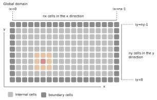
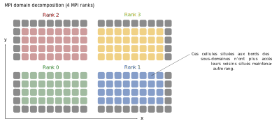
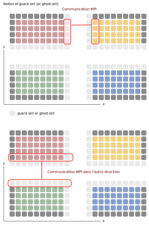
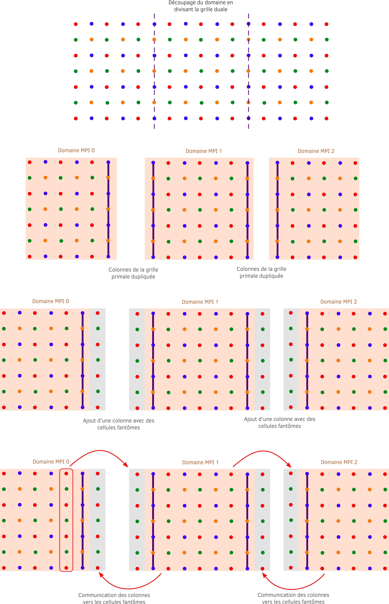

## III. MPI

Dans cette troisième partie, nous allons paralléliser le programme séquentiel en utilisant la méthode par passage de message et plus spécifiquement le standard MPI.

**Préparation :** Faites maintenant une copie du dossier `sequentiel` et appelez-le `mpi`.
On modifiera les sources de ce dossier pour y introduire la parallélisation MPI.

**Question 3.1 - compilation :** En premier lieu, il faut garder à l'esprit que la compilation se fera maintenant grâce au wrapper MPI:

```bash
mpic++ -O3 main.cpp -o exe
```

On utilise seulement le flag d'optimisation `-O3`.

Il est tout à fait possible de compiler un code séquentiel avec le *wrappper* MPI puisqu'il s'agit simplement d'un *wrapper* faisant appel au compilateur standard (`g++` ou `icpc`ici).
Compilez donc le code sans modification avant de commencer.

**Question 3.2 - Initialisation de MPI :** Nous allons commencer par préparer le programme pour MPI.

a) Commencez par inclure le header MPI dans le fichier [main.cpp](../cpp/main.cpp).
Notez que dans un programme composé de plusieurs sources, il faudrait l'inclure dans chaque fichier où seraient appelées des fonctions MPI.

b) Effectuez l'initialisation de MPI au début du fichier [main.cpp](../cpp/main.cpp).
Rajoutez la déclaration des nouveaux paramètres nécessaires à MPI là où tous les paramètres sont déclarés.
Placez l'initialisation de MPI après la déclaration des paramètres avant la configuration par défaut.

c) Toujours au début de [main.cpp](../cpp/main.cpp), ajoutez les fonctions permettant de récupérer le nombre de rang et le rang du processus en cours.
Aidez-vous du premier exercice sur MPI si besoin `1_initialization`.

d) Ensuite, rajoutez la fonction permettant de finaliser MPI tout de suite à la fin du programme.

e) Pour tester notre programme au fur et à mesure de l'implémentation, commentez la boucle en temps pour le moment.

f) Compilez votre programme sans l'exécuter.
Si des erreurs de compilation apparaissent, corrigez les avant de passer à la suite.

**Question 3.3 - Action réservée au rang 0 :** Il est important de se rappeler que dans un programme MPI, le code que vous écrivez après l'initialisation de MPI est exécuté par tous les rangs.
Néanmoins, la similitude peut être faite avec l'ouverture d'une région parallèle en OpenMP à partir de laquelle le code est exécuté par tous les *threads*.
A partir de là, il est important d'identifier les zones que l'on souhaite être exécutées que par un seul rang.

a) Faites en sorte que seulement le rang 0 puisse créer le dossier `diags` :
```C++
system("mkdir -p diags");
```

b) L'affichage d'information dans le terminal doit également
n'être effectué que par un rang pour la lisibilité.
Faites en sorte que seul le rang 0 puisse faire l'affichage des informations de sortie.
Bien sûr, pour le débogage, rien de vous empêche de demander à un autre rang d'afficher des informations.
N'oubliez pas l'affichage des *timers* à la fin du programme.

c) Dans la section de code `Summary in the terminal` qui fait un bilan à la fin de l'initialisation,
 rajoutez l'affichage des informations relatives à MPI.

d) Compilez le code et exécutez-le avec 1 rang MPI pour voir le résultat.

**Question 3.4 - Timers :** Nous allons changer le calcul du temps en remplaçant la fonction `gettimeofday` et rendant le calcul compatible avec le parallélisme MPI.
Chaque rang possèdera son propre *timer*.
Etant donné que ce temps n'est pas forcément le même pour tous en fonction de la charge de travail à traiter, on affichera à la fin dans le bilan des *timers* le temps maximal, minimal et la moyenne sur l'ensemble des rangs.

a) En premier lieu, nous allons remplacer tous les appels à la fonction `gettimeofday` par la fonction MPI `MPI_Wtime()` plus adaptée.

Chaque processus MPI va donc faire un calcul local du temps passé dans chaque partie.
Le bilan des *timers* ne sera affiché que par un seul processus.
En revanche, nous allons faire quelques statistiques en affichant le temps minimal, moyen et maximal entre tous les processus pour plusieurs parties du code.

b) Mettre à jour la partie `Summary of the timers` afin d'afficher, par le processus de rang 0 uniquement,  le temps minimal, moyen et maximal calculés entre tous les processus.
Des communications seront nécessaires et vous devrez utiliser les fonctions MPI adéquates.
Il faut en utiliser le moins possible.

Pour l'affichage, vous pouvez utiliser cette portion de code pour remplacer l'entête :

```C++
std::cout << " ------------------------------------ "<< std::endl;
std::cout << " TIMERS"<< std::endl;
std::cout << " ------------------------------------ "<< std::endl;
std::cout << "            code part |   min (s)  | averag (s) |   max (s)  | percentage |"<< std::endl;
std::cout << " ---------------------|------------|------------|------------|------------|"<< std::endl;
```

N'oubliez pas que seul le rang 0 s'occupe de l'affichage.
Par ailleurs, pour le calcul du pourcentage, utilisez le temps moyen.

Pour le moment, seul l'initialisation et la boucle itératives complète sont comptabilisées.
Plus tard, nous ajouterons des *timers* plus précis.

f) Compilez le code et exécutez-le en demandant un et plusieurs processeurs pour vérifier que tout fonctionne.
Par exemple :
```bash
mpirun -np 2 ./executable
```

**Question 3.5 - Topologie :**

Le but va maintenant être de décomposer le domaine de simulation en sous-domaine (parallélisme par décomposition de domaine). 
Chaque sous-domaine peut être vu comme un domaine avec ses propres conditions limites. 
Lorsque le bord d'un sous-domaine coïncide avec les bords du domaine global alors les mêmes conditions aux bords s'appliquent (ici réfléchissante).
Lorsque les bords d'un sous-domaine est une frontière avec un autre sous-domaine, il va falloir échanger des données.
La figure ci-dessous illustre l'état d'un domaine utilisant la notion de *stencil* comme c'est le cas ici.



La figure suivante illustre la décomposition de la grille avec une topologie cartésienne.
Il y a dans cet exemple 4 rangs et donc 4 sous-domaines avec chacun leurs grilles indépendantes.
Après la décomposition du domaine, certaines cellules à la frontière avec les autres rangs MPI n'ont plus directement accès au contenu de leurs voisines.



On fabrique donc une nouvelle rangée de cellules tout autour des frontières entre sous-domaines MPI dans le but de stocker les cellules voisines dont le contenu n'est connu que des autres rangs.
Ces rangées se nomment cellules fantômes.



Il faudra à chaque itération utiliser les communications MPI pour remplir ces cellules fantômes à partir des autres rangs.
Les communications doivent se faire par étape, d'abord une direction (x par exemple) puis une autre (y).
De la sorte, les voisins aux coins sont transférés au bon rang en 2 fois comme l'illustre la figure ci-dessus.

Dans le cas du schéma de Yee et ses grilles *stagered*, le problème est schématisé par la figure ci-dessous



On commence par diviser la grille duale en sous-grille dans la direction x.
Il y a donc le même nombre de points dans chaque grille duale.
La grille primale n'est pas divisible au premier abord (les frontières passent par les points de cette dernière).
On va donc dupliquer la frontière primale.
On a donc les mêmes colonnes qui existent de part et d'autre des frontières.
Enfin on ajoute pour la grille duale les cellules fantômes. 
Concernant les communications MPI, il ne faudra communiquer que les composantes présentes sur la grille duales.
Une fois ces composantes échangées, le schéma de Yee permet de mettre à jour les composantes primales sans difficulté.

Nous allons appliquer une décomposition de domaine dans la direction `x` uniquement (décomposition 1D)
Pour cela, nous allons utiliser la notion de topologie cartésienne vue dans le cours.
Pour cette question, aidez-vous de l'exercice MPI 7 sur la construction d'une topologie cartésienne.

a) Ajoutez la déclaration des paramètres permettant de construire la topologie cartésienne

b) Ajoutez les fonctions permettant de créer une topologie cartésienne 1D (`MPI_Cart_create`, `MPI_Comm_rank` et `MPI_Cart_coords`).

c) Utilisez `MPI_Cart_shift` pour déterminer les voisins dans la direction `x`.

e) Déclarer et calculer les valeurs locales de `nxp` et `nxd` ainsi que `xminp` et `xmind`.

f) Affichez pour chaque processus les informations concernant ses propriétés MPI 

g) Mettez à jour le calcul des conditions limites réfléchissantes pour que seul les processus MPI aux bords du domaine les effectuent.

h) Décommentez les boucles pour les calculs de Maxwell Ampère et Maxwell Faraday et testez la compilation.

i) Faire un premier run pour que la topologie est correcte sans s'occuper des diagnostiques

**Question 3.6 - Communication des cellules fantômes :**

a) Ajoutez après Maxwell-Faraday les communications MPI de type point à point permettant d'effectuer les échanges des cellules fantômes.
Ici on n'échange que les composantes By et Bz.
Pour rappel, l'axe des `y` est l'axe contigu.

b) Ajoutez un *timer* afin de connaître le temps passé strictement dans les communications des cellules fantômes.
Affichez le résultat lors de l'affichage des temps à la fin du code.

**Question 3.7 - Mise à jour du calcul de l'énergie :**

Le calcul de l'énergie s'effectue en sommant le carré de toutes les composantes.
Dans le code, on ne calcule que les composantes `Ex`, `Ey` et `Ez`.
En parallèle, on doit maintenant effectuer le calcul de chaque sous-domaine puis faire une réduction pour obtenir l'énergie totale.

a) Modifiez le calcul de l'énergie afin de calculer les valeurs locales en prenant soin de ne pas compter les cellules fantômes et les colonnes dupliquées.

b) Ajoutez la fonction MPI permettant d'obtenir la valeur globale à partir d'une réduction.

c) Mettez à jour l'affichage dans le terminal

d) Ajoutez un *timer* spécifique pour cette partie.

e) Compilez et testez le code

**Question 3.8 - Parallélisation des diagnostiques :**

Dans le but de pouvoir vérifier nos résultats, nous devons produire des diagnostiques parallèles.
La création de fichier en parallèle n'est pas au programme de ce cours.
Nous allons utiliser ce que nous avons appris pour mettre à jour les sorties de fichiers.
Pour cela, nous allons ramener sur le processus 0 tous les morceaux de grilles nécessaires à la reconstitution d'une grille globale.
La grille globale une fois reconstituée sera écrite sur le disque en exploitant la même fonction que celle utilisée dans le code séquentiel.
Lors de la reconstitution de la grille globale, il est important de ne pas ramener les cellules fantômes et de bien gérer les colonnes dupliquées.
Les étapes suivantes sont là pour vous guider mais c'est à vous d'adapter votre code et de décider quelles variables déclarer et fonctions MPI appeler.

a) Nous n'allons pas traiter toutes les composantes mais appliquez la méthode sur l'une d'elles. Choisissez donc une des composantes de champs. 

b) Pour celle composante, déterminez les limites de la grille locale à ramener sur le processus 0 pour reconstituer la grille globale. 
Ces limites dépendent du processus, notamment s'il est au bord du domaine.

c) Déclarez une grille globale pour accueillir les morceaux de grille venant de chaque processus.

d) Ramenez sur le processus 0 la taille de chaque morceau de grille.

e) Utilisez une fonction collective afin de ramener chaque morceau dans la grille globale à la bonne place.

f) Ajoutez un *timer* spécifique pour cette partie.
