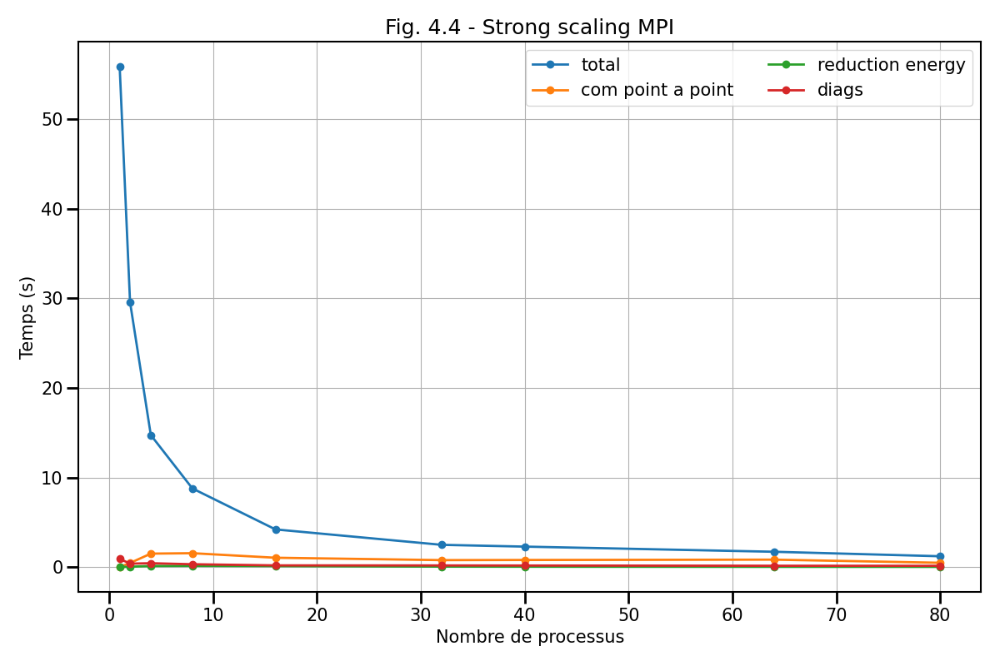
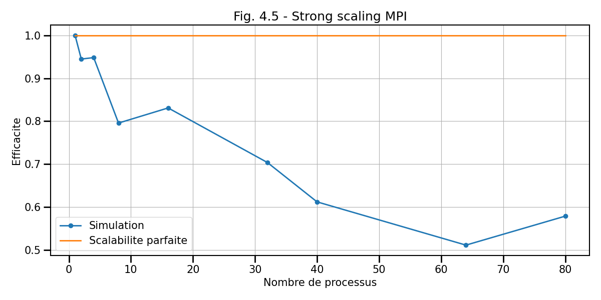

## IV. Etude de performance

Dans cette dernière partie, nous allons maintenant étudier la performance du code parallèle.
Pour cela nous allons regarder les deux types de passage à l'échelle que sont le *weak* ou *strong scaling*.
Dans chaque cas, vous serez amené à faire d'abord votre propre étude puis à étudier une étude faite sur le super-calculateur Ruche.

Pour rappel, sur Ruche, vous devez charger l'environnement suivant :
```bash
```

Vous pouvez comlpiler le code avec la commande suivante : 
```bash
mpiicpc -O3 -g main.cpp -o exe
```

Le wrapper `mpiicpc` est celui utilisé par Intel.
Attention à ne pas utiliser `mpicxx` qui utiliser `g++`.

### 4.1. Weak scaling

Regardons dans un premier temps le passage à l'échelle faible ou *weak scaling*.
Pour rappel, ce type d'étude consiste à regarder comment évolue l'efficacité du
code lorsque l'on augmente le nombre de processus tout en gardant la
charge constante par unité de calcul.

a) Effectuez un test de weak scaling jusqu'à 80 coeurs (2 noeuds) en choisissant les paramètres suivant pour le cas utilisant 1 processus :
- `nx = 5120`
- `ny = 128`
- 2000 itérations

b) Calculez quel est le coût mémoire théorique d'un domaine MPI en ne considérant que le poids des grilles (et pas toutes les petites variables)

c) Affichez la courbe en temps et d'efficacité correspondante en y faisant apparaître le temps dans chaque partie:
- calcul
- communications point à point
- communications globales 

Nous avons de notre côté également effectuer ce test :


d) Commentez ce *weak scaling* en vous aidant de toutes les courbes

### 4.2. Strong scaling

Regardons maintenant le passage à l'échelle fort ou *strong scaling*.
Pour rappel, ce type d'étude consiste à regarder comment évolue l'efficacité du
code lorsque l'on augmente le nombre de processus tout en gardant la
charge globale constante.

a) Effectuez un test de *strong scaling* jusqu'à 80 coeurs (2 noeuds) en choisissant les paramètres suivant :
- `nx = ny = `
- 2000 itérations

b) Affichez la courbe en temps et d'efficacité correspondante en y faisant apparaître le temps dans chaque partie :
- calcul
- communications point à point
- communications globales

Nous avons de notre côté également effectuer ce test :





c) Commentez ce *strong scaling* en vous aidant de toutes les courbes