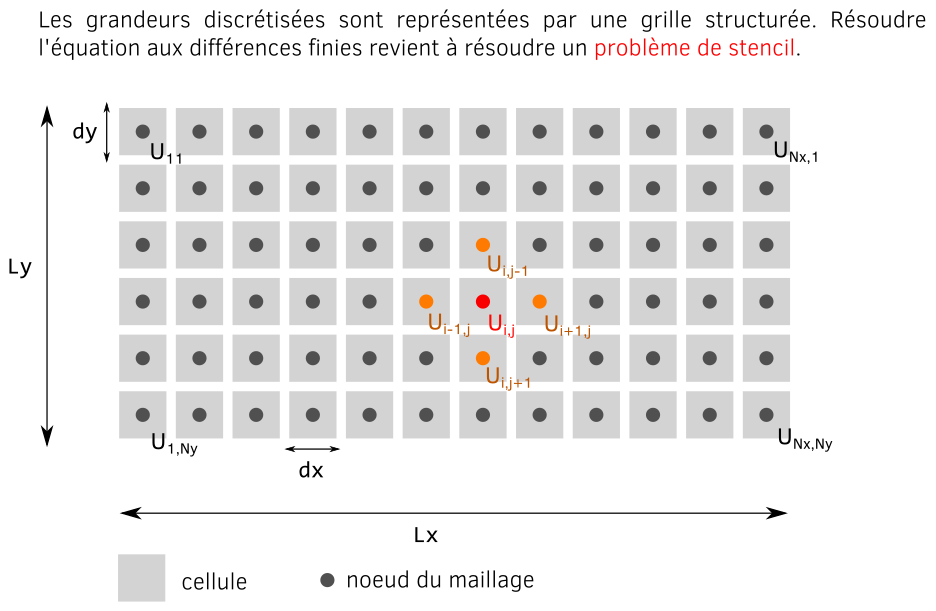
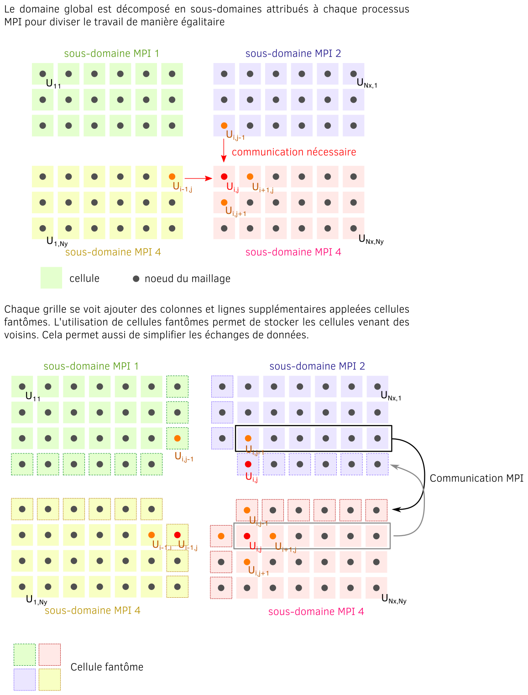

# Implémentation Fortran de l'équation d'onde linéaire, homogène et isotrope

## Discrétisation de l'équation d'onde

Ce cas applicatif s'intéresse à la parallélisation d'un code résolvant
l'équation d'onde 2D avec la méthode des différences finies.

L'équation d'onde que nous souhaitons résoudre correspond à l'équation dans un milieu homogène et isotrope :
```math
\frac{\partial^2 U(\mathbf{x},t)}{\partial t ^2} = c^2 \Delta U(\mathbf{x},t) + f
```
Où $`c`$ est la vitesse de propagation des ondes dans le milieu dans toutes les directions (isotropie).
Le terme $`f`$ est ici un terme source.

En 2D, cette équation devient :
```math
\frac{\partial^2 U(\mathbf{x},t)}{\partial t^2} = c^2 \cdot \left[ \frac{\partial^2 U(\mathbf{x},t)}{\partial x^2}  + \frac{\partial^2 U(\mathbf{x},t)}{\partial y^2}\right] + f
```

Dans cette exemple, nous utilisons des conditions limites de type Dirichlet.
```math
U(\mathbf{x},t)_{boundary} = 0
```
Cela correspond à une réflexion parfaite de l'onde sur les bords du domaine.
On peut noter qu'une condition de type Neumann nulle correspondrait à une absorption parfaite.

La discrétisation par la méthode des différences finies donne:
```math
U^{n+1}_{i,j} = 2 U^{n}_{i,j} - U^{n-1}_{i,j} + D  \cdot \left( U^{n}_{i+1,j} + U^{n}_{i-1,j} - 4 U^{n}_{i,j} + U^{n}_{i,j+1} + U^{n}_{i,j-1}  \right) + \Delta t ^2 f
```
où $`D`$ est un coefficient valant $`\left( c \Delta t / \Delta x \right)^2`$

Ici, $`\Delta t`$ est le pas de temps. On a donc $`t = n \cdot \Delta t `$. Il faut alors comprendre que pour obtenir le temps $`n+1`$
nous avons besoin des deux pas de temps précédent.
$`\Delta x`$ représentent le pas d'espace à la fois dans les directions $`x`$ et $`y`$.
Les indices $`i`$ et $`j`$ correspondent aux positions suivant $`x`$ et $`y`$
sur la grille 2D de telle sorte que $`x = i \cdot \Delta x`$ et $`y = j \cdot \Delta x`$.
De la même façon, $`\Delta t`$ est le pas de temps de telle sorte qu'en
définissant l'itération $`k`$, nous obtenons $`t = k \cdot \Delta t`$.

La condition de stabilité du schéma est donnée par la formule :
```math
dt \leq dx / c
```

Dans le code, les grandeurs discrétisées seront donc représentées par une grille structurée comme illustrée
sur la figure ci-dessous :



On remarque qu'obtenir la valeur de $`U^{n+1}_{i,j}`$ ne fait qu'appel qu'à des noeuds proches.
Ce type de problème se nomme problème de *stencil*.
Ils représentent une classe d’algorithme où les éléments
d’un tableau sont mis à jour à partir d’un motif local faisant appel aux points
adjacents.
C'est d'ailleurs un sujet d'étude pour obtenir les algorithmes les plus performants en informatique.
Il s'agit aussi d'un problème dit à dépendance local.
Il est de ce fait très facile à paralléliser.
En tout cas plus facile que les problèmes globaux.

## Description du répertoire

Ce programme écrit en Fortran se compose de plusieurs fichiers :
- main.F90: fichier principal contenant la structure du programme avec son initialisation et la boucle en temps
- parameters.F90 : fichier contenant tous les paramètres (variables)
- physics.F90 : fichier contenant l'initialisation physique du domaine et le solveur physique
- diagnostics.F90 : fichier contenant les diagnostiques

## Installation des dépendances

Ce programme nécessite l'installation d'un compilateur Fortran 90.

Pour le TP, vous aurez besoin d'installer un compilateur équipé de OpenMP.
C'est normalement le cas de la plupart des compilateurs récents.

Vous aurez aussi besoin d'installer MPI.
Sur les postes de travail de l'université, MPI est déjà installé.
Pour l'installer sur vos ordinateurs personnels, utilisez les instructions dans le dossier [./documentation](../../documentation/mpi.md).

## Compilation et exécution du programme

Pour compiler ce programme, vous pouvez tout simplement utiliser le makefile dans le dossier des sources :
```bash
make
```

La compilation génère un fichier `executable`. Vous pouvez lancer le programme en faisant :
```bash
./executable
```

Certains arguments peuvent être donné en ligne de commande après l'exécutable :

```bash
./executable -Nxy 500 500 -dx 0.01 -Nt 4000 -diags 100
```

Les arguments possibles ont la signification suivante :
- `Nxy`: nombre de points sur la grille dans la direction x puis y
- `Nt`: nombre d'itérations temporelles
- `diags`: période en nombre d'itérations entre chaque sortie de diagnostique
- `dx`: pas d'espace en x et en y


## Consignes de TP

Dans ce TP, vous aurez à modifier un programme séquentiel pour le paralléliser à la fois via OpenMP et MPI.
C'est le sujet des sous-sections I à IV.
Vous serez ensuite amené à étudier les performances des versions parallèles.
Il s'agit de la section IV.
En plus de travailler dans un code de calcul, il vous est demandé d'écrire un rapport détaillant votre démarche.
Le TP est divisé en questions successives vous invitant soit à modifier le code soit à compléter votre rapport, parfois les deux.
Pour le rapport, vous êtes libre du format d'écriture (LateX, Word, LibreOffice...).

### I. Découverte du code séquentiel

La première partie de ce TP est la découverte du code dans sa version non parallèle.

**Fichier main.F90 :**

Ouvrez le fichier [main.F90](./sequential/main.F90) et commencez par explorer la structure du code.
La première partie de l'initialisation est la définition des paramètres de simulation du code :

```fortran
Nx                  = 500                 ! Nombre de points sur la grille dans la direction x
Ny                  = 500                 ! Nombre de points sur la grille dans la direction y
dx                  = 0.01                 ! Pas d'espace
C                   = 1.                  ! Vitesse du son
Amplitude           = 40                 ! Amplitude du terme source
omega               = 2*PI                  ! Fréquence de la perturbation
Nt                  = 4000                ! Nombre d'itérations temporelles
alpha               = 0.5                 ! Facteur sur le pas en temps calculé avec la CFL
print_period        = 500                ! Période de sortie à l'écran des itérations
diagnostic_period   = 100                 ! Période en nombre d'itération entre chaque sortie de fichier
```

C'est ici que l'on peut jouer avec les paramètres comme la discrétisation de la grille (`Nx` et `Ny`),
la taille de la grille (`Lx` et `Ly`), le nombre d'itération (`Nt`).
Les paramètres sont stockés dans le fichier [parameters.F90](./sequential/parameters.F90).
Laissez ce fichier de côté pour le moment.

La fonction `get_arguments` vous permet de passer certains arguments en ligne de commande au moment de l'exécution.

La deuxième partie de l'initialisation va allouer les tableaux et définir des paramètres internes pour la simulation par l'appel à la fonction `initialize_domain` définie dans le fichier [physics.F90](./sequential/physics.F90).
Nécessairement, cette partie utilise les paramètres fournis plus haut dans `main.F90`.
Laissez le fichier [physics.F90](./sequential/physics.F90) de côté pour le moment.

Après l'initialisation c'est la boucle en temps. Par étapes sont effectués :
- la résolution de l'équation d'onde pour le pas de temps suivant par l'appel à la fonction `update_domain`
- les conditions limites par l'appel à `update_boundaries`. Pour des conditions réfléchissantes, cet appel pourrait même ne pas être fait.
- l'affichage d'information dans le terminal via `print_timestep_information`
- la sortie de la grille sous forme de fichiers binaires via `output_grid`

Vous devez remarquer que nous calculons le temps passé dans chaque partie du code grâce à la fonction `cpu_time`.
Une fois la boucle en temps terminée, les *timers* sont traités et affichés dans le terminal.

**Fichier parameters.F90 :**

Ouvrez le fichier [parameters.F90](./sequential/parameters.F90).
Ce fichier contient le module Fortran `parameters` contenant lui l'ensemble des paramètres utilisés dans le code.
C'est ici que vous trouverez les paramètres physiques, la déclaration des grilles et les paramètres numériques.
C'est également ici que vous devrez ajouter de nouvelles variables si ces dernières ne sont pas locales aux subroutines.

**Fichier physics.F90 :**

Ouvrez le fichier [physics.F90](./sequential/physics.F90).
Ce fichier contient les subroutines pour la résolution de l'équation d'onde et les choses connexes :
- `initialize_domain` : Cette subroutine initialise la simulation à partir des paramètres d'entrée données
  par l'utilisateur dans [main.F90](./sequential/main.F90). C'est notamment ici que sont allouées les grilles.
  A la fin de cette fonction, un récapitulatif des principaux paramètres est affiché dans le terminal.
  C'est ici que l'on rajoutera l'initialisation de certains paramètres pour MPI notamment.
  Vous pourrez aussi rajouter des informations à afficher pour la recherche de bug par exemple.
- `update_domain` : C'est dans cette fonction que l'équation d'onde est résolue pour le pas de temps suivant.
- `update_boundaries` : mise à jour des conditions aux limites
- `finalise_domain` : pour désallouer les grilles à la fin de la simulation

**Fichier diagnostics.F90 :**

Ouvrez le fichier [diagnostics.F90](./sequential/diagnostics.F90).
Ce fichier contient les fonctions relatives à l'affichage dans le terminal ou la sortie des fichiers de grille :
- `print_timestep_information` :
- `compute_grid_integration` :
- `output_grid` :

**Question 1.1 - première exécution :** Maintenant que vous avez une vision globale du code. Compilez et exécutez-le avec
les paramètres par défaut.

**Question 1.2 :** L'exécution a généré des fichiers dans le dossier `diags`.

- a) Utilisez les scripts Python fournis dans le dossier [python](../python) pour visualiser les résultats (utilisez le [README](../python/README.md) pour plus d'information).

- b) Placez dans le rapport une figure 2D ou 3D à différentes itérations de simulation.

**Question 1.3 - compteur en temps :**

- a) Prenez le temps d'observer les compteurs de temps (ou *timers*) affichés en fin de simulation.

- b) Quelle partie du code prend le plus de temps ?

### II. Découverte de la machine de calcul

**Question 2.1 - Architecture de la machine parallèle:** Avant de travailler sur la parallélisation du code, il est important de regarder
les propriétés de la machine parallèle que vous allez utiliser.
Dans notre cas, nous utiliserons des ordinateurs de bureau équipé d'un seul processeur mais de plusieurs coeurs de calcul.

- a) La première chose à faire est de récupérer ces informations. Pour cela, vous pouvez utiliser la commande suivante :

```bash
cat /proc/cpuinfo
```

Cette commande vous donne toutes les informations qui concernent votre processeur.
La ligne `model name` vous permet de récupérer le nom commercial du processeur et de faire une recherche Internet par exemple.
La ligne `cpu cores` vous donne le nombre de coeurs.
Vous noterez que les mêmes informations sont affichées un certain nombre de fois, autant de fois qu'il y a de *threads* pour être exact.
Un *thread* au sens d'Intel est une sous unité de calcul du coeur.
Il y a en général 2 *threads* par coeur qui partagent les ressources mémoires du coeur (à la fois le cache L2 mais aussi la bande passante !).
Lorsque l'on désire utiliser les *threads* comme des unités de calcul, on parle d'*hyperthreading*.

- b) Récupérez le nom du modèle du processeur. Utilisez un moteur de recherche pour trouver la page associée sur le site Intel.

- c) Donnez le nombre de coeurs total et le nombre de *threads* de votre processeur.

- d) Donnez la taille du cache L3.

- e) Sous Gnome, un autre moyen d'avoir des informations sur votre processeur est d'utiliser l'utilitaire graphique `Moniteur système` qui se substitue à la commande `top`.
Combien de CPUs sont affichés ? A quoi correspondent-ils ?
Prenez une capture d'écran et mettez la dans votre rapport.

### III. OpenMP

Dans cette deuxième partie, nous allons paralléliser le programme d'équation d'onde en utilisant la bibliothèque OpenMP
fonctionnant par directives.

**Préparation :** Pour cette partie, faites une copie du dossier contenant le code fortran que vous allez appeler `sequentiel`.
On utilisera cette copie comme référence.
Faites maintenant une deuxième copie pour y placer les directives OpenMP et appelez-la `openmp`.
Dans la partie suivante du TP, il vous sera demandé de modifier les sources dans le dossier `openmp`.

**Question 3.1 - région parallèle :** En premier lieu placez dans [main.F90](./sequential/main.F90) la directive d'ouverture et de fermeture d'une région
parallèle en OpenMP (`omp parallel`).
Faites en sorte que le passage des paramètres soit partagé par défaut (`shared`) et prenez soin de définir en privé (`private`)
les quelques paramètres qui en ont besoin. Justifiez le choix de l'emplacement de la directive dans le code et
le choix des paramètres passés en `private`. Compilez avec OpenMP (sans exécuter) pour vérifier.

**Question 3.2 - temps :** Pour mesurer le temps, il va être nécessaire de remplacer les fonctions `call cpu_time(time)` par la fonction OpenMP
spécifique `time = omp_get_wtime()` (https://www.openmp.org/spec-html/5.0/openmpsu160.html) dans [main.F90](./sequential/main.F90).
Le paramètre `time` est un réel dans les deux cas représentant des secondes. Compilez avec OpenMP (sans exécuter) pour vérifier.

**Question 3.3 - parallélisation de la boucle :** Dans [physics.F90](./sequential/physics.F90), ajoutez la directive permettant de paralléliser
la boucle de résolution de l'équation d'onde. Demandez à ce que le *scheduler* soit décidé au *runtime*. Compilez avec OpenMP (sans exécuter) pour vérifier.

**Astuce** : vous pouvez rendre parallèle des opérations sur des tableaux en utilisant `!$OMP workshare` :
```
!$omp workshare
A(:) = B(:) + C(:)
!$omp end workshare
```
Ou tout simplement transformer ces opérations en boucle classique précédée de `!$omp do`.
`workshare` ne semble cependant pas accepter la clause `schedule(runtime)`.

**Question 3.4 - région séquentielle :** Dans [main.F90](./sequential/main.F90) et [physics.F90](./sequential/physics.F90), identifiez les régions qui
nécessitent d'être faites en séquentiel. Ajoutez les directives souhaitées dans chaque cas. Justifiez rapidement votre choix.
Compilez avec OpenMP (sans exécuter) pour vérifier.

**Questions 3.5 - exécution :** Exportez dans votre environnement les variables pour le nombre de *threads* OpenMP (`OMP_NUM_THREADS=4`) et
le type *scheduler* ainsi que le le nombre de *chunks*. Choisissez pour commencer `OMP_SCHEDULE="static"`. Exécutez le code.

**Questions 3.6 - visualisation des résultats :** Visualisez les fichiers de sortie pour vous assurer que les résultats sont identiques
avec la version séquentielle.

### IV. MPI

Dans cette troisième partie, nous allons paralléliser le programme d'équation d'onde en utilisant la méthode par passage de message et la bibliothèque MPI.

**Préparation :** Faites maintenant une copie du dossier `sequentiel` et appelez-le `mpi`.
Vous allez modifier les sources pour y introduire la parallélisation MPI dans ce dossier.

**Question 4.1 - makefile :** En premier lieu, il nous faut modifier le makefile pour pouvoir compiler avec MPI.
Pour cela ouvrez le fichier `makefile` et remplacer `gfortran` par `mpif90` en tant que compilateur fortran (`FC`).
Supprimez les *flags* faisant référence à OpenMP : `-fopenmp`.
L'entête du makefile devrait ressembler à ça :
```makefile
# Fortran compiler (MPI wrapper)
FC = mpif90
# Fortran compiler flags
FFLAGS=
# Libraries
LDFLAGS =
```
Il est tout à fait possible de compiler un code séquentiel avec le *wrappper* MPI puisqu'il s'agit simplement d'un *wrapper* faisant appel au compilateur `gfortran`.
Compilez le code en faisant `make` pour vous assurez qu'il n'y a pas d'erreur.

**Question 4.2 - Initialisation de MPI :** Nous allons commencer par préparer le programme à MPI.
Pour cela, commencez par inclure le header MPI dans le fichier [main.F90](./sequential/main.F90).
Notez qu'il faudra l'inclure dans chaque fichier où sera appelées des fonctions MPI.

Effectuez l'initialisation de MPI tout en récupérant le nombre de rang et le rang du processus en cours.
Vous devrez déclarer les nouveaux paramètres dans le fichier [parameters.F90](./sequential/parameters.F90).
Les variables très locales comme l'erreur MPI par exemple peuvent être déclarées localement.
Aidez-vous du premier exercice sur MPI si besoin `1_initialization`.
N'oubliez pas de finaliser MPI tout de suite à la fin du programme.

**Question 4.3 - Timers :** Avant de rentrer dans le coeur du sujet, nous allons préparer le calcul du temps avec MPI.

a) En premier lieu, nous allons remplacer tous les appels à la fonction `cpu_time` dans le [main.F90](./sequential/main.F90) par la fonction MPI `MPI_WTIME()` plus adaptée.

Chaque processus MPI va donc faire un calcul local du temps passé dans chaque partie. Les bilans temporels ne seront affichés que par un seul processus.
En revanche, nous allons faire quelques statistiques en affichant le temps minimal, moyen et maximal entre tous les processus pour chaque partie du code. Dans [parameters.F90](./sequential/parameters.F90), nous avons déjà déclaré les tableaux `minimum_timers`, `average_timers` et `maximum_timers` à cet effet.

b) Utiliserz les fonctions MPI adéquates pour calculer le temps minimaml, moyen et maximal entre chaque processus.
Il n'y a pas une solution unique à cet exercice (plusieurs méthodes MPI sont possibles).
Vous pouvez coder cette partie directement dans [main.F90](./sequential/main.F90) avant l'affichage des temps.

c) Demandez à ce que l'affichage des temps à la fin de [main.F90](./sequential/main.F90) ne soit fait que par le rang 0. Dans le cas contraire, votre affichage sera saturé par les sorties terminal de chaque processus.

d) Compilez le code et exécutez le en demandant qu'un processeur.
```bash
mpirun -np 1 ./executable
```
Vérifiez que les résultats sont ceux attendus.

**Question 4.4 - Topologie :** L'idée est de découper la grille discrétisée en sous-grilles de manière cartésienne
dans les deux directions x et y.
Chaque processus MPI devra s'occuper d'une sous-grille.
La première chose à faire est donc de créer la topologie cartésienne.

- a) Ajoutez les nouveaux paramètres MPI dans le fichier [parameters.F90](./sequential/parameters.F90) permettant de créer la topologie cartésienne.

- b) Faites en sorte que la fonction de lecture des arguments en ligne de commande puisse lire le nombre de rangs dans chaque dimension (lignes commentées)

- c) Ajoutez les fonctions MPI correspondantes permettant de créer la topologie cartésienne dans [main.F90](./sequential/main.F90).
Ces fonctions doivent être placées après la lecture des paramètres mais avant l'initialisation.

- d) Rajoutez une condition qui vérifie que le nombre de processus dans chaque direction est conforme avec le nombre total de processus donné par la commande `mpirun`.

Pour les points a) à c), vous pouvez utiliser l'exercice 6 `6_cartesian_com` pour vous aider ainsi que le cours.

- e) Compilez le code et exécutez-le en demandant qu'un seul processus pour vérifier qu'il n'y a pas d'erreur à ce stade.

**Question 4.5 - Création des paramètres physiques locaux :** Dans le programme séquentiel, les grilles `next_grid`, `curr_grid` et `prev_grid` étaient des tableaux représentant l'ensemble du domaine.
Ces grilles deviennent maintenant une représentation locale de la sous-grille de chaque domaine MPI.
Ce sont donc des sous-grilles indépendantes constituant des morceaux des grilles totales.

Dans les problèmes de stencil, la décomposition de la grille en sous-domaines
de manière naïve entraîne un problème pour les points aux bords.
Il est nécessaire de mettre en place dans un modèle de programmation par passage de message des cellules dîtes fantômes
afin de recevoir des sous-domaines voisins la portion de données nécessaire à la résolution du schéma numérique.
La décomposition MPI et les cellules fantômes sont illustrées par la figure ci-dessous :



Pour les noeuds qui sont aux bords des sous-domaines, il est nécessaire de communiquer les valeurs adjacentes situées sur les autres sous-domaines MPI pour résoudre le schéma numérique.
Au lieu de communiquer chaque valeur une par une, il est préférable de les communiquer par bloc et de les stocker dans ce qu'on appelle
des cellules fantômes.
Ces cellules forment un halo autour des sous-domaines.

Il va donc falloir les allouer mais la taille va cette fois dépendre du nombre de processus MPI.
Pour commencer, vous allez créer les paramètres locaux suivant :
- local_Nx, local_Ny : le nombre de noeuds dans chaque processus MPI.
- local_Lx, local_Ly : la tailles du sous-domaine associé à chaque processus MPI.
- local_x_min, local_y_min : la borne minimale en x et en y
- local_x_max, local_y_max : la borne maximale en x et en y

Pour cela :

- a) Déclarez ces paramètres dans [parameters.F90](./sequential/parameters.F90).
  
- b) Calculez leurs valeurs dans la fonction `initialize_domain` de [physics.F90](./sequential/physics.F90).

- c) Modifiez ensuite l'allocation des tableaux pour utiliser les paramètres locaux. Vous pouvez également faire afficher à l'écran une partie de ces paramètres pour contrôler leurs valeurs.

Faites-en sorte que seulement le rang 0 puisse afficher à l'écran les informations à l'écran (pour débuguer votre programme, rien ne vous empêche
d'utiliser la fonction `print` depuis n'importe quel rang).

- d) Mettez à jour le calcul des conditions initiales

- e) Compilez et exécutez le code avec un processeur pour contrôler qu'il n'y a pas d'erreur à ce stade.

**Question 4.6 - Calcul du pas de temps suivant :** Nous allons maintenant mettre à jour la subroutine permettant de calculer le pas de temps suivant `update_domain` dans [physics.F90](./sequential/physics.F90).

- a) Mettez à jour les bornes des boucles sur les éléments de grille en utilisant les paramètres locaux.

- b) Compilez et exécutez le code avec un processeur pour contrôler qu'il n'y a pas d'erreur à ce stade.

**Question 4.7 - Echange des cellules fantômes :** Cette partie est l'une des plus délicates. Il s'agit maintenant de communiquer les informations qui viendront mettre à jour les cellules fantômes avant de calculer la grille au pas de temps suivant.

Pour cela, nous allons travailler directement dans la boucle en temps.
Vous allez implémenter en utilisant le type de communication MPI adéquate les échanges de données vers les cellules fantômes juste avant de mettre à jour le domaine.
Faites bien attention à communiquer dans chaque direction de l'espace (`-x`, `+x`, `-y`, `+y`).
Rajouter de nouveaux *timers* autour de ces communications et faites les apparaître dans les détails de la boucle en temps à la fin de [main.F90](./sequential/main.F90).

Compilez et exécutez le code avec un processeur pour contrôler qu'il n'y a pas d'erreur à ce stade.

**Question 4.8 - Affichage des pas de temps :** Dans le fichier [diagnostics.F90](./sequential/diagnostics.F90), la fonction `print_timestep_information` permet d'afficher
le pas de temps en cours et l'intégration de la grille à ce pas de temps.
En parallèle, le calcul de l'intégration de la grille doit d'abord se faire localement puis une communication doit être faite pour sommer les contributions
de chaque processus.

- a) Rajoutez la communication MPI adéquate permettant de sommer les intégrations locales dans `compute_grid_integration`. Rajoutez des paramètres si besoin.

- b) Dans `print_timestep_information`, faites-en sorte que seul le processus 0 puisse afficher dans le terminal.

**Question 4.9 - Diagnostiques :** La dernière partie qu'il faut adapter sont les sorties de fichiers. En effet, pour le moment la sortie de fichier se fait par chaque processeur mais chaque processeur ne possède pas la même portion de grille. Il existe plusieurs façons de gérer les sorties en calcul parallèle. Certaines sont plus efficaces que d'autres.

Ici, nous allons adopter l'écriture de toute la grille par le seul processus 0. Cela signifie qu'il va falloir que tous les processus communiquent au processeur 0
leur morceau de la grille globale. Le processus 0 reconstitue l'intégralité de la grille avant de l'écrire sur le disque comme en séquentiel.

- a) Dans [diagnostics.F90](./sequential/diagnostics.F90), mettez en place un algorithme dans la fonction `output_grid` pour effectuer le rapatriement des grilles locales des autres processus vers le processus 0 dans une grille globale qui sera écrite sur le disque.

- b) Expliquez maintenant les raisons qui font que cette façon de faire n'est pas très efficace.

En pratique, les sorties de fichiers sont très rarement faites de cette façon. Si cela ne pose pas de gros problème sur un socket, la méthode n'est plus du tout efficace sur un calculateur. Il existe dans MPI des fonctions permettant d'écrire des fichiers en parallèle (MPI-IO). Le fonctionnement de cette partie de MPI n'est pas au programme de ce cours. Il existe ensuite des bibliothèques d'IO qui intègre MPI ou une autre solution d'écriture parallèle et simplifie son fonctionnement tout en fournissant des structures de données adaptées (HDF5, ADIOS, NETCDF). Ces bibliothèques sont très courantes dans le monde du HPC.

**Question 4.10 - première exécution en parallèle :** A ce stade, votre code est maintenant prêt pour une exécution en parallèle.

- a) Compilez le code et exécutez-le en parallèle avec plusieurs processus.

- b) Contrôlez le résultat en ouvrant les fichiers de sortie grâce aux scripts Python (si votre code est bien conçu, il n'y a aucune modification à apporter aux scripts Python).

Allez voir la [page sur la visualisation](../python/README.md) pour plus d'information.

**Attention** : Lorsque vous exécutez votre code, ne faites rien tourner d'autre à côté.
Cela risquerait de ralentir votre exécution et de perturber votre exécution.

### V. Analyse de la performance

Dans cette dernière partie, nous allons analyser la performance de nos applications parallèles.

**Question 5.1 - Scalabilité faible** : Vous allez utiliser le code pour effectuer des tests de scalabilité faible.
Pour cela, vous allez faire plusieurs *runs* en augmentant successivement le nombre de processus tout en gardant la même taille de sous-domaine par rang (la surface totale du domaine va donc augmenter proportionnellement au nombre de processus).

- a) Choisissez d'abord un *scheduler* que vous allez conserver dans cette étude. Spécifiez lequel vous avez choisi dans votre rapport avec la taille de *chunk*. N'oubliez pas de le spécifier en entrant la ligne de commande `export OMP_SCHEDULE...`.

**Quelques conseils** : pendant vos tests, il est nécessaire de laisser le maximum de ressource à votre code.
Cela veut dire avoir le minimum de programmes ouverts.
Si vous utilisez votre navigateur alors il est nécessaire d'avoir le minimum d'onglets ouverts et d'éviter les sites internet bourrés de scripts (FaceBook par exemple...).
Sans cela, vous risquez de dégrader vos résultats.
Cela sera d'autant plus visible que le nombre de *threads* que vous utiliserez sera grand.

- b) Vous allez d'abord effectuer cette étude avec le code OpenMP. Faites évoluer le nombre de *threads* de 1 à 12 en utilisant une grille locale de 300x300 points :
```bash
export OMP_NUM_THREADS=1 ; ./executable -Nxy 300 300 -Nt 4000 -diags 5000
export OMP_NUM_THREADS=2 ; ./executable -Nxy 300 600 -Nt 4000 -diags 5000
export OMP_NUM_THREADS=3 ; ./executable -Nxy 300 900 -Nt 4000 -diags 5000
export OMP_NUM_THREADS=4 ; ./executable -Nxy 300 1200 -Nt 4000 -diags 5000
export OMP_NUM_THREADS=5 ; ./executable -Nxy 300 1500 -Nt 4000 -diags 5000
export OMP_NUM_THREADS=6 ; ./executable -Nxy 300 1800 -Nt 4000 -diags 5000
export OMP_NUM_THREADS=8 ; ./executable -Nxy 300 2400 -Nt 4000 -diags 5000
export OMP_NUM_THREADS=12 ; ./executable -Nxy 300 3600 -Nt 4000 -diags 5000
```
Notez les temps que vous obtenez dans chaque cas.
Il est recommandé de ne pas se contenter d'une valeur mais de faire la moyenne de plusieurs valeurs pour prendre en compte les fluctuations en temps.

- c) Calculez pour un processus l'espace mémoire approximatif en Mo occupé par les 3 grilles utilisées pour la résolution de l'équation d'onde.
A partir de combien de processus atteint-on la taille du cache L3 ?

- d) D'après vous, pourquoi est-il préférable de faire évoluer le nombre de points dans la direction `y` plutôt que dans la direction `x` ?
En serait-il de même dans un autre langage que Fortran ?

- e) Grâce à la méthode de votre choix (Python, Matlab, Excel...), tracez sur une courbe **le temps** total passé dans le programme OpenMP en fonction du nombre de processus.
Mettez votre courbe dans le rapport.

**Aide** : pour vous aider, vous trouverez des scripts Python préconçus et à remplir pour tracer ces courbes dans le dossier [python](../python/).

- f) Tracez maintenant grâce aux mêmes données, la courbe d'efficacité de passage à l'échelle pour le code OpenMP.
Mettez votre courbe dans le rapport.

- g) Vous allez maintenant effectuer la même chose pour le programme parallèle MPI.
```bash
mpirun -np 1 ./executable -Nxy 300 300 -ranksxy 1 1 -Nt 4000 -diags 5000
mpirun -np 2 ./executable -Nxy 300 600 -ranksxy 1 2 -Nt 4000 -diags 5000
mpirun -np 3 ./executable -Nxy 300 900 -ranksxy 1 3 -Nt 4000 -diags 5000
mpirun -np 4 ./executable -Nxy 300 1200 -ranksxy 1 4 -Nt 4000 -diags 5000
mpirun -np 5 ./executable -Nxy 300 1500 -ranksxy 1 5 -Nt 4000 -diags 5000
mpirun -np 6 ./executable -Nxy 300 1800 -ranksxy 1 6 -Nt 4000 -diags 5000
mpirun -np 8 ./executable -Nxy 300 2400 -ranksxy 1 8 -Nt 4000 -diags 5000
mpirun -np 12 ./executable -Nxy 300 3600 -ranksxy 1 12 -Nt 4000 -diags 5000
```
Gardez dans chaque cas le temps moyen total, le temps moyen dans l'équation d'onde et le temps moyen dans les cellules fantômes (effectuez des moyennes sur plusieurs *runs*).
Pour un même *run*, explicitez dans le rapport quelles fluctuations entre le temps min, moyen et max vous observez pour le temps total et le temps passé dans les cellules fantômes, à savoir les échanges MPI.
Expliquez pourquoi ce qui est observé pour les échanges MPI ne se retrouve pas dans le temps total.

- h) Tracez une courbe de temps faisant apparaître le temps total passé dans le programme, le temps passé dans la résolution de l'équation d'onde (ce qui représente le coeur de calcul du programme) et le temps passé dans la gestion des cellules fantômes (ce qui représente le temps dans les échanges MPI) en fonction du nombre de processus.

- i) Tracez maintenant grâce aux mêmes données, la courbe d'efficacité de passage à l'échelle faible (*weak scaling*) pour le code MPI.
Faites apparaître la courbe de scalabilité parfaite.
Mettez votre courbe dans le rapport.

- j) Comparez les résultats en temps obtenus entre le programme OpenMP et le programme MPI.

- k) A partir de combien de processus environ observe-t-on une cassure dans la courbe de passage à l'échelle dans les deux cas ? Cela s'explique par la combinaison de deux facteurs. Explicitez ces deux raisons.

- l) Tracer la part du temps passé dans MPI et dans l'équation d'onde par rapport au temps total en fonction du nombre de processus.
Décrivez et expliquez comment évolue la part MPI en fonction du nombre de processus (tenez compte des grandes tendances).

- m) A partir de quand peut-on dire qu'augmenter le nombre de processus n'est plus intéressant pour accélérer notre programme (dit d'une autre façon, à partir de quand notre programme n'est plus scalable) ?

**Question 5.2 - Scalabilité forte** : Vous allez maintenant étudier la scalabilité forte.
Pour cela, vous allez faire plusieurs *runs* en augmentant successivement le nombre de processus tout en gardant constante la taille du domaine.
Vous commencerez d'abord par le programme OpenMP avant de passer sur le programme MPI.

- a) Choisissez d'abord un *scheduler* que vous allez conserver dans cette étude. Spécifiez lequel vous avez choisi dans votre rapport avec la taille de *chunk*. N'oubliez pas de le spécifier en entrant la ligne de commande `export OMP_SCHEDULE...`.

- b) Vous allez d'abord effectuer cette étude avec le code OpenMP. Faites évoluer le nombre de *threads* de 1 à 12 en utilisant une grille globale de 300x1500 points :
```bash
export OMP_NUM_THREADS=1 ; ./executable -Nxy 300 1500 -Nt 4000 -diags 5000
export OMP_NUM_THREADS=2 ; ./executable -Nxy 300 1500 -Nt 4000 -diags 5000
export OMP_NUM_THREADS=3 ; ./executable -Nxy 300 1500 -Nt 4000 -diags 5000
export OMP_NUM_THREADS=4 ; ./executable -Nxy 300 1500 -Nt 4000 -diags 5000
export OMP_NUM_THREADS=5 ; ./executable -Nxy 300 1500 -Nt 4000 -diags 5000
export OMP_NUM_THREADS=6 ; ./executable -Nxy 300 1500 -Nt 4000 -diags 5000
export OMP_NUM_THREADS=10 ; ./executable -Nxy 300 1500 -Nt 4000 -diags 5000
export OMP_NUM_THREADS=12 ; ./executable -Nxy 300 1500 -Nt 4000 -diags 5000
```
Notez les temps que vous obtenez dans chaque cas (en moyennant sur plusieurs *runs*).
Quel est l'intérêt ici d'utiliser une grille globale de 300x1500 points ?

- c) Tracez sur une courbe l'évolution du temps total en fonction du nombre de processus pour le programme OpenMP.

- d) Tracez maintenant la courbe de scalabilité forte pour le programme OpenMP à partir des données précédentes.

- e) Vous allez maintenant effectuer la même chose pour le programme parallèle MPI.
```bash
mpirun -np 1 ./executable -Nxy 300 1500 -ranksxy 1 1 -Nt 4000 -diags 5000
mpirun -np 2 ./executable -Nxy 300 1500 -ranksxy 1 2 -Nt 4000 -diags 5000
mpirun -np 3 ./executable -Nxy 300 1500 -ranksxy 1 3 -Nt 4000 -diags 5000
mpirun -np 4 ./executable -Nxy 300 1500 -ranksxy 1 4 -Nt 4000 -diags 5000
mpirun -np 5 ./executable -Nxy 300 1500 -ranksxy 1 5 -Nt 4000 -diags 5000
mpirun -np 6 ./executable -Nxy 300 1500 -ranksxy 1 6 -Nt 4000 -diags 5000
mpirun -np 10 ./executable -Nxy 300 1500 -ranksxy 1 10 -Nt 4000 -diags 5000
mpirun -np 12 ./executable -Nxy 300 1500 -ranksxy 1 12 -Nt 4000 -diags 5000
```
Gardez dans chaque cas le temps moyen total, le temps moyen dans l'équation d'onde et le temps moyen dans les cellules fantômes (effectuez des moyennes sur plusieurs *runs*).

- f) Tracez une courbe de temps faisant apparaître le temps total passé dans le programme, le temps passé dans la résolution de l'équation d'onde (ce qui représente le coeur de calcul du programme) et le temps passé dans la gestion des cellules fantômes (ce qui représente le temps dans les échanges MPI) en fonction du nombre de processus.
Mettez votre courbe dans le rapport.

- g) Tracez maintenant grâce aux mêmes données, la courbe d'efficacité de passage à l'échelle forte (*strong scaling*) pour le code MPI.
Faites apparaître la courbe de scalabilité parfaite.
Mettez votre courbe dans le rapport.

- h) Comparez les temps obtenus avec le code OpenMP et le code MPI.
Pour quelle raison passé approximativement 6 processus, le temps de calcul n'évolue plus avec le nombre de processus alors que la taille de grille continue de diminuer ?

- i) Tracez la part du temps passé dans MPI et dans l'équation d'onde sur le temps total.
Mettez votre courbe dans le rapport.
Expliquez pourquoi la part du temps passé dans MPI augmente brutalement passé 6 processus.

- j) A partir de combien de processus pour la version OpenMP et MPI peut-on dire que notre programme n'est plus scalable ?

**Question 5.3 - Axe d'amélioration** : Voyez-vous un axe d'amélioration pour accélérer le programme MPI ?
