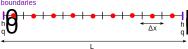
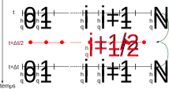
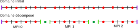
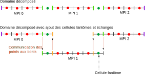

# Equation en eau peu prodonde ou équation de Saint-Venant

Pour en apprendre plus :
- [Excellent cours de P.-Y. Lagrée](http://www.lmm.jussieu.fr/~lagree/COURS/MFEnv/code_C_saintvenant.pdf)
- [Shallow Water Equations](https://en.wikipedia.org/wiki/Shallow_water_equations)

## Objectifs

L'objectif de ce projet est de résoudre en parallèle grâce à MPI l'équation en eau peu profonde conservatrice en 1D.

## Principes

Les équations en eau peu profonde sont des équations hyperboliques non linéaires qui approximent l'évolution de la hauteur d'eau d'un canal, d'une retenue, des marées, etc. 

On s'intéresse par simplicité ici à la forme conservative de l'équation en eau peu profonde en 1D.

 est l'axe spatial et  le temps.

On a alors :

<p align="center"></p>

<p align="center"></p>

avec  la hauteur d'eau et  le débit. La variable  est la constante de gravité.

Le débit est lié à la hauteur d'eau par la relation :

<p align="center"></p>

avec  la vitesse de l'eau.

## Discrétisation

On considère ici un canal 1D de longueur  avec des conditions aux limites réfléchissantes (des conditions périodiques sont aussi disponibles).



On discrétise l'espace en  points de discrétisation régulièrement espacés de .

On a donc :

<p align="center"></p>

On note  la hauteur d'eau au point  à l'instant  et  le débit au point  à l'instant .

On note  la vitesse de l'eau au point  à l'instant .

On note  l'instant  et  la position .

On résout alors les équations en eau peu profonde en 1D en utilisant un schéma de type Leap-Frog.
Ce schéma n'est pas le meilleur mais il a l'avantage d'être simple à implémenter.

On a alors :

<p align="center"></p>

et 

<p align="center"></p>

Les valeurs de  et  au au temps intermédiaire  sont calculées en utilisant les valeurs de  et  au temps .

<p align="center"></p>

et

<p align="center"></p>

Le schéma ci-dessous vous illustre la discrétisation en temps et en espace :



## Objectifs du projet

L'objectif de ce projet est de résoudre en parallèle grâce à MPI l'équation en eau peu profonde conservatrice en 1D.
Pour cela vous aurez un code séquentiel en Python qui vous servira de base de travail.
En suivant les consignes pas à pas, vous devrez paralléliser ce code séquentiel en utilisant MPI.

Pour le paralléliser, vous devrez découper le domaine en plusieurs sous-domaines de taille égale et chaque processus MPI devra s'occuper d'un sous-domaine. On appelle cela la décomposition de domaine. C'est une méthode très classique pour distribuer un problème en parallèle. Cela revient à résoudre sur chaque domaine la même équation en eau peu profonde mais sur un sous-domaine plus petit. On peut voir ça comme un ensemble de plusieurs simulations qui devront communiquer entre elles pour échanger les informations aux frontières des sous-domaines.

Commençons par faire un découpage en points : on distribue les points sur chaque processus MPI. On obtient donc un découpage comme ceci si on considère 3 processus MPI : 



En l'état, on remarque qu'un problème se pose pour le calcul des points situés aux bords des sous-domaines MPI (en vert sur le schéma). Il est nécessaire pour cela d'ajouter ce que l'on appelle des cellules fantômes. 
Ce sont des cellules supplémentaires qui étendent le domaine de calcul de chaque processus MPI et qui recouvre les cellules des processus voisins.
Avant d'effectuer un calcul au sein du sous-domaine, chaque processus MPI doit donc récupérer les valeurs des cellules fantômes des processus voisins afin d'avoir les dernières données à jour.



En ajoutant les cellules fantômes, on commence par mettre à jour les points aux bords (les tirets verts et oranges) à partir des données sur les voisins.

Cela permet de calculer les centres de cellules (les ronds verts et rouges) avant de mettre à jour les points intérieurs (tirets noirs).

En pratique, on effectuera les échanges après le calcul des points intérieurs.

## Description du projet

Le projet est composé de plusieurs dossiers :

- `consignes` :  contient les consignes du projet. Elles sont organisées en plusieurs parties chacune dans un fichier `md` différent.
- `python/sequential` : contient une implémentation séquentielle de l'équation en eau peu profonde en 1D en Python.
- `visualization` : contient des scripts Python pour visualiser les résultats de l'équation en eau peu profonde en 1D.
- `cpp/kokkos` : contient une implémentation C++ kokkos de l'équation en eau peu profonde en 1D. Cette implémentation ne sera pas utilisée pour ce projet.

## Description du code séquentiel

Le code séquentiel est divisé en plusieurs parties : 

* `Input parameters` : définition des paramètres d'entrée
* `Initialization` : initialisation des variables et des conditions initiales
* `Terminal output summary` : affichage des informations de sortie dans le terminal
* `Time loop` : boucle en temps
* `Timers` : mesure du temps

Les paramètres d'entrée sont les suivants :

* `L` : La taille du domaine (en ligne de commande : `-L`)
* `N` : Le nombre de points de discrétisation (en ligne de commande : `-N`)
* `iterations` : Le nombre d'itérations (en ligne de commande : `-i`)
* `print_period` : Le nombre d'itérations entre chaque affichage dans le terminal (en ligne de commande : `-p`)
* `g` : La constante de gravité
* `output_period` : Le nombre d'itérations entre chaque sortie sur le disque (en ligne de commande : `-o`)
* `matplotlib_period` : Le nombre d'itérations entre chaque affichage avec matplotlib (en ligne de commande : `-mp`)
* `matplotlib_pause_duration` : Le temps d'affichage de chaque figure matplotlib (en ligne de commande : `-md`)

Il est possible de faire un affichage en direct de la simulation avec matplotlib en utilisant la variable `matplotlib_period` et `matplotlib_pause_duration`.
Cette option est pratique pour voir ce qu'il se passe dans la simulation mais elle ralentit considérablement le code.

Les paramètres peuvent aussi être donnés en ligne de commande. Par exemple :

```
python shallow_water.py -L 1000 -N 1000 -i 1000 -p 100 -o 100 -mp 100 -md 0.01
```

## Visualisation des résultats

Une fois la simulation terminée, vous pouvez visualiser les résultats écrits dans le dossier `diags`.

Dans le dossier `visualization`, vous trouverez 2 scripts python pour visualiser les données :

* `plot.py` : permet de visualiser un fichier précis
* `animate.py` : permet de visualiser une animation de la simulation

Par exemple pour visualiser le fichier `diags/diag_09900.bin` (on donne le chemin vers le fichier) :

```bash
python plot.py ./diags/diag_09900.bin
```

Ou pour animer tous les fichiers (on donne le chemin vers le dossier `diags`) :

```bash
python3 animate.py ./diags
```


## Consignes

Les consignes du cours sont disponibles dans le dossier `./consignes`. Elles sont organisées en plusieurs parties chacune dans un fichier `md` différent :

* `1_sequentiel.md` : découverte du code séquentiel
* `2_machines.md` : découverte de la machine parallèle
* `3_mpi.md` : parallélisation avec MPI
* `4_performance.md` : analyse de la performance


