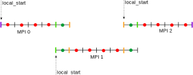

# Aide et conseils

1. Plus de précision concernant la question suivante :
```
 d) Déclarez et initialisez la variable local_start qui représente l'origine locale de chaque sous-domaine (en nombre de points) par rapport à l'index global.
``````
Comment une origine local peut être évaluée en nombre de points et à quoi sert local_start ?

Réponse :

`local_start` est un entier qui représente l'origine locale de chaque sous-domaine (en nombre de points) **par rapport à l'index global**. Il sert à définir la position de départ de chaque sous-domaine dans le tableau global.

La variable `local_start` sert par exemple à initialiser correctement chaque sous domaine ou à reconstruire le domaine global à partir des sous-domaines par la suite. 

Il y a plusieurs choix possible pour l'initialisation de cette variable. On peut le définir comme étant le premier point du sous-domaine ou comme le premier point sans les cellules fantômes.

J'ai mis à jour le schéma des consignes pour le faire apparaître plus clairement. Dans ce cas, j'ai choisi de faire apparaître `local_start` comme étant le premier point du sous-domaine.

